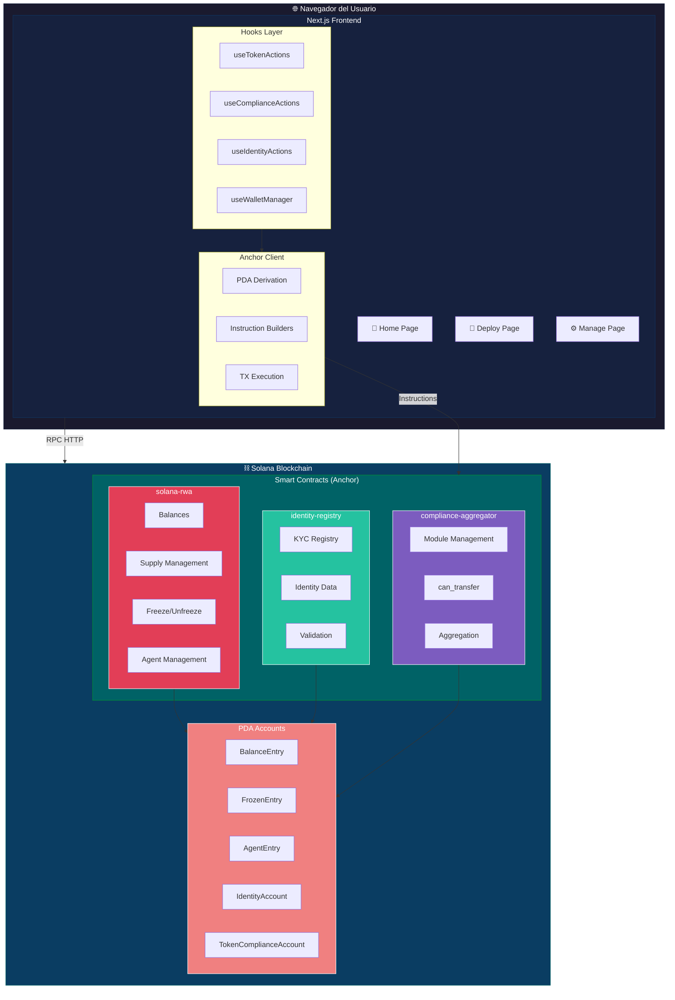
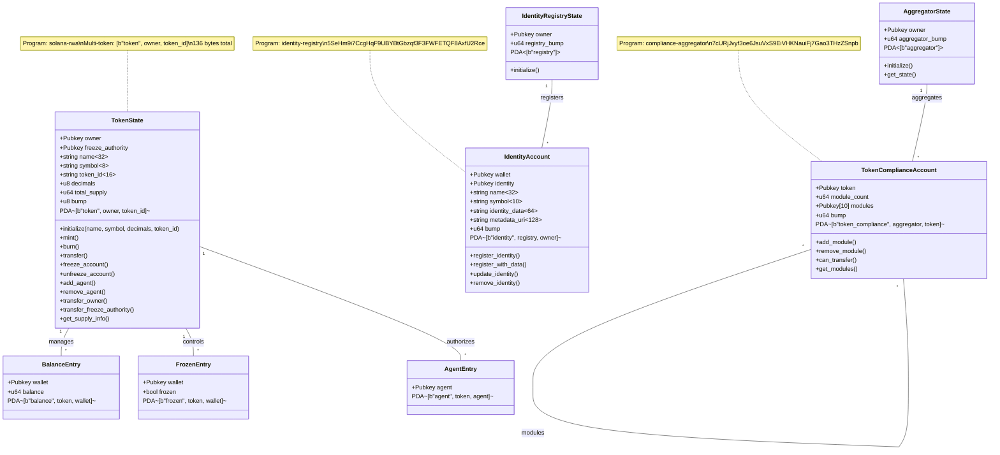
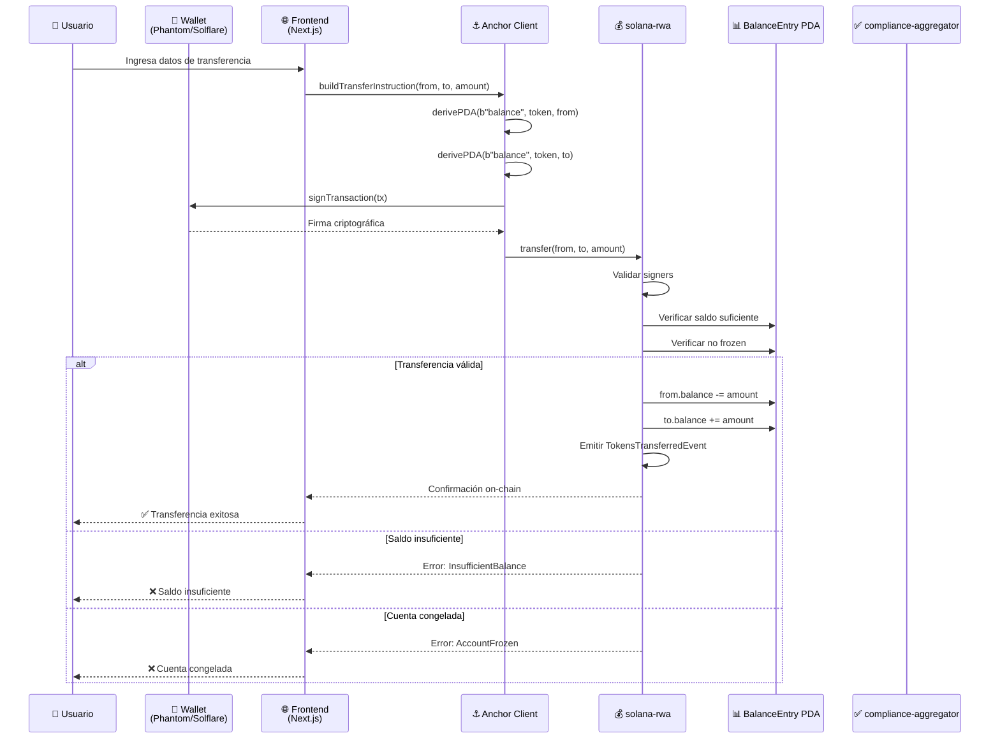
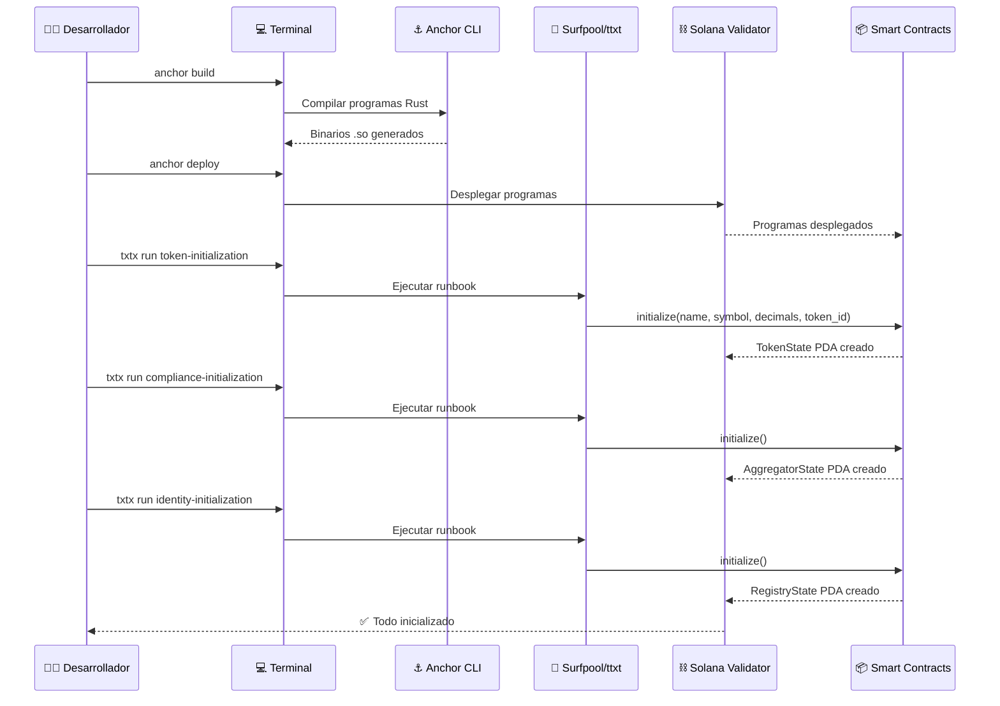
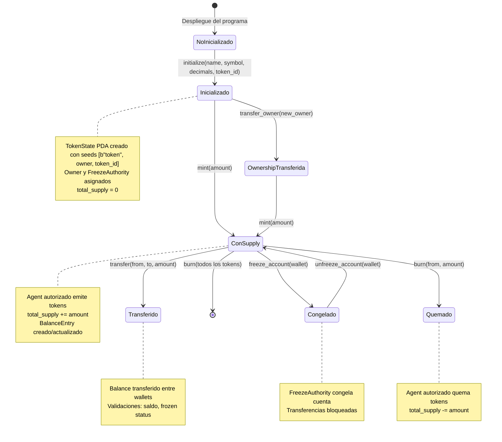
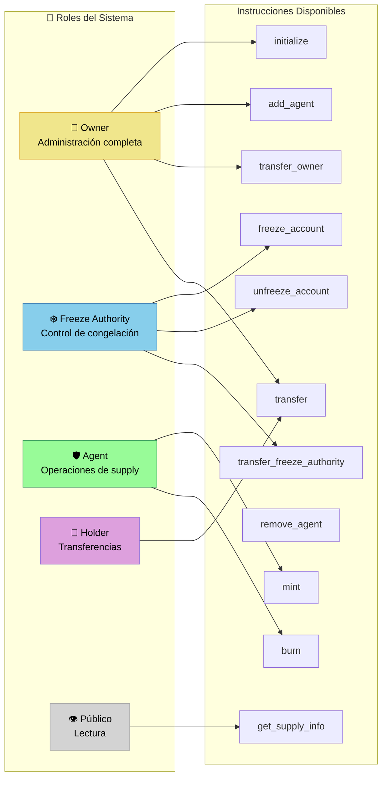

# Solana RWA Token Platform

Plataforma completa de tokenización de **Real World Assets (RWA)** sobre Solana con cumplimiento regulatorio integrado y **soporte multi-token**. Construida con Anchor Framework (Rust) para los smart contracts y Next.js para la interfaz web. Permite crear, gestionar y transferir múltiples tokens de seguridad desde una misma wallet con controles KYC/AML, restricciones de transferencia y módulos de cumplimiento extensibles.

## ✨ Novedades Multi-Token

**Cada wallet puede ahora crear y gestionar múltiples tokens diferenciados por `token_id`:**

- **Seeds PDA**: `[b"token", owner, token_id]` - permite un TokenState PDA único por combinación wallet+token_id
- **token_id**: Identificador de 16 bytes (alfanumérico, guiones y underscores) que diferencia tokens del mismo owner
- **Gestión**: La página `/manage` incluye un selector para cambiar entre tokens del wallet conectado
- **Compatibilidad**: Todos los balances, agentes y estados de congelación se derivan dinámicamente del TokenState seleccionado

## 🎯 Características Principales

### Smart Contracts (Rust + Anchor)

Tres programas coordinados que implementan un ecosistema completo de tokens regulados:

| Programa | Descripción | Program ID (Localnet) |
|----------|-------------|----------------------|
| **solana-rwa** | Programa principal de tokenización con gestión de balances, supply, agentes autorizados y congelación de cuentas | `2XuB3ngjvJkMTxB82eM9NszBUGNovjuJUs4mzdez7EEX` |
| **identity-registry** | Registro on-chain de identidades verificadas con datos de perfil (nombre, símbolo, metadata) | `5SeHm9i7CcgHqF9UBYBtGbzqf3F3FWFETQF8AxfU2Rce` |
| **compliance-aggregator** | Agregador modular de reglas de cumplimiento que valida transferencias contra múltiples módulos | `7cURjJvyf3oe6JsuVxS9EiVHKNauiFj7Gao3THzZSnpb` |

#### solana-rwa - Programa Principal de Tokens

Gestiona el ciclo de vida completo de un token RWA con arquitectura basada en **PDAs (Program Derived Addresses)** para balances y estados de congelación:

| Instrucción | Permisos Requeridos | Descripción |
|-------------|---------------------|-------------|
| `initialize(name, symbol, decimals, token_id)` | Owner (payer) | Crea el TokenState PDA con los parámetros del token. Seeds: `[b"token", owner, token_id]`. Establece al caller como owner y freeze_authority |
| `mint(to, amount)` | Agent autorizado | Emite nuevos tokens hasta el límite MAX_SUPPLY. Actualiza el balance PDA del destinatario y el total_supply |
| `burn(from, amount)` | Agent autorizado | Destruye tokens de un balance específico. Reduce el total_supply proporcionalmente |
| `transfer(from, to, amount)` | Sender (signer) | Transfiere tokens entre balances PDAs. Valida saldo suficiente y rechaza montos cero |
| `freeze_account(account)` | Freeze authority | Crea una entrada en frozen_accounts PDA que bloquea transferencias de la cuenta objetivo |
| `unfreeze_account(account)` | Freeze authority | Elimina la entrada de congelación, restaurando la capacidad de transferencia |
| `add_agent(agent)` | Owner | Agrega un nuevo agente autorizado al listado del token. Los agentes pueden mintear y quemar |
| `remove_agent()` | Agent (self) | Permite a un agente renunciar a su rol. Solo el propio agente puede invocarlo |
| `transfer_owner(new_owner)` | Owner | Transfiere la propiedad del token. El nuevo owner hereda todos los permisos de administración |
| `transfer_freeze_authority(new_authority)` | Freeze authority | Transfiere la autoridad de congelación. Separada del owner para gobernanza delegada |
| `get_supply_info()` | Público | Retorna SupplyInfo con total_supply, max_supply y remaining_supply sin modificar estado |

**Modelo de datos:**
- **TokenState** (PDA `[b"token", owner, token_id]`): Estado principal con owner, freeze_authority, name, symbol, decimals, **token_id**, total_supply y bump (136 bytes)
- **BalanceEntry** (PDA por wallet): Balance individual derivado de `[b"balance", token, wallet]`
- **FrozenEntry** (PDA por wallet): Estado de congelación derivado de `[b"frozen", token, wallet]`
- **AgentEntry** (PDA por agente): Registro de agente derivado de `[b"agent", token, agent]`

#### identity-registry - Registro de Identidades

Sistema de registro on-chain que asocia direcciones wallet con identidades verificadas, incluyendo datos de perfil completos:

| Instrucción | Permisos Requeridos | Descripción |
|-------------|---------------------|-------------|
| `initialize()` | Payer | Crea el RegistryState PDA con el owner como administrador |
| `register_identity(wallet, identity)` | Wallet owner (signer) | Registra una identidad Pubkey-Pubkey para el wallet. Valida que wallet == owner |
| `register_identity_with_data(wallet, name, symbol, identity_data, metadata_uri)` | Wallet owner (signer) | Registra identidad con datos completos de perfil. Valida longitudes de strings contra constantes MAX_* |
| `update_identity(name, symbol, identity_data, metadata_uri)` | Identity owner o registry admin | Actualiza los datos de perfil de una identidad existente |
| `remove_identity()` | Identity owner | Cierra el IdentityAccount PDA y devuelve el SOL de rent al owner |

**Validaciones de seguridad:**
- **WalletMismatch**: El wallet registrado debe coincidir con el signer
- **StringTooLong**: Todos los campos de texto validados contra límites (name: 32, symbol: 10, identity_data: 64, metadata_uri: 128)
- **AlreadyRegistered / NotRegistered**: Prevención de registros duplicados y operaciones en identidades inexistentes

**Modelo de datos:**
- **IdentityRegistryState** (PDA `[b"registry"]`): Estado global con owner y registry_bump
- **IdentityAccount** (PDA `[b"identity", registry, owner]`): Perfil completo con wallet, identity, name, symbol, identity_data, metadata_uri

#### compliance-aggregator - Agregador de Cumplimiento

Motor modular de reglas de cumplimiento que permite asociar múltiples módulos de validación a cada token y verificar transferencias:

| Instrucción | Permisos Requeridos | Descripción |
|-------------|---------------------|-------------|
| `initialize()` | Payer | Crea el AggregatorState PDA con el owner como administrador |
| `add_module(token, module)` | Owner | Crea un nuevo TokenComplianceAccount PDA para el token con el primer módulo |
| `add_module_to_existing(module)` | Owner | Agrega un módulo a un TokenComplianceAccount existente. Valida duplicados |
| `remove_module(module)` | Owner | Elimina un módulo del listado. Usa swap-and-pop para mantener eficiencia |
| `can_transfer(token, sender, recipient, amount)` | Público | Evalúa si una transferencia cumple con todos los módulos activos. Retorna ComplianceCheckResult |
| `get_state()` | Público | Retorna AggregatorState con owner y bump |
| `get_module_count()` | Público | Retorna la cantidad de módulos activos para un token |
| `get_modules()` | Público | Retorna el listado completo de módulos Pubkey para un token |

**Modelo de datos:**
- **AggregatorState** (PDA `[b"aggregator"]`): Estado global con owner y aggregator_bump
- **TokenComplianceAccount** (PDA `[b"token_compliance", aggregator, token]`): Módulos asociados con token, module_count y array de módulos (máx. 10)

### Aplicación Web (Next.js + Solana Web3)

Interfaz completa para gestión de tokens RWA con conexión a wallets Solana:

| Página | Funcionalidad |
|--------|---------------|
| **/** (Home) | Landing page con overview de la plataforma, características y navegación a Deploy/Manage |
| **/deploy** | Formulario de despliegue de tokens con validación de parámetros (name, symbol, decimals, **token_id**) y conexión wallet |
| **/manage** | Dashboard completo de gestión con **selector multi-token**: transferencias, mint/burn, freeze/unfreeze, gestión de agentes, transferencia de ownership, módulos de compliance y registro de identidades |

**Componentes de Wallet:**
- **WalletProvider**: Contexto global con gestión de conexión, desconexión y firma de transacciones
- **WalletConnect**: Selector de wallets soportados (Phantom, Solflare, Ledger, Trezor, Coinbase)
- **NetworkStatus**: Indicador en tiempo real del estado de conexión y slot actual
- **NotificationContainer**: Sistema de notificaciones para resultados de transacciones

**Hooks Personalizados:**
- **useTokenActions**: Operaciones del programa solana-rwa (initialize, mint, burn, transfer, freeze, agents, ownership)
- **useComplianceActions**: Operaciones del compliance-aggregator (initialize, add/remove modules, can_transfer)
- **useIdentityActions**: Operaciones del identity-registry (initialize, register, update, remove)
- **useSolanaConnection**: Gestión de conexión RPC con reintentos y detección de red
- **useWalletManager**: Gestión unificada de selección y conexión de wallets

## 📁 Estructura del Proyecto

```
rwa/
├── solana-rwa/                  # Smart Contracts Solana (Anchor)
│   ├── programs/                # Programas Rust
│   │   ├── solana-rwa/          # Token principal (balances, supply, agents, freeze)
│   │   │   ├── src/lib.rs       # Instrucciones: initialize, mint, burn, transfer, freeze, agents
│   │   │   ├── src/states/      # TokenState, BalanceEntry, FrozenEntry, AgentEntry
│   │   │   ├── src/events/      # TokensMinted, TokensBurned, TokensTransferred, etc.
│   │   │   ├── src/errors/      # ErrorCode enum (Unauthorized, InsufficientBalance, etc.)
│   │   │   └── src/tests/       # 28 tests unitarios (states, pdas, errors, events, edge_cases)
│   │   ├── identity-registry/   # Registro de identidades KYC
│   │   │   ├── src/lib.rs       # Instrucciones: initialize, register, update, remove
│   │   │   ├── src/states/      # IdentityRegistryState, IdentityAccount
│   │   │   ├── src/constants.rs # Límites de strings (MAX_NAME=32, MAX_SYMBOL=10, etc.)
│   │   │   └── src/tests/       # 18 tests unitarios (accounts, constants, errors, events, pdas)
│   │   └── compliance-aggregator # Motor de reglas de cumplimiento
│   │       ├── src/lib.rs       # Instrucciones: initialize, add/remove module, can_transfer
│   │       ├── src/states/      # AggregatorState, TokenComplianceAccount
│   │       └── src/tests/       # 16 tests unitarios (accounts, errors, events, pdas, transfer_checks)
│   ├── tests/                   # Tests de integración TypeScript
│   │   ├── solana-rwa.ts        # Entry point que importa todos los suites
│   │   ├── token-program.ts     # Tests de funcionalidad del token (819 líneas)
│   │   └── security/            # Tests de seguridad (42 casos SC-001 a SC-042)
│   │       ├── solana-rwa-security.ts       # Access control, transfer, mint/burn security
│   │       ├── compliance-aggregator-security.ts # Module management security
│   │       ├── identity-registry-security.ts    # Identity registration security
│   │       └── pda-enforcement.ts             # PDA derivation enforcement
│   ├── runbooks/                # Runbooks de despliegue (txtx/Surfpool)
│   │   ├── deployment/main.tx           # Despliegue de programas
│   │   ├── token-initialization/main.tx # Inicialización de token state
│   │   ├── compliance-initialization/main.tx # Inicialización de compliance
│   │   └── identity-initialization/main.tx    # Inicialización de identity registry
│   ├── Anchor.toml              # Configuración Anchor (Program IDs, cluster)
│   ├── Cargo.toml               # Workspace Rust (3 programas)
│   ├── txtx.yml                 # Manifiesto Surfpool (runbooks, signers, variables)
│   └── idl_*.json               # IDLs generados para cada programa
│
├── web/                         # Aplicación Frontend (Next.js 14)
│   ├── src/
│   │   ├── app/                 # App Router
│   │   │   ├── layout.tsx       # Root layout con SolanaProvider + QueryClient
│   │   │   ├── page.tsx         # Home page
│   │   │   ├── deploy/page.tsx  # Despliegue de tokens
│   │   │   └── manage/page.tsx  # Dashboard de gestión completo
│   │   ├── components/          # Componentes React
│   │   │   ├── WalletConnect.tsx      # Selector de wallets
│   │   │   ├── NetworkStatus.tsx      # Indicador de red
│   │   │   └── NotificationContainer.tsx # Notificaciones
│   │   ├── hooks/               # Hooks personalizados
│   │   │   ├── useTokenActions.ts       # Operaciones de token (1500+ líneas)
│   │   │   ├── useComplianceActions.ts  # Operaciones de compliance
│   │   │   ├── useIdentityActions.ts    # Operaciones de identidad
│   │   │   ├── useSolanaConnection.ts   # Gestión de conexión RPC
│   │   │   └── useWalletManager.ts      # Gestión de wallets
│   │   ├── anchor/              # Cliente Anchor
│   │   │   ├── client.ts        # Builders de instrucciones y ejecución de TXs
│   │   │   ├── pdas.ts          # Derivación de PDAs (balance, frozen, agent, etc.)
│   │   │   ├── solana-rwa.ts    # Serialización y builders para solana-rwa
│   │   │   ├── compliance.ts    # Builders para compliance-aggregator
│   │   │   ├── identity.ts      # Builders para identity-registry
│   │   │   └── idl/             # IDLs embebidos para tipado
│   │   ├── providers/           # Context providers
│   │   │   └── SolanaProvider.tsx # Provider global de Solana
│   │   ├── config/              # Configuración
│   │   │   └── solana.ts        # URLs de red y Program IDs
│   │   └── wallet/              # Sistema de wallets
│   │       ├── WalletProvider.tsx # Provider de wallets con logging
│   │       ├── types.ts         # Tipos TypeScript para wallets
│   │       └── logger.ts        # Logger con niveles y filtros
│   └── package.json
│
├── docs/                        # Documentación
│   ├── ARQUITECTURA.md          # Arquitectura técnica con diagramas UML
│   ├── DESPLIEGUE.md            # Guía de despliegue paso a paso
│   ├── SURFPOOL_TXTX.md         # Guía completa de Surfpool y txtx (IaC)
│   └── USUARIO_GUIDE.md         # Guía de usuario para la interfaz /manage
│
├── plans/                       # Planes de desarrollo
│   ├── architecture-audit-and-optimization-plan.md
│   ├── git-commit-plan.md
│   ├── solana-integrity-verification-plan.md
│   └── test-refactoring-plan.md
│
├── README.md                    # Este archivo
└── .roo/                        # Configuración de Agent Skills
```

## 🏗️ Arquitectura

### Diagrama de Componentes del Sistema



### Diagrama de Clases - Modelos de Datos On-Chain



### Diagrama de Secuencia - Flujo de Transferencia



### Diagrama de Secuencia - Flujo de Despliegue



### Diagrama de Estados - Ciclo de Vida del Token



### Diagrama de Roles y Permisos



## 🚀 Inicio Rápido

### Prerrequisitos

| Software | Versión | Comando de Instalación |
|----------|---------|------------------------|
| **Rust** | latest | `curl --proto '=https' --tlsv1.2 -sSf https://sh.rustup.rs \| sh` |
| **Solana CLI** | v1.18+ | `sh -c "$(curl -sSfL https://release.solana.com/v1.18.18/install)"` |
| **Anchor CLI** | 0.30.x | `cargo install --git https://github.com/coral-xyz/anchor avm --locked` |
| **Node.js** | 18+ | `nvm install 18` |
| **Surfpool** | latest | Para despliegues con txtx runbooks |

### Inicio Rápido (Recomendado)

```bash
# 1. Compilar y desplegar smart contracts
cd solana-rwa
anchor build
anchor deploy

# 2. Iniciar validador local (terminal separada)
solana-test-validator --reset

# 3. Iniciar frontend
cd ../web
npm install
npm run dev
```

Abre [http://localhost:3000](http://localhost:3000) en tu navegador.

### Despliegue con Surfpool (Automatizado)

```bash
cd solana-rwa

# Iniciar infraestructura con Surfpool
surfpool start --no-deploy

# Ejecutar runbooks de inicialización
txtx run token-initialization --env localnet
txtx run compliance-initialization --env localnet
txtx run identity-initialization --env localnet
```

### Configuración de Wallet

Para desarrollo local, configura tu wallet para conectar a localhost:

**Phantom Wallet:**
1. Abre la extensión Phantom
2. Configuración → Developer → Custom RPC
3. URL: `http://localhost:8899`

**Solflare Wallet:**
1. Abre Solflare
2. Configuración → Network → Custom RPC
3. URL: `http://localhost:8899`

### Obtener SOL de Prueba

```bash
# Airdrop al wallet por defecto
solana airdrop 100

# A wallet específico
solana airdrop 100 <YOUR_WALLET_ADDRESS>
```

## 📖 Guía de Uso

### Desplegar un Token

1. Conecta tu wallet con el botón "Connect Wallet"
2. Navega a la página **Deploy**
3. Completa la configuración del token:
   - **Token Name**: Nombre del token (máx. 32 caracteres)
   - **Symbol**: Símbolo del token (máx. 8 caracteres)
   - **Decimals**: Precisión decimal (0-18, típico: 9)
   - **Token ID**: Identificador único (máx. 16 caracteres, alfanumérico/guiones/underscores)
4. Haz clic en "Deploy Token"
5. Confirma la transacción en tu wallet
6. Espera la confirmación on-chain (~10-30 segundos)

> **Nota Multi-Token**: Puedes crear múltiples tokens desde la misma wallet usando diferentes `token_id`. Cada token tiene su propio TokenState PDA, balances, agentes y estados de congelación independientes.

### Gestionar Tokens (Página /manage)

| Acción | Permisos | Descripción |
|--------|----------|-------------|
| **Transfer** | Cualquier holder | Enviar tokens a otra dirección wallet |
| **Mint** | Agent autorizado | Emitir nuevos tokens (respetando MAX_SUPPLY) |
| **Burn** | Agent autorizado | Destruir tokens permanentemente |
| **Freeze** | Freeze authority | Congelar una cuenta (bloquea transferencias) |
| **Unfreeze** | Freeze authority | Descongelar una cuenta previamente congelada |
| **Add Agent** | Owner | Agregar agente autorizado (puede mint/burn) |
| **Transfer Owner** | Owner | Transferir propiedad del token a otro wallet |
| **Transfer Freeze Authority** | Freeze authority | Delegar autoridad de congelación |
| **Get Supply Info** | Público | Consultar total_supply, max_supply, remaining_supply |

### Gestión de Compliance

| Acción | Permisos | Descripción |
|--------|----------|-------------|
| **Initialize Compliance** | Payer | Crear el AggregatorState PDA |
| **Add Module** | Owner | Asociar módulo de compliance a un token |
| **Get Aggregator State** | Público | Consultar estado del agregador |

### Registro de Identidades

| Acción | Permisos | Descripción |
|--------|----------|-------------|
| **Initialize Registry** | Payer | Crear el RegistryState PDA |
| **Register Identity** | Wallet owner | Registrar identidad Pubkey-Pubkey |
| **Register with Data** | Wallet owner | Registrar con nombre, símbolo, datos y metadata |
| **Get Identity** | Público | Consultar identidad registrada |

## 🔒 Características de Seguridad

### Control de Acceso Basado en Roles

| Rol | Permisos | Instrucciones |
|-----|----------|---------------|
| **Owner** | Administración completa | initialize, add_agent, transfer_owner |
| **Freeze Authority** | Control de congelación | freeze_account, unfreeze_account, transfer_freeze_authority |
| **Agent** | Operaciones de supply | mint, burn |
| **Holder** | Transferencias | transfer (si no está frozen) |
| **Público** | Lectura | get_supply_info, get_state, get_identity |

### Protecciones On-Chain

- **Derivación PDA multi-token**: TokenState usa seeds `[b"token", owner, token_id]` para aislamiento completo entre tokens del mismo owner
- **Seeds dinámicas**: Todas las instrucciones derivan PDAs desde el TokenState cargado (`token.load()?.owner`, `token.load()?.token_id`)
- **Validación de signers**: Cada instrucción verifica que el caller tenga el rol requerido
- **Protección contra overflow**: Operaciones aritméticas con `checked_add`/`checked_sub` y límites MAX_SUPPLY
- **Prevención de duplicados**: Validación de agentes e identidades duplicadas
- **Validación de strings**: Límites de longitud en todos los campos de texto (identity-registry y token_id)
- **Separación de autoridades**: Owner y Freeze Authority son roles independientes para gobernanza segura

### Suite de Tests

| Tipo | Cantidad | Cobertura |
|------|----------|-----------|
| **Rust unit tests** | 62 tests | States, PDAs, errors, events, constants, edge cases |
| **TypeScript integration tests** | 42+ casos SC | Access control, transfer security, mint/burn, freeze, agents |
| **Security tests** | SC-001 a SC-042 | Casos de seguridad específicos con nombres descriptivos |

## 🧪 Testing

### Tests de Smart Contracts (Rust)

```bash
cd solana-rwa

# Ejecutar todos los tests unitarios
cargo test --lib

# Tests por programa
cargo test --lib -p solana-rwa           # 28 tests
cargo test --lib -p compliance-aggregator # 16 tests
cargo test --lib -p identity-registry     # 18 tests
```

### Tests de Integración (TypeScript)

```bash
cd solana-rwa

# Con validador local corriendo
anchor test

# O manualmente
yarn run ts-mocha -p ./tsconfig.json -t 1000000 "tests/**/*.ts"
```

### Frontend

```bash
cd web

# Linting
npm run lint

# Build (verifica TypeScript)
npm run build
```

## 📚 Documentación

| Documento | Descripción |
|-----------|-------------|
| [ARQUITECTURA.md](docs/ARQUITECTURA.md) | Arquitectura técnica con diagramas UML y flujos de datos |
| [DESPLIEGUE.md](docs/DESPLIEGUE.md) | Guía detallada de despliegue con troubleshooting |
| [SURFPOOL_TXTX.md](docs/SURFPOOL_TXTX.md) | Guía completa de Surfpool y txtx para IaC |
| [USUARIO_GUIDE.md](docs/USUARIO_GUIDE.md) | Guía de usuario para la interfaz /manage |

## 🛠️ Stack Tecnológico

### Smart Contracts
| Componente | Tecnología |
|------------|------------|
| Language | Rust |
| Framework | Anchor 0.32.1 |
| Testing | Cargo test (Rust) + Mocha/Chai (TypeScript) |
| Deployment | Surfpool + txtx runbooks |

### Frontend
| Componente | Tecnología |
|------------|------------|
| Framework | Next.js 14 (App Router) |
| Language | TypeScript 5.x |
| UI | React 19 |
| Styling | TailwindCSS v4 |
| Wallets | @solana/wallet-adapter + wallet-standard |
| State | @tanstack/react-query |
| Blockchain | @solana/web3.js |
| Multi-Token | Selector token_id en /manage para gestionar múltiples tokens |

## 📝 Variables de Entorno

| Variable | Descripción | Valor por Defecto |
|----------|-------------|-------------------|
| `NEXT_PUBLIC_SOLANA_NETWORK` | Red objetivo | `localnet` |
| `NEXT_PUBLIC_SOLANA_RPC_ENDPOINT` | URL del RPC | `http://localhost:8899` |
| `NEXT_PUBLIC_SOLANA_RWA_PROGRAM_ID` | Program ID del token | Ver Anchor.toml |
| `NEXT_PUBLIC_IDENTITY_REGISTRY_PROGRAM_ID` | Program ID de identidades | Ver Anchor.toml |
| `NEXT_PUBLIC_COMPLIANCE_AGGREGATOR_PROGRAM_ID` | Program ID de compliance | Ver Anchor.toml |

## 🚦 Configuración de Redes

| Red | RPC URL | Explorer |
|-----|---------|----------|
| **Localnet** | `http://localhost:8899` | Local |
| **Devnet** | `https://api.devnet.solana.com` | [explorer.solana.com](https://explorer.solana.com/?cluster=devnet) |
| **Mainnet** | `https://api.mainnet-beta.solana.com` | [explorer.solana.com](https://explorer.solana.com/) |

## 📄 Licencia

MIT

## 🤝 Contribución

Este proyecto es con fines educativos y de demostración. Para uso en producción:

1. Realiza una auditoría de seguridad profesional
2. Asegura el cumplimiento legal con regulaciones locales
3. Implementa gestión segura de claves (HSM, multi-sig)
4. Añade soporte multi-firma para operaciones críticas
5. Configura monitoreo y alertas en tiempo real

## 📊 Estadísticas del Proyecto

| Métrica | Valor |
|---------|-------|
| Smart Contracts | 3 programas Anchor |
| Arquitectura Multi-Token | Soporte completo (seeds `[b"token", owner, token_id]`) |
| Tests Unitarios (Rust) | 62 tests (100% passing) |
| Tests de Seguridad (TS) | 42+ casos (SC-001 a SC-042) |
| Páginas Frontend | 3 (Home, Deploy, Manage) |
| Wallets Soportados | 5+ (Phantom, Solflare, Ledger, Trezor, Coinbase) |
| Tiempo de Transacción | < 1 segundo |
| Costo Promedio | < $0.01 por transacción |

---

**Construido con Anchor Framework & Next.js sobre Solana Blockchain**
