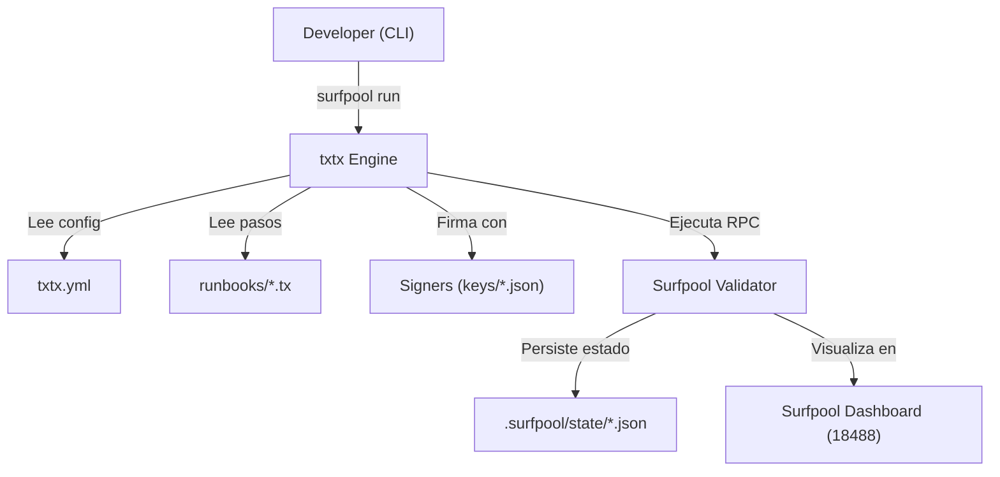

# Guía de Surfpool & txtx - Infraestructura como Código (IaC)

Esta guía detalla el uso de **Surfpool** y **txtx** para la implementación y gestión automatizada de la plataforma Solana RWA. Este enfoque sustituye los scripts manuales por un sistema de *Infraestructura como Código* (IaC) similar a Terraform, pero especializado en Web3.

## 🛠️ Herramientas Incluidas

| Herramienta | Propósito | Acceso |
|-------------|-----------|--------|
| **Surfpool CLI** | Orquestador de nodo local y ejecución de runbooks. | `surfpool` |
| **txtx Engine** | Motor de ejecución IaC que interpreta archivos `.tx`. | Integrado en `surfpool` |
| **Local Validator** | Nodo de Solana pre-configurado para desarrollo. | `localhost:8899` |
| **Surfpool Dashboard** | Interfaz web para monitorear transacciones y estados. | `http://localhost:18488` |

---

## 📈 Flujo de Ejecución

El siguiente diagrama explica cómo interactúan los componentes durante un despliegue:



---

## ⚙️ Estructura de Configuración

### 1. `txtx.yml` (El Orquestador)
Este archivo define los entornos (localnet, devnet, mainnet) y los runbooks disponibles.

```yaml
name: solana-rwa
id: solana-rwa
runbooks:
  - name: deployment
    description: Despliegue completo
    location: ./runbooks/deployment
    state:
      location: .surfpool/state

environments:
  localnet:
    network_id: localnet
    rpc_api_url: http://127.0.0.1:8899
    payer_keypair_json: ~/.config/solana/id.json
```

### 2. Archivos `.tx` (Los Pasos)
Definen acciones específicas mediante el addon `svm` (Solana Virtual Machine).

```hcl
addon "svm" {
    rpc_api_url = input.rpc_api_url
    network_id = input.network_id
}

signer "payer" "svm::secret_key" {
    keypair_json = input.payer_keypair_json
}

action "initialize_registry" "svm::process_instructions" {
    instruction {
        program_id = variable.program_id
        signers = [signer.payer]
        accounts = [ ... ]
        data = "initialize"
    }
}
```

---

## 🚀 Secuencia de Comandos (Orden de Despliegue)

Es CRÍTICO seguir este orden para respetar las dependencias entre programas:

1.  **Iniciar Entorno**:
    ```bash
    surfpool start
    ```

2.  **Desplegar Binarios (Anchor)**:
    ```bash
    cd solana-rwa
    ./deploy.sh
    ```

3.  **Inicializar Estados (txtx)**:
    ```bash
    # Ejecuta el script que orquestas los runbooks de txtx
    ./init.sh
    ```

### Orden Interno de `init.sh`:
1. `compliance-initialization`: Crea el agregador base.
2. `identity-initialization`: Crea el registro de identidades (depende del anterior).
3. `token-initialization`: Configura el token RWA (depende de ambos).

---

## 🔍 Depuración y Verificación

### ¿Cómo saber si fue exitoso?

1.  **Consola**: `txtx` mostrará un check verde ✅ por cada acción completada y un resumen de `outputs` al final.
2.  **Dashboard**: Abre `http://localhost:18488` y verifica que las transacciones aparezcan como "Confirmed".
3.  **Estado Local**: Revisa `.surfpool/state/`. Si el archivo JSON contiene datos, `txtx` sabe que la infraestructura ya fue creada.

### Validación de Configuración
Antes de ejecutar, puedes validar la sintaxis:
```bash
surfpool validate --environment localnet
```

### Problemas Comunes
- **NetworkError**: Verifica que `surfpool start` esté corriendo.
- **Unauthorized**: Asegúrate de que las keys en `keys/*.json` coincidan con la `authority` del programa.
- **Account Already Exists**: `txtx` intenta ser idempotente. Si falla a mitad, puedes re-ejecutar; si ya existe, fallará a menos que la acción soporte updates.

---

## 🧰 Detalle de Herramientas del Nodo Local

- **Snapshot Management**: Surfpool permite guardar y cargar snapshots del estado de la blockchain (`surfpool snapshot save/load`).
- **Payer Faucet**: El nodo local viene con una cuenta cargada de SOL para pagar fees.
- **Log Streamer**: Puedes ver los logs de los programas en tiempo real:
  ```bash
  solana logs -u localhost
  ```
- **txtx Explorer**: Permite ver la documentación de los runbooks generada automáticamente desde los archivos `.tx`.
