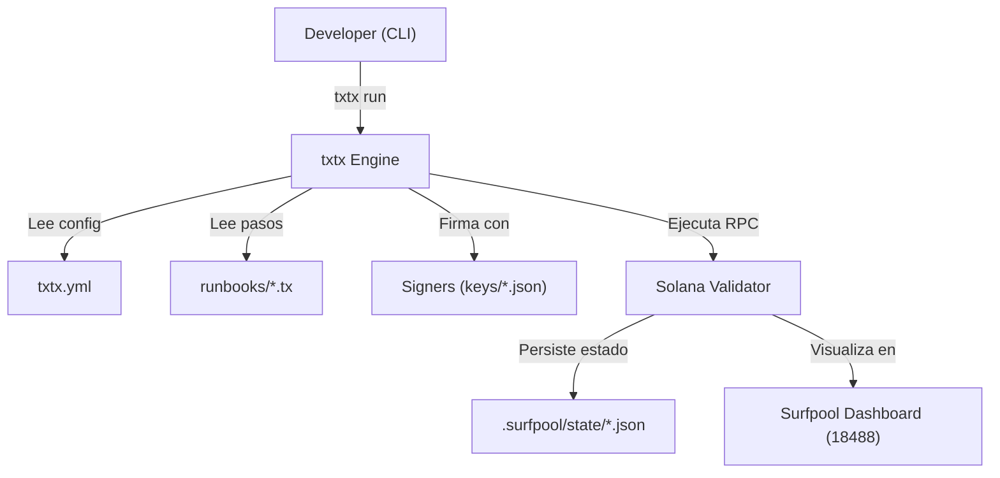

# Guía Completa de Surfpool & txtx - Infraestructura como Código (IaC)

Esta guía detalla el uso de **Surfpool** y **txtx** para la implementación y gestión automatizada de la plataforma Solana RWA. Este enfoque sustituye los scripts manuales por un sistema de *Infraestructura como Código* (IaC) similar a Terraform, pero especializado en Web3.

**Versión del addon**: `txtx-addon-network-svm-0.3.21`

---

## 🛠️ Herramientas Incluidas

| Herramienta | Propósito | Acceso |
|-------------|-----------|--------|
| **Surfpool CLI** | Orquestador de nodo local y ejecución de runbooks. | `surfpool` |
| **txtx Engine** | Motor de ejecución IaC que interpreta archivos `.tx`. | `txtx run <runbook>` |
| **Local Validator** | Nodo de Solana pre-configurado para desarrollo. | `localhost:8899` |
| **Surfpool Dashboard** | Interfaz web para monitorear transacciones y estados. | `http://localhost:18488` |

---

## 📈 Flujo de Ejecución



---

## 📋 Arquitectura de Configuración

### 1. `txtx.yml` - El Manifiesto Principal

El archivo `txtx.yml` es el punto de entrada. Define:
- Los **runbooks** disponibles (nombre, descripción, ubicación)
- Los **entornos** (localnet, devnet, mainnet) con sus variables

#### Estructura del Manifiesto

```yaml
name: solana-rwa              # Nombre del proyecto
id: solana-rwa                # Identificador único

runbooks:
  - name: compliance-initialization        # Nombre con el que se invoca
    description: "Initialize compliance aggregator"  # Descripción
    location: ./runbooks/compliance-initialization   # Ruta al directorio con main.tx

environments:
  localnet:
    network_id: localnet                        # Identificador de red
    rpc_api_url: http://127.0.0.1:8899          # URL del RPC
    payer_keypair_json: ~/.config/solana/id.json  # Keypair del pagador
    authority_keypair_json: ~/.config/solana/id.json  # Keypair de autoridad

    # Variables de configuración del entorno
    token_name: "RWA Token"
    token_symbol: "RWA"
    token_decimals: 9

    # Program IDs - DEBEN coincidir con los programas desplegados
    solana_rwa_program_id: "2XuB3ngjvJkMTxB82eM9NszBUGNovjuJUs4mzdez7EEX"
    identity_registry_program_id: "5SeHm9i7CcgHqF9UBYBtGbzqf3F3FWFETQF8AxfU2Rce"
    compliance_aggregator_program_id: "7cURjJvyf3oe6JsuVxS9EiVHKNauiFj7Gao3THzZSnpb"
```

#### ¿Dónde Obtener los Valores?

| Variable | Origen |
|----------|--------|
| `network_id` | `localnet`, `devnet`, o `mainnet` |
| `rpc_api_url` | URL del nodo Solana (`http://127.0.0.1:8899` para localnet) |
| `payer_keypair_json` | Ruta al archivo `.json` del keypair (ej: `~/.config/solana/id.json`) |
| `*_program_id` | **Program ID desplegado** (ver sección "Gestión de Program IDs") |
| `token_name`, `token_symbol`, `token_decimals` | Valores personalizados del token |

---

## 📝 Estructura de Archivos `.tx` (Runbooks)

Los archivos `.tx` son archivos declarativos que definen las transacciones a ejecutar. Cada runbook debe contener un archivo `main.tx` en su directorio.

### Anatomía Completa de un Archivo `.tx`

Un archivo `.tx` se compone de **5 secciones principales** en este orden:

```
1. addon          → Configuración del addon SVM
2. signer         → Definición de firmantes
3. variable       → Variables locales del runbook
4. action         → Acciones (transacciones) a ejecutar
5. output         → Resultados a mostrar
```

---

### Sección 1: `addon` - Configuración del Addon SVM

**Propósito**: Configura la conexión al nodo Solana.

```txtx
addon "svm" {
    rpc_api_url = input.rpc_api_url    # URL del RPC (viene de txtx.yml)
    network_id = input.network_id      # Identificador de red (viene de txtx.yml)
}
```

| Campo | Tipo | Origen | Descripción |
|-------|------|--------|-------------|
| `rpc_api_url` | string | `input.rpc_api_url` | URL del nodo Solana |
| `network_id` | string | `input.network_id` | `localnet`, `devnet`, `mainnet` |

**Nota**: Los valores `input.*` se resuelven automáticamente desde la sección `environments` del `txtx.yml` correspondiente al `--env` especificado.

---

### Sección 2: `signer` - Definición de Firmantes

**Propósito**: Define las cuentas que firmarán las transacciones.

```txtx
signer "payer" "svm::secret_key" {
    description = "Pays fees for initialization"
    keypair_json = input.payer_keypair_json
}

signer "authority" "svm::secret_key" {
    description = "Authority for operations"
    keypair_json = input.authority_keypair_json
}
```

| Campo | Tipo | Obligatorio | Descripción |
|-------|------|-------------|-------------|
| Nombre | string | Sí | Identificador del signer (ej: `"payer"`) |
| Tipo | string | Sí | `"svm::secret_key"` para keypairs |
| `description` | string | No | Descripción del signer |
| `keypair_json` | string | Sí | Ruta al archivo `.json` del keypair |

**Tipos de Signer Disponibles**:
- `"svm::secret_key"`: Keypair desde archivo JSON (estándar de Solana)

**Acceso al public_key**: Una vez definido, se accede con `signer.<nombre>.public_key`.

---

### Sección 3: `variable` - Variables Locales

**Propósito**: Define variables reutilizables dentro del runbook.

```txtx
# Variable desde input de txtx.yml
variable "compliance_aggregator_program_id" {
    value = input.compliance_aggregator_program_id
}

# Variable desde función del addon SVM
variable "compliance_aggregator_program" {
    value = svm::get_program_from_anchor_project("compliance_aggregator")
}

# Variable con valor literal
variable "token_name" {
    value = input.token_name
}

# Variable numérica
variable "token_decimals" {
    value = input.token_decimals
}
```

| Campo | Tipo | Descripción |
|-------|------|-------------|
| Nombre | string | Identificador de la variable |
| `value` | any | Valor de la variable (input, función, literal) |

**Acceso**: `variable.<nombre>`

---

### Sección 4: `action` - Acciones (Transacciones)

**Propósito**: Define las transacciones que se ejecutarán. Es el núcleo del runbook.

#### Acción `svm::process_instructions` - Invocar Instrucciones de Programa

Esta es la acción principal para interactuar con programas Solana.

```txtx
action "initialize_compliance_aggregator" "svm::process_instructions" {
    description = "Initialize compliance aggregator state"
    signers = [signer.payer]

    instruction {
        program_id = variable.compliance_aggregator_program_id
        program_idl = variable.compliance_aggregator_program.idl
        instruction_name = "initialize"

        # Accounts (si la instrucción los requiere)
        payer {
            public_key = signer.payer.public_key
        }
    }
}
```

##### Campos de `action`

| Campo | Tipo | Obligatorio | Descripción |
|-------|------|-------------|-------------|
| Nombre | string | Sí | Identificador de la acción |
| Tipo | string | Sí | `"svm::process_instructions"` |
| `description` | string | No | Descripción de la acción |
| `signers` | array | Sí | Lista de signers que firman: `[signer.payer]` |

##### Campos de `instruction`

| Campo | Tipo | Obligatorio | Descripción |
|-------|------|-------------|-------------|
| `program_id` | string | **Sí** | Address SVM del programa (ej: `"7cURjJvyf3oe6JsuVxS9EiVHKNauiFj7Gao3THzZSnpb"`) |
| `program_idl` | string | **Sí** | IDL del programa (desde `variable.<prog>.idl`) |
| `instruction_name` | string | **Sí** | Nombre de la instrucción según el IDL (ej: `"initialize"`) |
| `instruction_args` | array | No | Argumentos de la instrucción en orden |

##### Bloques de Accounts

Dentro de `instruction`, se definen los accounts como **bloques nombrados** (no como array):

```txtx
instruction {
    program_id = variable.program_id
    program_idl = variable.program.idl
    instruction_name = "initialize"

    # Account "payer" - el pagador de la transacción
    payer {
        public_key = signer.payer.public_key
    }
}
```

**Reglas para accounts**:
1. El nombre del bloque debe coincidir con el nombre del account en el IDL
2. Se usa `public_key` para referenciar la clave pública
3. Los PDA se derivan automáticamente si no se proporcionan
4. **No incluir** `system_program` explícitamente (ya está definido en el IDL de Anchor)

**Tipos de referencia para `public_key`**:
- `signer.<nombre>.public_key` → Clave pública de un signer
- `"11111111111111111111111111111111"` → Clave pública literal (ej: System Program)

##### Ejemplo con Argumentos

```txtx
action "initialize_token" "svm::process_instructions" {
    description = "Initialize RWA token"
    signers = [signer.payer]

    instruction {
        program_id = variable.solana_rwa_program_id
        program_idl = variable.solana_rwa_program.idl
        instruction_name = "initialize"
        instruction_args = [variable.token_name, variable.token_symbol, variable.token_decimals]

        payer {
            public_key = signer.payer.public_key
        }
    }
}
```

Los `instruction_args` deben coincidir con el orden y tipo de los argumentos definidos en el IDL para la instrucción especificada.

---

### Sección 5: `output` - Resultados

**Propósito**: Define los valores que se mostrarán al completar el runbook.

```txtx
output "initialization_summary" {
    description = "Compliance aggregator initialization result"
    value = "Compliance aggregator initialized. Program ID: ${variable.compliance_aggregator_program_id}"
}
```

| Campo | Tipo | Obligatorio | Descripción |
|-------|------|-------------|-------------|
| Nombre | string | Sí | Identificador del output |
| `description` | string | No | Descripción del output |
| `value` | string | Sí | Valor a mostrar (soporta interpolación `${...}`) |

**Interpolación**: Usa `${variable.nombre}` o `${signer.nombre.public_key}` para insertar valores dinámicos.

---

## 🔧 Funciones del Addon SVM

### `svm::get_program_from_anchor_project(program_name)`

**Propósito**: Carga los artefactos de un programa Anchor, incluyendo el IDL.

**Parámetros**:
- `program_name`: Nombre del programa según `Anchor.toml` (ej: `"compliance_aggregator"`)

**Retorna**: Un objeto con:
- `.idl`: El IDL del programa (necesario para `program_idl`)
- `.program_id`: El Program ID (si está definido en el IDL)

**Uso**:
```txtx
variable "my_program" {
    value = svm::get_program_from_anchor_project("compliance_aggregator")
}

# Luego en la acción:
program_idl = variable.my_program.idl
```

**Nota**: Esta función busca los artefactos en el directorio `target/deploy/` generado por `anchor build`. El nombre debe coincidir con la sección `[programs.localnet]` de `Anchor.toml`.

---

## 🔑 Gestión de Program IDs

### Problema Crítico: Coherencia de Program IDs

Los Program IDs deben ser **consistentes** en 4 lugares:

```
┌─────────────────────────────────────────────────────────────────┐
│                    FUENTES DE PROGRAM IDs                       │
├─────────────────────────────────────────────────────────────────┤
│                                                                 │
│  1. declare_id!("...")  →  programs/<name>/src/lib.rs          │
│         ↓ debe coincidir con ↓                                  │
│  2. [programs.localnet] →  Anchor.toml                         │
│         ↓ debe coincidir con ↓                                  │
│  3. environments.localnet → txtx.yml                           │
│         ↓ debe coincidir con ↓                                  │
│  4. Programa desplegado   →  Solana Blockchain                 │
│                                                                 │
└─────────────────────────────────────────────────────────────────┘
```

### Error `DeclaredProgramIdMismatch` (0x1004)

**Síntoma**:
```
AnchorError occurred. Error Code: DeclaredProgramIdMismatch.
Error Number: 4100.
Error Message: The declared program id does not match the actual program id.
```

**Causa**: El `declare_id!()` en el código Rust no coincide con el Program ID desplegado en la blockchain.

**Solución**:
1. Verificar el ID desplegado:
   ```bash
   solana program show <PROGRAM_ID> --url http://127.0.0.1:8899
   ```
2. Actualizar `declare_id!()` en `programs/<name>/src/lib.rs`
3. Rebuild: `anchor build`
4. Redeploy con el keypair correcto:
   ```bash
   solana program deploy target/deploy/<program>.so \
     --program-id keys/<program>.json \
     --url http://127.0.0.1:8899
   ```
5. Actualizar `txtx.yml` y `Anchor.toml` con el nuevo ID

### Error "This program may not be used for executing instructions"

**Causa**: El `program_id` especificado en el runbook no existe en la blockchain.

**Solución**:
1. Verificar que el programa está desplegado:
   ```bash
   solana program show <PROGRAM_ID> --url http://127.0.0.1:8899
   ```
2. Si no existe, desplegar: `./deploy.sh`
3. Verificar que el `program_id` en `txtx.yml` coincide con el desplegado

---

## 🚀 Secuencia de Comandos (Orden de Despliegue)

### Flujo Completo

```bash
# 1. Iniciar el validador local
surfpool start

# 2. Desplegar programas (Anchor)
cd solana-rwa
./deploy.sh                    # Deploy a localnet

# 3. Inicializar estados (txtx)
./init.sh localnet             # Ejecuta los 3 runbooks en orden
```

### Orden de Ejecución de Runbooks

1. **`compliance-initialization`**: Crea el agregador de compliance (sin dependencias)
2. **`identity-initialization`**: Crea el registro de identidades
3. **`token-initialization`**: Configura el token RWA (depende de ambos anteriores)

### Ejecución Manual

```bash
# Individualmente:
txtx run compliance-initialization --env localnet
txtx run identity-initialization --env localnet
txtx run token-initialization --env localnet
```

---

## 📖 Referencia Completa de Sintaxis

### Ejemplo Completo: Runbook de Inicialización

```txtx
################################################################
# Ejemplo: Inicialización de Compliance Aggregator
################################################################

# =====================================================================
# 1. ADDON - Configuración del addon SVM
# =====================================================================
addon "svm" {
    rpc_api_url = input.rpc_api_url
    network_id = input.network_id
}

# =====================================================================
# 2. SIGNERS - Definición de firmantes
# =====================================================================
signer "payer" "svm::secret_key" {
    description = "Pays fees for compliance aggregator initialization"
    keypair_json = input.payer_keypair_json
}

signer "authority" "svm::secret_key" {
    description = "Authority for compliance aggregator operations"
    keypair_json = input.authority_keypair_json
}

# =====================================================================
# 3. VARIABLES - Variables locales
# =====================================================================
# Variable desde input de txtx.yml
variable "compliance_aggregator_program_id" {
    value = input.compliance_aggregator_program_id
}

# Variable desde función SVM (carga IDL desde Anchor project)
variable "compliance_aggregator_program" {
    value = svm::get_program_from_anchor_project("compliance_aggregator")
}

# =====================================================================
# 4. ACTIONS - Transacciones a ejecutar
# =====================================================================
action "initialize_compliance_aggregator" "svm::process_instructions" {
    description = "Initialize compliance aggregator state (creates ComplianceAggregatorState PDA)"
    signers = [signer.payer]

    instruction {
        # Program ID - debe coincidir con el programa desplegado
        program_id = variable.compliance_aggregator_program_id

        # IDL - cargado desde artefactos de Anchor
        program_idl = variable.compliance_aggregator_program.idl

        # Nombre de la instrucción según el IDL
        instruction_name = "initialize"

        # Accounts - bloques nombrados que coinciden con el IDL
        payer {
            public_key = signer.payer.public_key
        }
    }
}

# =====================================================================
# 5. OUTPUTS - Resultados a mostrar
# =====================================================================
output "initialization_summary" {
    description = "Compliance aggregator initialization result"
    value = "Compliance aggregator initialized. Program ID: ${variable.compliance_aggregator_program_id}"
}
```

### Ejemplo con Argumentos

```txtx
action "initialize_token" "svm::process_instructions" {
    description = "Initialize RWA token (creates TokenState PDA with metadata)"
    signers = [signer.payer]

    instruction {
        program_id = variable.solana_rwa_program_id
        program_idl = variable.solana_rwa_program.idl
        instruction_name = "initialize"

        # Argumentos en el orden definido en el IDL
        instruction_args = [
            variable.token_name,      # string - nombre del token
            variable.token_symbol,    # string - símbolo del token
            variable.token_decimals   # u8 - decimales del token
        ]

        payer {
            public_key = signer.payer.public_key
        }
    }
}
```

---

## 🔍 Depuración y Verificación

### Verificar Estado de Ejecución

1. **Consola**: `txtx` mostrará checks verdes ✅ por cada acción completada
2. **Dashboard**: `http://localhost:18488` para ver transacciones "Confirmed"
3. **Estado Local**: `.surfpool/state/` contiene JSON con el estado persistente

### Validación de Configuración

```bash
# Validar sintaxis antes de ejecutar
txtx validate --environment localnet
```

### Problemas Comunes

| Error | Causa | Solución |
|-------|-------|----------|
| `NetworkError` | Validador no corriendo | `surfpool start` |
| `Unauthorized` | Keypair incorrecto | Verificar `payer_keypair_json` |
| `DeclaredProgramIdMismatch` | `declare_id!()` no coincide | Actualizar `declare_id!()` y redeploy |
| `program may not be used` | Programa no desplegado | `./deploy.sh` |
| `account could not be derived` | Account faltante en runbook | Agregar bloque de account |
| `data not found` | Campo incorrecto en instruction | Usar `program_idl` (no `idl`) |
| `Rust panic: range end index` | Account con formato incorrecto | Usar bloques nombrados, no strings |

### Logs en Tiempo Real

```bash
# Ver logs de programas
solana logs -u localhost

# Ver transacciones específicas
solana transaction <SIGNATURE> -u localhost
```

---

## 🧰 Herramientas del Nodo Local

- **Snapshot Management**: `surfpool snapshot save/load`
- **Payer Faucet**: Cuenta pre-cargada con SOL para fees
- **Log Streamer**: `solana logs -u localhost`
- **txtx Explorer**: Documentación automática desde archivos `.tx`

---

## 📚 Referencia Rápida

### Mapeo de Campos IDL → Runbook

```
IDL (Anchor)                    Runbook (.tx)
─────────────                   ─────────────
instruction.name         →      instruction_name = "initialize"
instruction.args[]       →      instruction_args = [var1, var2]
accounts[].name          →      <name> { public_key = ... }
accounts[].is_signer     →      (usar signer.*.public_key)
accounts[].is_pda        →      (se deriva automáticamente)
metadata.address         →      program_id = "..."
```

### Funciones SVM Disponibles

| Función | Propósito |
|---------|-----------|
| `svm::get_program_from_anchor_project(name)` | Carga IDL y artefactos de Anchor |
| `svm::process_instructions` | Acción para invocar instrucciones |
| `svm::secret_key` | Tipo de signer para keypairs |

### Patrones Comunes

**Referenciar un signer**:
```txtx
signer.payer.public_key
```

**Referenciar una variable**:
```txtx
variable.my_program_id
```

**Referenciar un input**:
```txtx
input.rpc_api_url
```

**Interpolación en strings**:
```txtx
value = "Program: ${variable.program_id}"
```
