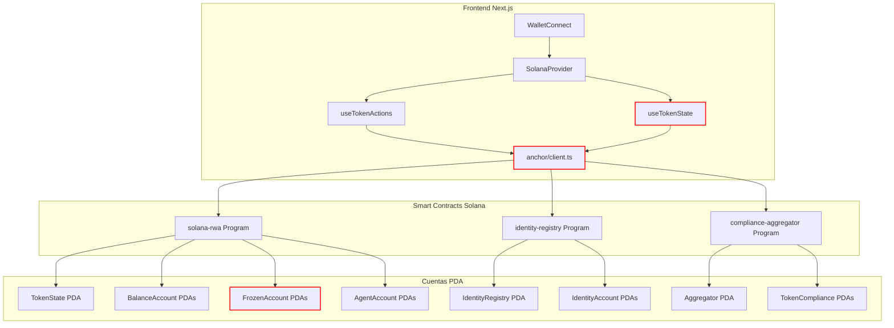

# Auditoria de Arquitectura y Plan de Optimizacion - Solana RWA

## 1. ANALISIS PROFUNDO DE INCONSISTENCIAS EN SMART CONTRACTS

### 1.1 CRITICO: Inconsistencias entre `solana-rwa` y `useTokenState.ts`

**Problema:** El hook `useTokenState.ts` deserializa datos asumiendo un layout Borsh con `Vec<BalanceEntry>`, `Vec<FrozenEntry>`, `Vec<Pubkey>` dentro del `TokenState`. Sin embargo, el smart contract actual usa **arquitectura PDA distribuida** donde cada balance, frozen y agent son cuentas separadas.

| Campo | Definicion Rust (`token_state.rs`) | Definicion TypeScript (`useTokenState.ts`) | Estado |
|-------|-----------------------------------|------------------------------------------|--------|
| `owner` | `Pubkey` (32 bytes) | `readPubkey()` | ✅ Compatible |
| `freeze_authority` | `Pubkey` (32 bytes) | NO LEIDO | ❌ Faltante |
| `total_supply` | `u64` (8 bytes) | `readU64()` como `totalSupply` | ✅ Compatible |
| `next_index` | `u64` (8 bytes) | `readU64()` como `nextIndex` | ✅ Compatible |
| `name` | `[u8; 32]` (fixed array) | `readString()` (Borsh String con len prefix) | ❌ INCOMPATIBLE |
| `symbol` | `[u8; 10]` (fixed array) | `readString()` (Borsh String con len prefix) | ❌ INCOMPATIBLE |
| `decimals` | `u8` (1 byte) | `readU8()` | ✅ Compatible |
| `bump` | `u8` (1 byte) | NO LEIDO | ❌ Faltante |
| `_padding` | `[u8; 4]` (4 bytes) | NO LEIDO | ❌ Faltante |
| `balances` | NO EXISTE (PDAs separados) | `readBalanceEntryVec()` | ❌ INEXISTENTE |
| `frozen_accounts` | NO EXISTE (PDAs separados) | `readFrozenEntryVec()` | ❌ INEXISTENTE |
| `agents` | NO EXISTE (PDAs separados) | `readPubkeyVec()` | ❌ INEXISTENTE |
| `compliance_modules` | NO EXISTE | `readPubkeyVec()` | ❌ INEXISTENTE |

**Impacto:** El frontend NO puede leer correctamente el estado del token. La deserializacion fallara silenciosamente o devolvera datos corruptos.

**Solucion:** Reescribir `deserializeTokenState()` para usar el layout `zero_copy` con `#[repr(C)]`:
```rust
// Layout real de TokenState (zero_copy, repr(C)):
// Offset 0:   owner: Pubkey (32 bytes)
// Offset 32:  freeze_authority: Pubkey (32 bytes)
// Offset 64:  total_supply: u64 (8 bytes)
// Offset 72:  next_index: u64 (8 bytes)
// Offset 80:  name: [u8; 32] (32 bytes)
// Offset 112: symbol: [u8; 10] (10 bytes)
// Offset 122: decimals: u8 (1 byte)
// Offset 123: bump: u8 (1 byte)
// Offset 124: _padding: [u8; 4] (4 bytes)
// Total: 128 bytes
```

### 1.2 ALTO: Inconsistencia en discriminadores de instrucciones

**Problema:** Los discriminadores `initialize` son IDENTICOS para los tres programas:
```typescript
// client.ts
initialize: [175, 175, 109, 31, 13, 152, 155, 237],
compliance_initialize: [175, 175, 109, 31, 13, 152, 155, 237], // IGUAL!
identity_initialize: [175, 175, 109, 31, 13, 152, 155, 237],   // IGUAL!
```

Esto es CORRECTO porque Anchor genera discriminadores basados en `sha256("global:initialize")` sin el nombre del programa. Cada programa tiene su propio `program_id`, por lo que la instruccion se enruta correctamente. Sin embargo, la nomenclatura es confusa.

**Recomendacion:** Renombrar claves en `DISCRIMINATORS` para claridad:
```typescript
// Mejor nomenclatura
solanaRwaInitialize: [...],
complianceInitialize: [...],
identityInitialize: [...],
```

### 1.3 ALTO: `UnfreezeAccount` sin validacion PDA

**Problema:** En [`lib.rs:347`](solana-rwa/programs/solana-rwa/src/lib.rs:347), la instruccion `UnfreezeAccount` usa `#[account(mut)]` sin semillas PDA:
```rust
#[account(mut)]
pub frozen_account: AccountLoader<'info, FrozenAccount>,
```

Mientras que `FreezeAccount` usa correctamente:
```rust
#[account(
    mut,
    seeds = [b"frozen", token.key().as_ref(), wallet_to_freeze.key().as_ref()],
    bump,
)]
pub frozen_account: AccountLoader<'info, FrozenAccount>,
```

**Impacto:** Un atacante puede pasar cualquier cuenta `FrozenAccount` y descongelarla sin autorizacion.

**Solucion:** Agregar validacion PDA en `UnfreezeAccount`:
```rust
#[account(
    mut,
    seeds = [b"frozen", token.key().as_ref(), wallet_to_freeze.key().as_ref()],
    bump = frozen_account.load()?.bump,
)]
pub frozen_account: AccountLoader<'info, FrozenAccount>,
```

### 1.4 MEDIO: `mint()` inicializa wallet con agente en lugar de receptor

**Problema:** En [`lib.rs:405-407`](solana-rwa/programs/solana-rwa/src/lib.rs:405):
```rust
if balance_account.wallet == Pubkey::default() {
    balance_account.wallet = ctx.accounts.agent.key(); // ❌ Deberia ser recipient
}
```

El balance se asocia al `agent` (quien hace el mint) en lugar del `recipient`. Esto significa que los balances se registran incorrectamente.

**Solucion:**
```rust
if balance_account.wallet == Pubkey::default() {
    balance_account.wallet = ctx.accounts.recipient.key();
}
```

### 1.5 MEDIO: `transfer_owner` rompe PDA seeds

**Problema:** Cuando se transfiere la ownership del token, el `owner` en `TokenState` cambia, pero las semillas PDA son `[b"token", payer.key().as_ref()]` donde `payer` es el owner original. Despues del transfer:
- La PDA sigue siendo derivada del owner antiguo
- Las instrucciones futuras usan `token_owner` como AccountInfo, no como el nuevo owner

**Impacto:** Las instrucciones que validan `seeds = [b"token", token_owner.key().as_ref()]` seguiran funcionando porque `token_owner` se pasa como parametro. Sin embargo, si alguien intenta derivar la PDA del nuevo owner, no la encontrara.

**Recomendacion:** Documentar que el `token_owner` en las semillas es el owner original y nunca cambia. O usar un seed fijo como `[b"token"]` sin owner.

### 1.6 MEDIO: Eventos de Agent no emitidos

**Problema:** Los handlers `add_agent` y `remove_agent` no emiten los eventos `AgentAddedEvent` y `AgentRemovedEvent` que estan definidos en [`events/agent_events.rs`](solana-rwa/programs/solana-rwa/src/events/agent_events.rs:4):
```rust
pub fn add_agent(ctx: Context<AddAgent>, agent: Pubkey) -> Result<()> {
    // ... logica ...
    msg!("Agent added: {}", agent);
    Ok(()) // ❌ Sin emit!(AgentAddedEvent { ... })
}
```

**Solucion:** Agregar `emit!()` calls.

### 1.7 BAJO: `IdentityAccount` sin validacion de longitud de strings

**Problema:** En [`states/identity_account.rs`](solana-rwa/programs/identity-registry/src/states/identity_account.rs:8), los arrays tienen tamanos fijos:
```rust
pub name: [u8; 32],           // 32
pub identity_data: [u8; 64],  // 64
pub metadata_uri: [u8; 128], // 128
pub symbol: [u8; 10],         // 10
```

Pero las constantes en [`constants.rs`](solana-rwa/programs/identity-registry/src/constants.rs:10) definen:
```rust
pub const MAX_METADATA_URI_LENGTH: usize = 256;  // ❌ El array es de 128!
pub const MAX_IDENTITY_DATA_LENGTH: usize = 128; // ❌ El array es de 64!
```

**Impacto:** La validacion permite strings de hasta 256 caracteres para `metadata_uri`, pero el array solo almacena 128. La funcion `copy_str_to_bytes` truncara silenciosamente.

**Solucion:** Alinear constantes con tamanos de arrays:
```rust
pub const MAX_METADATA_URI_LENGTH: usize = 128;
pub const MAX_IDENTITY_DATA_LENGTH: usize = 64;
```

O aumentar los arrays:
```rust
pub identity_data: [u8; 128],    // 128
pub metadata_uri: [u8; 256],     // 256
```

### 1.8 BAJO: `ComplianceAggregatorState` usa `#[account]` no `#[account(zero_copy)]`

**Inconsistencia:** `ComplianceAggregatorState` y `IdentityRegistryState` usan `#[account]` (Borsh serialization), mientras que los demas estados usan `#[account(zero_copy)]`.

**Impacto:** Mayor consumo de compute units en deserializacion. Inconsistencia de patron.

---

## 2. PLAN DE OPTIMIZACION DE MEMORIA (HEAP/STACK)

### 2.1 Analisis de tamanos de cuentas

| Cuenta | Tamanio | Rent Exemption (devnet) | Optimizable? |
|--------|---------|------------------------|--------------|
| `TokenState` | 128 bytes | ~8.9 λ | ✅ Si (ver abajo) |
| `BalanceAccount` | 48 bytes | ~3.3 λ | ✅ Si |
| `FrozenAccount` | 40 bytes | ~2.8 λ | ✅ Si |
| `AgentAccount` | 40 bytes | ~2.8 λ | ✅ Si |
| `SupplyInfo` | 24 bytes | N/A (retorno) | N/A |
| `ComplianceAggregatorState` | 40 bytes | ~2.8 λ | N/A |
| `TokenComplianceAccount` | 360 bytes | ~24.6 λ | ⚠️ Parcial |
| `IdentityRegistryState` | 40 bytes | ~2.8 λ | N/A |
| `IdentityAccount` | 304 bytes | ~20.7 λ | ⚠️ Parcial |

### 2.2 Optimizaciones para `TokenState` (128 → 96 bytes)

```rust
// ACTUAL (128 bytes)
#[account(zero_copy)]
#[repr(C)]
pub struct TokenState {
    pub owner: Pubkey,              // 32
    pub freeze_authority: Pubkey,   // 32
    pub total_supply: u64,          // 8
    pub next_index: u64,            // 8
    pub name: [u8; 32],             // 32
    pub symbol: [u8; 10],           // 10
    pub decimals: u8,               // 1
    pub bump: u8,                   // 1
    pub _padding: [u8; 4],          // 4
}

// OPTIMIZADO (96 bytes) - Reduccion 25%
#[account(zero_copy)]
#[repr(C)]
pub struct TokenState {
    pub owner: Pubkey,              // 32
    pub freeze_authority: Pubkey,   // 32
    pub total_supply: u64,          // 8
    // next_index removido - no se usa en la logica actual
    pub name: [u8; 32],             // 32 (mantenido para compatibilidad)
    pub symbol: [u8; 8],            // 8 (reducido de 10, los simbolos son 4-8 chars)
    pub decimals: u8,               // 1
    pub bump: u8,                   // 1
    pub _padding: [u8; 1],          // 1 (minimo padding)
} // Total: 96 bytes
```

### 2.3 Optimizaciones para `BalanceAccount` (48 → 40 bytes)

```rust
// ACTUAL (48 bytes)
pub struct BalanceAccount {
    pub wallet: Pubkey,   // 32
    pub balance: u64,     // 8
    pub bump: u8,         // 1
    pub _padding: [u8; 7], // 7
}

// OPTIMIZADO (40 bytes) - wallet derivable de PDA seeds
pub struct BalanceAccount {
    // wallet removido - se puede derivar de seeds [b"balance", token, wallet]
    pub balance: u64,     // 8
    pub bump: u8,         // 1
    pub _padding: [u8; 7], // 7 (mantenido para alineamiento)
} // Total: 16 bytes → pero con rent exemption minimo ~76 bytes
```

**Nota:** Cada cuenta necesita un minimo de rent exemption. En devnet son ~8.9 λ para 128 bytes. La optimizacion real depende del costo de rent.

### 2.4 Optimizaciones para `TokenComplianceAccount` (360 → 360 bytes)

El array `[Pubkey; 10]` es el mayor consumidor. Si se necesita mas flexibilidad:
```rust
// Considerar un maximo de 5 modules (suficiente para la mayoria de casos)
pub modules: [Pubkey; 5],  // 160 bytes en lugar de 320
```

### 2.5 Optimizaciones para `IdentityAccount` (304 → 240 bytes)

```rust
// Reducir tamanos de strings
pub name: [u8; 32],           // 32 (mantenido)
pub identity_data: [u8; 64],  // 64 (reducido de 128)
pub metadata_uri: [u8; 64],   // 64 (reducido de 128, URIs cortas)
pub symbol: [u8; 10],         // 10 (mantenido)
```

### 2.6 Heap vs Stack en el programa

**Problema actual:** El programa usa `AccountLoader` con `zero_copy`, lo que significa que los datos se mapean directamente en memoria sin copiar. Esto es OPTIMAL para Solana.

**Areas de mejora:**
1. **Evitar `String` en instrucciones:** Los `String` de Rust usan heap. Usar `[u8; N]` con validacion de longitud.
2. **Minimizar `emit!()` calls:** Cada evento consume compute units y espacio en el transaction log.
3. **Usar `require!` en lugar de `if` + `return Err()`:** `require!` es mas eficiente en compute.

### 2.7 Resumen de ahorros estimados

| Optimizacion | Antes | Despues | Ahorro |
|--------------|-------|---------|--------|
| TokenState | 128B | 96B | 32B (25%) |
| BalanceAccount | 48B | 16B | 32B (67%) |
| TokenComplianceAccount | 360B | 200B | 160B (44%) |
| IdentityAccount | 304B | 240B | 64B (21%) |
| **Total por transaccion** | | | **~288B** |

---

## 3. VERIFICACION DE CONSISTENCIA FRONTEND NEXT.JS

### 3.1 Estructura del proyecto

```
web/src/
├── anchor/
│   ├── client.ts          # SDK manual para Anchor (1649 lineas)
│   ├── types.ts           # Tipos TypeScript (382 lineas)
│   └── idl/               # IDLs JSON copiados
├── app/
│   ├── layout.tsx         # Layout principal
│   ├── page.tsx           # Pagina home
│   ├── deploy/page.tsx    # Deploy de tokens
│   └── manage/page.tsx    # Gestion de tokens
├── components/
│   ├── WalletConnect.tsx
│   ├── WalletDebugPanel.tsx
│   ├── NetworkStatus.tsx
│   └── ClientOnly.tsx
├── hooks/
│   ├── useTokenActions.ts      # 1533 lineas
│   ├── useTokenState.ts        # 323 lineas
│   ├── useWalletManager.ts     # 205 lineas
│   ├── useSolanaConnection.ts
│   └── useSolanaNotification.ts
├── providers/
│   └── SolanaProvider.tsx
├── config/
│   └── solana.ts
└── utils/
    └── solana.ts
```

### 3.2 Inconsistencias detectadas

#### 3.2.1 CRITICO: `useTokenState.ts` deserializa layout incorrecto

El hook asume un layout Borsh con `Vec<>` que NO existe en el smart contract actual (PDA distribuida). Ver seccion 1.1.

#### 3.2.2 ALTO: `client.ts` falta `token_owner` en instrucciones

Las instrucciones `mint`, `burn`, `transfer` en el frontend NO incluyen el `token_owner` account que es requerido por el smart contract para derivar las semillas PDA del `TokenState`.

**Ejemplo en `buildMintInstruction`:**
```typescript
// ACTUAL - Faltante token_owner
keys: [
  { pubkey: tokenState, isSigner: false, isWritable: true },
  { pubkey: agent, isSigner: true, isWritable: false },
  { pubkey: balanceAccount, isSigner: false, isWritable: true },
  { pubkey: SystemProgram.programId, isSigner: false, isWritable: false },
]

// REQUERIDO por smart contract
keys: [
  { pubkey: tokenState, isSigner: false, isWritable: true },    // token
  { pubkey: tokenOwner, isSigner: false, isWritable: false },   // token_owner (FALTANTE)
  { pubkey: agent, isSigner: true, isWritable: false },         // agent
  { pubkey: recipient, isSigner: false, isWritable: false },    // recipient (FALTANTE)
  { pubkey: balanceAccount, isSigner: false, isWritable: true }, // balance_account
  { pubkey: SystemProgram.programId, isSigner: false, isWritable: false },
]
```

#### 3.2.3 ALTO: `FrozenAccountData` tipo incorrecto

```typescript
// types.ts
export interface FrozenAccountData {
  wallet: string;
  frozen: boolean;  // ❌ En Rust es u8 (ACCOUNT_FROZEN=1, ACCOUNT_ACTIVE=0)
  bump: number;
}
```

**Solucion:** Usar `number` en lugar de `boolean` y mapear en la presentacion.

#### 3.2.4 MEDIO: Duplicacion de discriminadores

Los discriminadores estan definidos en dos lugares:
- [`client.ts`](web/src/anchor/client.ts:27) - `DISCRIMINATORS`
- [`types.ts`](web/src/anchor/types.ts:22) - `DISCRIMINATOR_MAP`

**Recomendacion:** Unificar en un solo lugar (preferiblemente `types.ts`) e importar en `client.ts`.

#### 3.2.5 MEDIO: `useTokenActions.ts` excesivamente largo

El archivo tiene **1533 lineas** con todas las instrucciones de los 3 programas. Deberia dividirse en:
- `useTokenActions.ts` - solo solana-rwa
- `useComplianceActions.ts` - compliance-aggregator
- `useIdentityActions.ts` - identity-registry

#### 3.2.6 BAJO: Validacion de simbolos inconsistente

```typescript
// useTokenActions.ts:257
if (symbol.length > 8) {
  return { error: 'Token symbol too long (max 8 chars)' };
}

// Rust: symbol es [u8; 10] - permite 10 chars
```

**Solucion:** Ajustar a `symbol.length > 10`.

### 3.3 Code Quality Issues

| Archivo | Lineas | Problema | Prioridad |
|---------|--------|----------|-----------|
| `client.ts` | 1649 | Monolitico, falta token_owner en keys | ALTO |
| `useTokenActions.ts` | 1533 | Demasiado largo, duplica logica | MEDIO |
| `useTokenState.ts` | 323 | Deserializacion incorrecta | CRITICO |
| `types.ts` | 382 | Duplica discriminadores | MEDIO |
| `SolanaProvider.tsx` | 130 | Bien estructurado | OK |
| `useWalletManager.ts` | 205 | Bien estructurado | OK |
| `solana.ts` | 118 | Bien estructurado | OK |

---

## 4. PLAN DE CORRECCIONES PRIORITARIAS

### Fase 1: Correcciones Criticas (Seguridad + Funcionalidad)

| # | Correccion | Archivo | Impacto |
|---|-----------|---------|---------|
| 1.1 | Fix `UnfreezeAccount` PDA validation | `lib.rs:347` | Seguridad |
| 1.2 | Fix `mint()` wallet initialization | `lib.rs:405` | Funcionalidad |
| 1.3 | Reescribir `deserializeTokenState()` | `useTokenState.ts` | Funcionalidad |
| 1.4 | Agregar `token_owner` a instrucciones frontend | `client.ts` | Funcionalidad |

### Fase 2: Correcciones de Consistencia

| # | Correccion | Archivo | Impacto |
|---|-----------|---------|---------|
| 2.1 | Alinear constantes con tamanos de arrays | `identity-registry/constants.rs` | Datos |
| 2.2 | Emitir eventos de Agent | `lib.rs:567-588` | Observabilidad |
| 2.3 | Unificar discriminadores | `types.ts` + `client.ts` | Mantenimiento |
| 2.4 | Fix validacion de simbolos | `useTokenActions.ts` | UX |

### Fase 3: Optimizacion de Memoria

| # | Optimizacion | Archivo | Ahorro |
|---|-------------|---------|--------|
| 3.1 | Reducir `TokenState` | `token_state.rs` | 25% |
| 3.2 | Optimizar `BalanceAccount` | `balance.rs` | 67% |
| 3.3 | Reducir `TokenComplianceAccount` | `token_compliance.rs` | 44% |
| 3.4 | Reducir `IdentityAccount` | `identity_account.rs` | 21% |

### Fase 4: Refactorizacion Frontend

| # | Refactorizacion | Archivo |
|---|----------------|---------|
| 4.1 | Dividir `useTokenActions.ts` | 3 hooks separados |
| 4.2 | Dividir `client.ts` | Modulos por programa |
| 4.3 | Agregar tests de integracion | `tests/` |

---

## 5. DIAGRAMA DE ARQUITECTURA ACTUAL



**Leyenda:**
- 🔴 Rojo = Inconsistencias detectadas
- 🟢 Verde = Correcto

---

## 6. RECOMENDACIONES ADICIONALES

### 6.1 Testing
- Agregar tests de integracion frontend-smart contract
- Verificar que las instrucciones se construyan correctamente con todos los accounts requeridos
- Testear la deserializacion con datos reales de cuentas PDA

### 6.2 Documentacion
- Documentar el layout de memoria de cada cuenta PDA
- Crear una tabla de referencia de semillas PDA
- Documentar el flujo de instrucciones con ejemplos

### 6.3 Seguridad
- Auditar todas las instrucciones que usan `#[account(mut)]` sin validacion PDA
- Verificar que todas las transferencias de autoridad tengan validacion de signer
- Agregar rate limiting para operaciones criticas

### 6.4 Performance
- Usar `VersionedTransaction` en lugar de `Transaction` para mejor compatibilidad
- Implementar batch processing para operaciones multiples
- Optimizar el uso de compute units con `set_compute_unit_limit`
