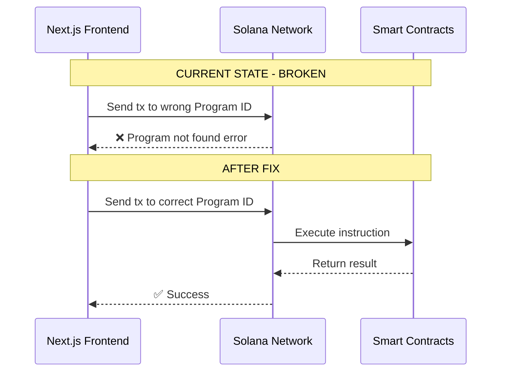
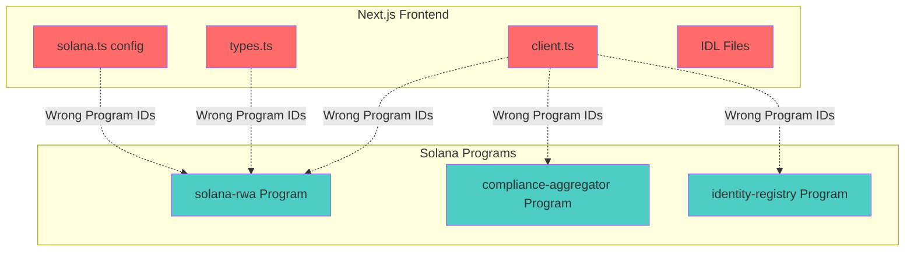

# Backend-Frontend Inconsistency Analysis Report

## Project: Solana RWA (Real World Assets)

**Date**: 2026-04-27  
**Scope**: Solana Anchor smart contracts vs. Next.js frontend integration

---

## Executive Summary

This report identifies **CRITICAL inconsistencies** between the Solana Anchor smart contract codebase and the frontend implementation. The most severe issue is a **complete Program ID mismatch** that will prevent the frontend from interacting with the deployed contracts.

### Severity Classification
| Severity | Count | Description |
|----------|-------|-------------|
| 🔴 CRITICAL | 3 | Issues that will cause complete failure |
| 🟠 HIGH | 4 | Issues that will cause incorrect behavior |
| 🟡 MEDIUM | 2 | Issues that may cause problems in edge cases |
| 🟢 LOW | 1 | Minor inconsistencies |

---

## 1. 🔴 CRITICAL: Program ID Mismatch

### Problem
The frontend uses **completely different Program IDs** than the backend smart contracts. This means the frontend cannot communicate with the deployed programs.

### Backend Program IDs (Source of Truth)

| Program | File | Program ID |
|---------|------|------------|
| solana-rwa | [`solana-rwa/programs/solana-rwa/src/lib.rs:85`](solana-rwa/programs/solana-rwa/src/lib.rs:85) | `6XDDBdZm8pqamteHWRHS2A8Ka4Pb6BkN5nCpWxWCzVpe` |
| compliance-aggregator | [`solana-rwa/programs/compliance-aggregator/src/lib.rs:58`](solana-rwa/programs/compliance-aggregator/src/lib.rs:58) | `9EbDbR12nkLx2t7iYDJCgvJrELM1cDKqLQHgVWG3vzY7` |
| identity-registry | [`solana-rwa/programs/identity-registry/src/lib.rs:67`](solana-rwa/programs/identity-registry/src/lib.rs:67) | `6ULwDvPcDHFVET7oi172RSvE51oGmLC8PajxfnzVH5fc` |

### Frontend Program IDs (INCORRECT)

| Program | File | Wrong Program ID |
|---------|------|------------------|
| solana-rwa | [`web/src/anchor/types.ts:120`](web/src/anchor/types.ts:120) | `2XuB3ngjvJkMTxB82eM9NszBUGNovjuJUs4mzdez7EEX` |
| compliance-aggregator | [`web/src/anchor/types.ts:122`](web/src/anchor/types.ts:122) | `7cURjJvyf3oe6JsuVxS9EiVHKNauiFj7Gao3THzZSnpb` |
| identity-registry | [`web/src/anchor/types.ts:121`](web/src/anchor/types.ts:121) | `5SeHm9i7CcgHqF9UBYBtGbzqf3F3FWFETQF8AxfU2Rce` |

### Affected Files
- [`web/src/anchor/types.ts`](web/src/anchor/types.ts) - Primary type definitions with wrong IDs
- [`web/src/config/solana.ts`](web/src/config/solana.ts) - Configuration file with same wrong IDs
- [`web/src/anchor/idl/solana-rwa.json`](web/src/anchor/idl/solana-rwa.json) - Frontend IDL with wrong program ID
- [`web/src/anchor/idl/compliance-aggregator.json`](web/src/anchor/idl/compliance-aggregator.json) - Frontend IDL with wrong program ID
- [`web/src/anchor/idl/identity-registry.json`](web/src/anchor/idl/identity-registry.json) - Frontend IDL with wrong program ID

### Impact
**Complete failure**: All frontend transactions will fail because they target non-existent programs.

### Fix Required
Update all frontend Program IDs to match the backend:
```typescript
// web/src/anchor/types.ts
const SOLANA_RWA_PROGRAM_ID = '6XDDBdZm8pqamteHWRHS2A8Ka4Pb6BkN5nCpWxWCzVpe'
const IDENTITY_REGISTRY_PROGRAM_ID = '6ULwDvPcDHFVET7oi172RSvE51oGmLC8PajxfnzVH5fc'
const COMPLIANCE_AGGREGATOR_PROGRAM_ID = '9EbDbR12nkLx2t7iYDJCgvJrELM1cDKqLQHgVWG3vzY7'
```

---

## 2. 🟠 HIGH: TypeScript Interface Field Mismatches

### 2.1 IdentityRegistryStateData

#### Frontend Interface ([`web/src/anchor/types.ts:185-189`](web/src/anchor/types.ts:185))
```typescript
export interface IdentityRegistryStateData {
  owner: string;
  identityCount: number;      // ❌ NOT in Rust struct
  identities: string[];        // ❌ NOT in Rust struct
}
```

#### Backend Struct ([`solana-rwa/programs/identity-registry/src/states/registry_state.rs:7-10`](solana-rwa/programs/identity-registry/src/states/registry_state.rs:7))
```rust
pub struct IdentityRegistryState {
    pub owner: Pubkey,
    pub registry_bump: u8,     // ✅ Missing in frontend
}
```

**Mismatch**: Frontend expects `identityCount` and `identities` fields that do not exist in the Rust struct. The `registry_bump` field is missing from frontend.

---

### 2.2 IdentityAccountData

#### Frontend Interface ([`web/src/anchor/types.ts:195-202`](web/src/anchor/types.ts:195))
```typescript
export interface IdentityAccountData {
  wallet: string;
  name: string;
  kycStatus: number;           // ❌ NOT in Rust struct
  amlStatus: number;           // ❌ NOT in Rust struct
  createdAt: bigint;           // ❌ NOT in Rust struct
  updatedAt: bigint;           // ❌ NOT in Rust struct
}
```

#### Backend Struct ([`solana-rwa/programs/identity-registry/src/states/identity_account.rs:8-16`](solana-rwa/programs/identity-registry/src/states/identity_account.rs:8))
```rust
pub struct IdentityAccount {
    pub wallet: Pubkey,
    pub identity: Pubkey,      // ✅ Missing in frontend
    pub name: String,
    pub symbol: String,        // ✅ Missing in frontend
    pub identity_data: String, // ✅ Missing in frontend
    pub metadata_uri: String,  // ✅ Missing in frontend
    pub bump: u8,              // ✅ Missing in frontend
}
```

**Mismatch**: Frontend expects KYC/AML status fields and timestamps that do not exist. Backend has `identity`, `symbol`, `identity_data`, `metadata_uri`, and `bump` fields missing from frontend.

---

## 3. 🟠 HIGH: IDL Program ID Mismatch

### Problem
The frontend IDL files contain wrong program IDs that differ from the backend IDLs.

| IDL File | Backend ID | Frontend ID |
|----------|------------|-------------|
| solana-rwa | `6XDDBdZm8pqamteHWRHS2A8Ka4Pb6BkN5nCpWxWCzVpe` | `2XuB3ngjvJkMTxB82eM9NszBUGNovjuJUs4mzdez7EEX` |
| compliance-aggregator | `9EbDbR12nkLx2t7iYDJCgvJrELM1cDKqLQHgVWG3vzY7` | `7cURjJvyf3oe6JsuVxS9EiVHKNauiFj7Gao3THzZSnpb` |
| identity-registry | `6ULwDvPcDHFVET7oi172RSvE51oGmLC8PajxfnzVH5fc` | `5SeHm9i7CcgHqF9UBYBtGbzqf3F3FWFETQF8AxfU2Rce` |

### Impact
IDL-based instruction parsing will fail or produce incorrect results.

### Fix Required
Copy the backend IDLs to the frontend:
```bash
cp solana-rwa/idl_solana_rwa.json web/src/anchor/idl/solana-rwa.json
cp solana-rwa/idl_compliance_aggregator.json web/src/anchor/idl/compliance-aggregator.json
cp solana-rwa/idl_identity_registry.json web/src/anchor/idl/identity-registry.json
```

---

## 4. 🟠 HIGH: Potential State Parsing Errors

### Problem
Due to the interface mismatches, the frontend parsing functions may fail when reading actual on-chain data.

### Affected Parsing Functions
| Function | Expected Fields | Actual Fields | Risk |
|----------|----------------|---------------|------|
| `parseIdentityInfo()` | `kycStatus`, `amlStatus`, `createdAt`, `updatedAt` | `identity`, `symbol`, `identity_data`, `metadata_uri`, `bump` | HIGH |
| Registry state parsing | `identityCount`, `identities` | `owner`, `registry_bump` | HIGH |

### Impact
Frontend will display incorrect or undefined values when reading identity data.

---

## 5. 🟠 HIGH: Config File Duplicated Wrong IDs

### Problem
The [`web/src/config/solana.ts`](web/src/config/solana.ts) file duplicates the wrong Program IDs in the `IDL_PROGRAM_IDS` object:

```typescript
const IDL_PROGRAM_IDS = {
  solanaRwa: '2XuB3ngjvJkMTxB82eM9NszBUGNovjuJUs4mzdez7EEX',
  identityRegistry: '5SeHm9i7CcgHqF9UBYBtGbzqf3F3FWFETQF8AxfU2Rce',
  complianceAggregator: '7cURjJvyf3oe6JsuVxS9EiVHKNauiFj7Gao3THzZSnpb',
} as const;
```

### Impact
Any code using `getProgramIds()` from this config will get wrong IDs.

---

## 6. ✅ VERIFIED: PDA Seeds Consistency

### Good News
All PDA seed derivations are **CONSISTENT** between frontend and backend:

| PDA Type | Backend Seeds | Frontend Seeds | Status |
|----------|---------------|----------------|--------|
| Balance | `[b"balance", token, wallet]` | `[Buffer.from("balance"), tokenState, wallet]` | ✅ MATCH |
| Frozen | `[b"frozen", token, wallet]` | `[Buffer.from("frozen"), tokenState, wallet]` | ✅ MATCH |
| Agent | `[b"agent", token, agent]` | `[Buffer.from("agent"), tokenState, agent]` | ✅ MATCH |
| Token State | `[b"token", owner]` | `[Buffer.from("token"), owner]` | ✅ MATCH |
| Compliance | `[b"compliance", aggregator, token]` | Not derived in frontend | ⚠️ MISSING |
| Aggregator | `[b"aggregator"]` | Not derived in frontend | ⚠️ MISSING |
| Registry | `[b"registry"]` | Not derived in frontend | ⚠️ MISSING |
| Identity | `[b"identity", registry, wallet]` | `[Buffer.from("identity"), registryState, wallet]` | ✅ MATCH |

### Missing Frontend PDA Derivations
The frontend is missing PDA derivation functions for:
- Compliance PDA
- Aggregator PDA
- Registry PDA

These should be added to [`web/src/anchor/client.ts`](web/src/anchor/client.ts).

---

## 7. 🟡 MEDIUM: Instruction Discriminator Verification

### Status
The instruction discriminators in the frontend appear to match the backend IDLs:

| Instruction | Backend Discriminator | Frontend Discriminator | Status |
|-------------|----------------------|----------------------|--------|
| initialize | `[175, 175, 109, 31, 13, 152, 155, 237]` | `[175, 175, 109, 31, 13, 152, 155, 237]` | ✅ MATCH |
| mint | `[51, 57, 225, 47, 182, 146, 137, 166]` | `[51, 57, 225, 47, 182, 146, 137, 166]` | ✅ MATCH |
| burn | `[116, 110, 29, 56, 107, 219, 42, 93]` | `[116, 110, 29, 56, 107, 219, 42, 93]` | ✅ MATCH |
| transfer | `[163, 52, 200, 231, 140, 3, 69, 186]` | `[163, 52, 200, 231, 140, 3, 69, 186]` | ✅ MATCH |
| compliance_add_module | `[81, 183, 101, 212, 17, 241, 122, 204]` | `[81, 183, 101, 212, 17, 241, 122, 204]` | ✅ MATCH |

### Risk
Discriminators are correct, but they are hardcoded in frontend rather than derived from IDL. If the backend changes, the frontend discriminators must be manually updated.

---

## 8. 🟡 MEDIUM: Anchor.toml vs. IDL Program ID Consistency

### Status
The [`solana-rwa/Anchor.toml`](solana-rwa/Anchor.toml) file contains the correct program IDs matching the `declare_id!()` macros in the Rust code. However, the generated IDLs in the root (`solana-rwa/idl_*.json`) also have the correct IDs.

### Recommendation
Ensure the IDL generation process uses the correct program IDs. The current backend IDLs are correct.

---

## 9. 🟢 LOW: Documentation References

### Problem
The documentation files may reference old program IDs or incorrect addresses.

### Files to Check
- [`solana-rwa/docs/DEPLOYMENT_ERRORS.md`](solana-rwa/docs/DEPLOYMENT_ERRORS.md)
- [`solana-rwa/docs/DEPLOYMENT_SYSTEM.md`](solana-rwa/docs/DEPLOYMENT_SYSTEM.md)
- [`solana-rwa/docs/DESPLEGUE.md`](solana-rwa/docs/DESPLEGUE.md)
- [`solana-rwa/docs/SECURITY_ANALYSIS.md`](solana-rwa/docs/SECURITY_ANALYSIS.md)
- [`web/SOLANA_INTEGRATION_DOCUMENTATION.md`](web/SOLANA_INTEGRATION_DOCUMENTATION.md)

---

## Summary of Required Fixes

### Priority 1: Critical (Must Fix Before Deployment)
1. **Update Program IDs in [`web/src/anchor/types.ts`](web/src/anchor/types.ts)**
2. **Update Program IDs in [`web/src/config/solana.ts`](web/src/config/solana.ts)**
3. **Replace frontend IDLs with backend IDLs**

### Priority 2: High (Must Fix Before Production)
4. **Fix [`IdentityRegistryStateData`](web/src/anchor/types.ts:185) interface** to match Rust struct
5. **Fix [`IdentityAccountData`](web/src/anchor/types.ts:195) interface** to match Rust struct
6. **Update parsing functions** in [`web/src/anchor/client.ts`](web/src/anchor/client.ts)
7. **Add missing PDA derivation functions** for compliance, aggregator, and registry

### Priority 3: Medium (Should Fix)
8. **Consider deriving discriminators from IDL** instead of hardcoding
9. **Verify documentation** references correct program IDs

---

## Architecture Diagram



## System Architecture Overview



---

## File Reference Index

| Category | File | Lines | Issue |
|----------|------|-------|-------|
| Backend Program ID | [`solana-rwa/programs/solana-rwa/src/lib.rs`](solana-rwa/programs/solana-rwa/src/lib.rs:85) | 85 | Source of truth |
| Backend Program ID | [`solana-rwa/programs/compliance-aggregator/src/lib.rs`](solana-rwa/programs/compliance-aggregator/src/lib.rs:58) | 58 | Source of truth |
| Backend Program ID | [`solana-rwa/programs/identity-registry/src/lib.rs`](solana-rwa/programs/identity-registry/src/lib.rs:67) | 67 | Source of truth |
| Frontend Wrong ID | [`web/src/anchor/types.ts`](web/src/anchor/types.ts:120) | 120-122 | Wrong IDs |
| Frontend Wrong ID | [`web/src/config/solana.ts`](web/src/config/solana.ts) | ~32-50 | Wrong IDs |
| Frontend Wrong IDL | [`web/src/anchor/idl/solana-rwa.json`](web/src/anchor/idl/solana-rwa.json) | 1 | Wrong program ID |
| Frontend Wrong IDL | [`web/src/anchor/idl/compliance-aggregator.json`](web/src/anchor/idl/compliance-aggregator.json) | 1 | Wrong program ID |
| Frontend Wrong IDL | [`web/src/anchor/idl/identity-registry.json`](web/src/anchor/idl/identity-registry.json) | 1 | Wrong program ID |
| Backend Struct | [`solana-rwa/programs/identity-registry/src/states/registry_state.rs`](solana-rwa/programs/identity-registry/src/states/registry_state.rs:7) | 7-10 | Correct struct |
| Backend Struct | [`solana-rwa/programs/identity-registry/src/states/identity_account.rs`](solana-rwa/programs/identity-registry/src/states/identity_account.rs:8) | 8-16 | Correct struct |
| Frontend Interface | [`web/src/anchor/types.ts`](web/src/anchor/types.ts:185) | 185-189 | Wrong fields |
| Frontend Interface | [`web/src/anchor/types.ts`](web/src/anchor/types.ts:195) | 195-202 | Wrong fields |
| PDA Backend | [`solana-rwa/programs/solana-rwa/src/pdas/mod.rs`](solana-rwa/programs/solana-rwa/src/pdas/mod.rs) | 1-25 | Correct seeds |
| PDA Backend | [`solana-rwa/programs/compliance-aggregator/src/pdas/mod.rs`](solana-rwa/programs/compliance-aggregator/src/pdas/mod.rs) | 1-19 | Correct seeds |
| PDA Backend | [`solana-rwa/programs/identity-registry/src/pdas/mod.rs`](solana-rwa/programs/identity-registry/src/pdas/mod.rs) | 1-13 | Correct seeds |
| PDA Frontend | [`web/src/anchor/client.ts`](web/src/anchor/client.ts:71) | 71-131 | Correct seeds |
| PDA Frontend | [`web/src/anchor/client.ts`](web/src/anchor/client.ts:1215) | 1215-1225 | Correct seeds |

---

*Report generated by Roo Architect Mode*
