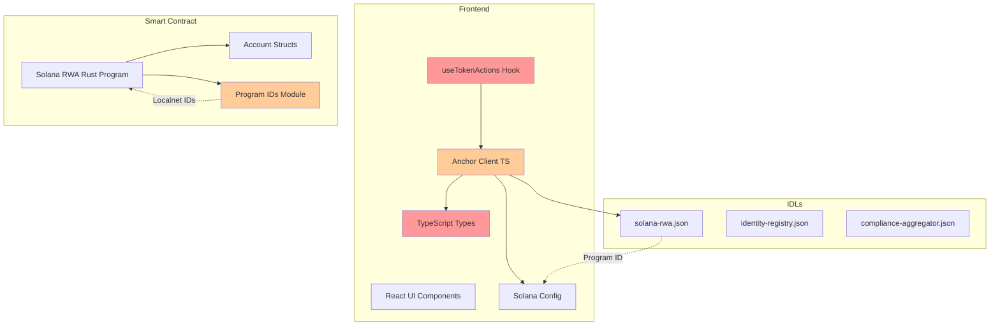

# Análisis de Integración Dapp - Smart Contract vs Frontend

## Resumen Ejecutivo

Se realizó un análisis exhaustivo de la integración entre el smart contract Solana (Anchor/Rust) y el frontend (Next.js/TypeScript). Se identificaron **6 categorías de inconsistencias**, algunas de las cuales son críticas y impedirían el funcionamiento correcto de la dapp en producción.

---

## 1. INCONSISTENCIAS CRÍTICAS - PDAs de Balance No Derivadas

### Problema
Las funciones [`buildMintInstruction`](web/src/anchor/client.ts:176), [`buildBurnInstruction`](web/src/anchor/client.ts:211), [`buildTransferInstruction`](web/src/anchor/client.ts:252) y [`buildFreezeInstruction`](web/src/anchor/client.ts:294) reciben direcciones de wallet directamente en lugar de las PDAs derivadas de los balance accounts.

### Detalle por instrucción

#### mintTokens
**Rust** ([`solana-rwa/src/lib.rs`](solana-rwa/programs/solana-rwa/src/lib.rs:90-94)):
```rust
#[account(
    mut,
    seeds = [b"balance", token.key().as_ref(), balance_account.wallet.as_ref()],
    bump,
)]
pub balance_account: Account<'info, BalanceAccount>,
```

**Frontend** ([`useTokenActions.ts`](web/src/hooks/useTokenActions.ts:324-329)):
```typescript
buildMintInstruction(
  tokenState,
  currentPublicKey,
  recipientPubkey,  // ❌ DEBERÍA SER PDA: [b"balance", tokenState, recipientPubkey]
  amountBigInt,
  programId
)
```

#### burnTokens
**Rust** ([`solana-rwa/src/lib.rs`](solana-rwa/programs/solana-rwa/src/lib.rs:120-124)):
```rust
#[account(
    mut,
    seeds = [b"balance", token.key().as_ref(), sender.key().as_ref()],
    bump,
)]
pub balance_account: Account<'info, BalanceAccount>,
```

**Frontend** ([`useTokenActions.ts`](web/src/hooks/useTokenActions.ts:442-448)):
```typescript
buildBurnInstruction(
  tokenState,
  currentPublicKey,
  fromPubkey,
  fromPubkey,  // ❌ DEBERÍA SER PDA: [b"balance", tokenState, fromPubkey]
  amountBigInt,
  programId
)
```

#### transferTokens
**Rust** ([`solana-rwa/src/lib.rs`](solana-rwa/programs/solana-rwa/src/lib.rs:145-158)):
```rust
#[account(
    mut,
    seeds = [b"balance", token.key().as_ref(), from.key().as_ref()],
    bump,
)]
pub from_balance: Account<'info, BalanceAccount>,

#[account(
    mut,
    seeds = [b"balance", token.key().as_ref(), to_balance.wallet.as_ref()],
    bump,
)]
pub to_balance: Account<'info, BalanceAccount>,
```

**Frontend** ([`useTokenActions.ts`](web/src/hooks/useTokenActions.ts:385-391)):
```typescript
buildTransferInstruction(
  tokenState,
  currentPublicKey,
  fromPubkey,   // ❌ DEBERÍA SER PDA: [b"balance", tokenState, fromPubkey]
  toPubkey,     // ❌ DEBERÍA SER PDA: [b"balance", tokenState, toPubkey]
  amountBigInt,
  programId
)
```

#### freezeAccount
**Rust** ([`solana-rwa/src/lib.rs`](solana-rwa/programs/solana-rwa/src/lib.rs:261-266)):
```rust
#[account(
    mut,
    seeds = [b"frozen", token.key().as_ref(), frozen_account.wallet.as_ref()],
    bump,
)]
pub frozen_account: Account<'info, FrozenAccount>,
```

**Frontend**: Similar problema - se pasa la wallet directa en lugar del PDA frozen.

### Solución Requerida
Crear funciones helper en [`client.ts`](web/src/anchor/client.ts) para derivar PDAs:
```typescript
export function deriveBalancePda(tokenState: PublicKey, wallet: PublicKey, programId: PublicKey): PublicKey {
  const [pda] = PublicKey.findProgramAddressSync(
    [Buffer.from("balance"), tokenState.toBuffer(), wallet.toBuffer()],
    programId
  );
  return pda;
}

export function deriveFrozenPda(tokenState: PublicKey, wallet: PublicKey, programId: PublicKey): PublicKey {
  const [pda] = PublicKey.findProgramAddressSync(
    [Buffer.from("frozen"), tokenState.toBuffer(), wallet.toBuffer()],
    programId
  );
  return pda;
}
```

---

## 2. INCONSISTENCIAS CRÍTICAS - Tipos TypeScript vs Estructuras Rust

### TokenStateData
**Rust** ([`solana-rwa/src/lib.rs`](solana-rwa/programs/solana-rwa/src/lib.rs:537-547)):
```rust
pub struct TokenState {
    pub owner: Pubkey,
    pub freeze_authority: Pubkey,
    pub name: String,
    pub symbol: String,
    pub decimals: u8,
    pub total_supply: u64,
    pub next_index: u64,
    pub bump: u8,
}
```

**TypeScript** ([`types.ts`](web/src/anchor/types.ts:124-135)):
```typescript
export interface TokenStateData {
  owner: string;
  name: string;
  symbol: string;
  decimals: number;
  totalSupply: bigint;
  nextIndex: number;
  balances: Array<{ account: string; amount: bigint }>;  // ❌ NO EXISTE EN RUST
  frozenAccounts: string[];  // ❌ NO EXISTE EN RUST
  agents: string[];  // ❌ NO EXISTE EN RUST
  complianceModules: string[];  // ❌ NO EXISTE EN RUST
}
```

**Campos faltantes en TypeScript**: `freeze_authority`, `bump`
**Campos fantasma en TypeScript**: `balances`, `frozenAccounts`, `agents`, `complianceModules`

### BalanceAccount
**Rust**:
```rust
pub struct BalanceAccount {
    pub wallet: Pubkey,
    pub balance: u64,
    pub bump: u8,
}
```

**TypeScript** ([`types.ts`](web/src/anchor/types.ts:141-144)):
```typescript
export interface BalanceEntryData {
  account: string;  // ❌ DEBERÍA SER wallet
  amount: bigint;   // ❌ DEBERÍA SER balance
}
```

### AgentAccount
**Rust**:
```rust
pub struct AgentAccount {
    pub agent: Pubkey,
    pub bump: u8,
}
```

**TypeScript** ([`types.ts`](web/src/anchor/types.ts:150-153)):
```typescript
export interface AgentAccountData {
  agent: string;
  permissions: number;  // ❌ NO EXISTE EN RUST
}
```

### FrozenAccount
**Rust**:
```rust
pub struct FrozenAccount {
    pub wallet: Pubkey,
    pub frozen: bool,
    pub bump: u8,
}
```

**TypeScript** ([`types.ts`](web/src/anchor/types.ts:159-163)):
```typescript
export interface FrozenAccountData {
  account: string;  // ❌ DEBERÍA SER wallet
  reason: string;   // ❌ NO EXISTE EN RUST
  timestamp: bigint; // ❌ NO EXISTE EN RUST
}
```

### SupplyInfo
**Rust** ([`solana-rwa/src/lib.rs`](solana-rwa/programs/solana-rwa/src/lib.rs:580-585)):
```rust
pub struct SupplyInfo {
    pub current_supply: u64,
    pub max_supply: u64,
    pub remaining_supply: u64,
}
```

**TypeScript** ([`types.ts`](web/src/anchor/types.ts:169-173)):
```typescript
export interface SupplyInfoData {
  totalSupply: bigint;           // ❌ DEBERÍA SER currentSupply
  circulatingSupply: bigint;     // ❌ NO EXISTE EN RUST
  decimals: number;              // ❌ NO EXISTE EN RUST
}
```

---

## 3. INCONSISTENCIAS - Program IDs entre Módulos

### Rust ids.rs (Localnet)
**Archivo**: [`solana-rwa/src/ids.rs`](solana-rwa/programs/solana-rwa/src/ids.rs:73-85)
```rust
pub const SOLANA_RWA_PROGRAM_ID: &str = "EwAUDz8ZVXqJQqYYcd8ZEPSGpx2HvG61PweDThK5vrQt";
pub const IDENTITY_REGISTRY_PROGRAM_ID: &str = "48szCrY5scr6MbqdTDJe8X8NAWejkRaiTe4VEyCGRTu9";
pub const COMPLIANCE_AGGREGATOR_PROGRAM_ID: &str = "AmFr5NUWU3E4neLzKHe2pkX5yTochgFTUHtwMB7aDszK";
```

### TypeScript config/solana.ts
**Archivo**: [`web/src/config/solana.ts`](web/src/config/solana.ts:22-26)
```typescript
const IDL_PROGRAM_IDS = {
  solanaRwa: '2XuB3ngjvJkMTxB82eM9NszBUGNovjuJUs4mzdez7EEX',
  identityRegistry: '5SeHm9i7CcgHqF9UBYBtGbzqf3F3FWFETQF8AxfU2Rce',
  complianceAggregator: '7cURjJvyf3oe6JsuVxS9EiVHKNauiFj7Gao3THzZSnpb',
}
```

### IDL JSON
**Archivo**: [`web/src/anchor/idl/solana-rwa.json`](web/src/anchor/idl/solana-rwa.json:2)
```json
{
  "address": "2XuB3ngjvJkMTxB82eM9NszBUGNovjuJUs4mzdez7EEX",
  ...
}
```

**Problema**: Los program IDs en `ids.rs` (Rust localnet) NO coinciden con los del `config/solana.ts` e IDLs. Esto indica que:
- El smart contract se compiló/deployó con una clave diferente
- El frontend se conecta a los program IDs del IDL, que podrían ser incorrectos para localnet

---

## 4. INCONSISTENCIAS - Accounts en remove_agent

### Rust RemoveAgent Struct
**Archivo**: [`solana-rwa/src/lib.rs`](solana-rwa/programs/solana-rwa/src/lib.rs:198-219)
```rust
pub struct RemoveAgent<'info> {
    pub token: Account<'info, TokenState>,
    pub payer: Signer<'info>,
    pub agent_account: Account<'info, AgentAccount>,  // PDA [b"agent", token, agent]
}
```

### Frontend buildRemoveAgentInstruction
**Archivo**: [`client.ts`](web/src/anchor/client.ts:406-433)
```typescript
return {
  keys: [
    { pubkey: tokenState, isSigner: false, isWritable: true },
    { pubkey: payer, isSigner: true, isWritable: true },
    { pubkey: agent, isSigner: false, isWritable: true },  // ❌ DEBERÍA SER agentAccount PDA
  ],
  data,
};
```

**Problema**: El tercer key es un pubkey genérico (`agent`) cuando debería ser el PDA `agent_account` derivado como `[b"agent", tokenState, agent]`.

---

## 5. INCONSISTENCIAS - Nombres de Campos en Identity Instructions

### buildIdentityRegisterInstruction
**Archivo**: [`client.ts`](web/src/anchor/client.ts:858-866)
```typescript
keys: [
  { pubkey: payer, isSigner: true, isWritable: true },
  { pubkey: registryState, isSigner: false, isWritable: true },
  { pubkey: owner, isSigner: true, isWritable: false },
  { pubkey: wallet, isSigner: false, isWritable: true },  // ❌ Comment dice "identity_account"
  { pubkey: SystemProgram.programId, isSigner: false, isWritable: false },
]
```

### buildIdentityUpdateInstruction
**Archivo**: [`client.ts`](web/src/anchor/client.ts:964-970)
```typescript
keys: [
  { pubkey: registryState, isSigner: false, isWritable: false },
  { pubkey: wallet, isSigner: false, isWritable: true },  // ❌ Comment dice "identity_account"
  { pubkey: owner, isSigner: true, isWritable: false },
]
```

---

## 6. INCONSISTENCIAS - String Serialization en initialize

### Rust initialize
**Archivo**: [`solana-rwa/src/lib.rs`](solana-rwa/programs/solana-rwa/src/lib.rs:310-327)
```rust
pub fn initialize(ctx: Context<Initialize>, name: String, symbol: String, decimals: u8) -> Result<()> {
```

Anchor serializa Strings como: 4-byte u32 LE length prefix + UTF-8 bytes.

### Frontend buildInitializeInstruction
**Archivo**: [`client.ts`](web/src/anchor/client.ts:111-117)
```typescript
function serializeAnchorString(s: string): Buffer {
  const utf8Buffer = Buffer.from(s, 'utf-8');
  const prefix = Buffer.alloc(4);
  prefix.writeUInt32LE(utf8Buffer.length, 0);
  return Buffer.concat([prefix, utf8Buffer]);
}
```

**Estado**: Correcto - la serialización de strings coincide con Anchor.

---

## Diagrama de Arquitectura Actual



---

## Resumen de Inconsistencias

| # | Categoría | Severidad | Archivos Afectados |
|---|-----------|-----------|-------------------|
| 1 | PDAs de Balance no derivadas | CRÍTICA | client.ts, useTokenActions.ts |
| 2 | Tipos TypeScript incorrectos | ALTA | types.ts vs lib.rs |
| 3 | Program IDs inconsistentes | ALTA | ids.rs vs config/solana.ts |
| 4 | Accounts en remove_agent | MEDIA | client.ts vs lib.rs |
| 5 | Nombres en Identity instructions | BAJA | client.ts |
| 6 | String serialization | CORRECTO | - |

---

## Plan de Correcciones Recomendado

### Fase 1: Correcciones Críticas
1. Agregar funciones helper para derivar PDAs en `client.ts`
2. Actualizar `useTokenActions.ts` para usar PDAs derivadas en mint, burn, transfer, freeze
3. Agregar validación de PDA en las funciones del hook

### Fase 2: Corrección de Tipos
4. Actualizar interfaces en `types.ts` para coincidir con estructuras Rust
5. Agregar campos faltantes (freeze_authority, bump)
6. Remover campos fantasma (balances, frozenAccounts, agents, complianceModules, permissions, reason, timestamp, circulatingSupply, decimals)

### Fase 3: Program IDs
7. Verificar cuál es el program ID correcto para cada red
8. Sincronizar `ids.rs` con `config/solana.ts` e IDLs
9. Agregar validación de program ID en el frontend

### Fase 4: Accounts Order
10. Corregir `buildRemoveAgentInstruction` para usar PDA correcta
11. Verificar accounts order en identity instructions
