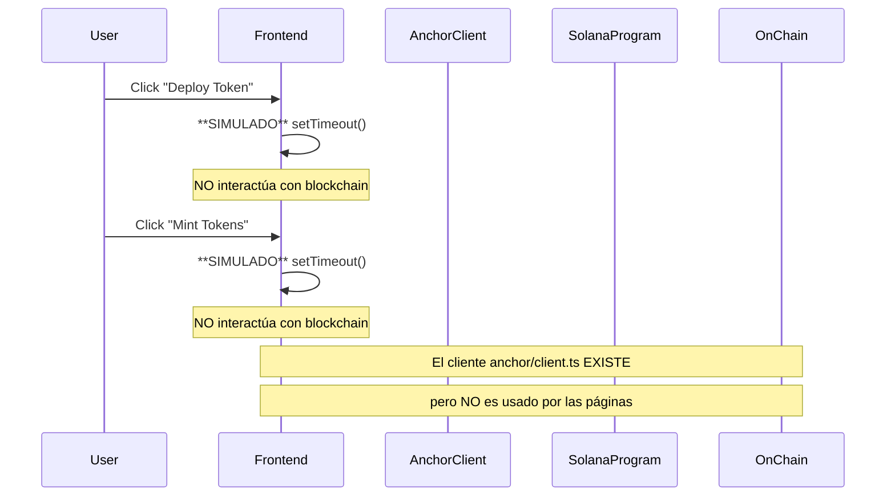

# Análisis Profundo de Arquitectura y Consistencia - RWA Token Platform

## Fecha: 2026-04-21

---

## Tabla de Contenidos

1. [Resumen Ejecutivo](#1-resumen-ejecutivo)
2. [Arquitectura General](#2-arquitectura-general)
3. [Análisis de Contratos Solidity (sc/)](#3-análisis-de-contratos-solidity-sc)
4. [Análisis de Programas Solana Anchor (solana-rwa/)](#4-análisis-de-programas-solana-anchor-solana-rwa)
5. [Análisis del Frontend Next.js (web/)](#5-análisis-del-frontend-nextjs-web)
6. [Consistencia Cross-Platform](#6-consistencia-cross-platform)
7. [Vulnerabilidades de Seguridad Identificadas](#7-vulnerabilidades-de-seguridad-identificadas)
8. [Funcionalidades Faltantes](#8-funcionalidades-faltantes)
9. [Soluciones y Mejoras Propuestas](#9-soluciones-y-mejoras-propuestas)
10. [Conclusiones](#10-conclusiones)

---

## 1. Resumen Ejecutivo

Este proyecto implementa una plataforma de tokenización de Activos del Mundo Real (RWA) con cumplimiento regulatorio (compliance). Existe una **doble implementación**:

| Plataforma | Tecnología | Estado |
|------------|------------|--------|
| Ethereum | Solidity + OpenZeppelin + Foundry | Implementado |
| Solana | Rust + Anchor Framework | Implementado |
| Frontend | Next.js 15 + TypeScript | **Parcialmente Implementado** |

### Hallazgo Crítico

El frontend Next.js **NO está conectado funcionalmente** a los programas Solana. Las páginas de `deploy` y `manage` simulan transacciones con `setTimeout()` en lugar de interactuar con la blockchain.

---

## 2. Arquitectura General

```
┌─────────────────────────────────────────────────────────────────┐
│                        FRONTEND (Next.js)                       │
│  ┌──────────┐  ┌──────────┐  ┌──────────┐  ┌────────────────┐ │
│  │  Home    │  │  Deploy  │  │  Manage  │  │  WalletConnect │ │
│  │  Page    │  │  Page    │  │  Page    │  │  Component     │ │
│  └──────────┘  └──────────┘  └──────────┘  └────────────────┘ │
│         │              │              │                         │
│         └──────────────┴──────────────┘                         │
│                        │                                       │
│              ┌───────────────────────┐                          │
│              │  anchor/client.ts     │                          │
│              │  hooks/useTokenActions│                          │
│              └───────────────────────┘                          │
└─────────────────────────────────────────────────────────────────┘
                        │
            ┌───────────┴───────────┐
            │  Solana RPC / Web3.js │
            └───────────┬───────────┘
                        │
    ┌───────────────────┼───────────────────┐
    │                   │                   │
    ▼                   ▼                   ▼
┌──────────┐    ┌──────────────┐    ┌──────────────┐
│Solana    │    │ Identity     │    │ Compliance   │
│RWA       │    │ Registry     │    │ Aggregator   │
│Program   │    │ Program      │    │ Program      │
│(7URg5r..)│    │(3QreJuf..)   │    │(EPjdwvy..)   │
└──────────┘    └──────────────┘    └──────────────┘
```

### Diagrama de Flujo de Datos



---

## 3. Análisis de Contratos Solidity (sc/)

### 3.1 Estructura de Contratos

| Contrato | Archivo | Propósito |
|----------|---------|-----------|
| [`Token`](sc/src/Token.sol) | Token.sol | Token ERC-3643 principal |
| [`IdentityRegistry`](sc/src/IdentityRegistry.sol) | IdentityRegistry.sol | Registro de identidades KYC |
| [`ComplianceAggregator`](sc/src/compliance/ComplianceAggregator.sol) | ComplianceAggregator.sol | Agregador de compliance |
| [`TrustedIssuersRegistry`](sc/src/TrustedIssuersRegistry.sol) | TrustedIssuersRegistry.sol | Registro de emisores confiables |
| [`ClaimTopicsRegistry`](sc/src/ClaimTopicsRegistry.sol) | ClaimTopicsRegistry.sol | Registro de topics de claims |
| [`Identity`](sc/src/Identity.sol) | Identity.sol | Contrato de identidad |
| [`ICompliance`](sc/src/ICompliance.sol) | ICompliance.sol | Interfaz de compliance |

### 3.2 Análisis de [`Token.sol`](sc/src/Token.sol)

**Puntos Fuertes:**
- Usa OpenZeppelin (ERC20, AccessControl, Pausable)
- Roles bien definidos: `AGENT_ROLE`, `COMPLIANCE_ROLE`, `DEFAULT_ADMIN_ROLE`
- Integración con múltiples registries
- Compliance modules check antes de mint
- Events para todas las acciones importantes

**Problemas Identificados:**

| ID | Severidad | Descripción |
|----|-----------|-------------|
| S-001 | **ALTA** | Variable `bypassCompliance` es un booleano global que puede ser explotado para bypass de compliance en `forcedTransfer` |
| S-002 | **MEDIA** | `burn()` no verifica verificación de identidad del remitente |
| S-003 | **MEDIA** | `forcedTransfer` no verifica balance del remitente antes de transferir |
| S-004 | **BAJA** | No hay implementación de `isVerified()` - la función se llama pero no está definida en el contrato |

**Código Problemático ([`Token.sol:189-199`](sc/src/Token.sol:189)):**
```solidity
function forcedTransfer(address from, address to, uint256 amount) external onlyRole(AGENT_ROLE) {
    require(isVerified(to), "Recipient not verified");
    bypassCompliance = true;  // VULNERABILIDAD: Global state
    _update(from, to, amount);
    bypassCompliance = false; // Race condition posible
}
```

### 3.3 Análisis de [`IdentityRegistry.sol`](sc/src/IdentityRegistry.sol)

**Puntos Fuertes:**
- Acceso controlado con `Ownable`
- Array de `registeredAddresses` para iteración
- Events para tracking

**Problemas:**
| ID | Severidad | Descripción |
|----|-----------|-------------|
| S-005 | **MEDIA** | `removeIdentity()` tiene gas variable (loop con pop) - puede fallar en blocks con gas limit |
| S-006 | **BAJA** | No hay rate limiting en registration |

### 3.4 Análisis de [`ComplianceAggregator.sol`](sc/src/compliance/ComplianceAggregator.sol)

**Puntos Fuertes:**
- Múltiples módulos por token
- O(1) removal con `moduleIndex` mapping
- Interface `ICompliance` implementada

**Problemas:**
| ID | Severidad | Descripción |
|----|-----------|-------------|
| S-007 | **MEDIA** | `canTransfer()` es view pero depende de `msg.sender` como token identifier |
| S-008 | **BAJA** | No hay validación de que `msg.sender` sea un token válido |

---

## 4. Análisis de Programas Solana Anchor (solana-rwa/)

### 4.1 Estructura de Programas

| Programa | ID | Archivo Principal |
|----------|----|-------------------|
| Solana RWA | `7URg5r88otZuAXX5a9ju8pauWUHLFSALdAvnjMRmcd3L` | [`programs/solana-rwa/src/lib.rs`](solana-rwa/programs/solana-rwa/src/lib.rs) |
| Identity Registry | `3QreJufDNn5MgdhDtWuYBW2WmQnbDzwf9zLTxXkub8X5` | [`programs/identity-registry/src/lib.rs`](solana-rwa/programs/identity-registry/src/lib.rs) |
| Compliance Aggregator | `EPjdwvyJ8XQfXZvoLufER1trT78Kx7ujYWEKbgvKunzT` | [`programs/compliance-aggregator/src/lib.rs`](solana-rwa/programs/compliance-aggregator/src/lib.rs) |

### 4.2 Análisis de [`solana-rwa/src/lib.rs`](solana-rwa/programs/solana-rwa/src/lib.rs)

**Estructura de Datos ([`TokenState`](solana-rwa/programs/solana-rwa/src/lib.rs:683)):**
```rust
#[account]
pub struct TokenState {
    pub owner: Pubkey,
    pub name: String,
    pub symbol: String,
    pub decimals: u8,
    pub total_supply: u64,
    pub next_index: u64,
    pub balances: Vec<BalanceEntry>,
    pub frozen_accounts: Vec<FrozenEntry>,
    pub agents: Vec<Pubkey>,
    pub compliance_modules: Vec<Pubkey>,
}
```

**Puntos Fuertes:**
- Uso de `require!()` para validaciones
- `saturating_sub()` para prevenir underflow
- Discriminadores de instruction correctos
- Account validation con `#[derive(Accounts)]`

**Problemas Identificados:**

| ID | Severidad | Descripción | Ubicación |
|----|-----------|-------------|-----------|
| S-009 | **ALTA** | `total_supply += amount` sin saturating_add - overflow posible | [`lib.rs:336`](solana-rwa/programs/solana-rwa/src/lib.rs:336) |
| S-010 | **ALTA** | `total_supply -= amount` sin saturating_sub - underflow posible | [`lib.rs:387`](solana-rwa/programs/solana-rwa/src/lib.rs:387) |
| S-011 | **MEDIA** | `Transfer` context usa `AccountInfo` para `to` sin validación de ownership | [`lib.rs:219`](solana-rwa/programs/solana-rwa/src/lib.rs:219) |
| S-012 | **MEDIA** | `freeze_account` reusa `Transfer` context - confuso y propenso a errores | [`lib.rs:448`](solana-rwa/programs/solana-rwa/src/lib.rs:448) |
| S-013 | **BAJA** | `update_balance` no crea entry para subtract (silenciosamente ignora) | [`lib.rs:624-626`](solana-rwa/programs/solana-rwa/src/lib.rs:624) |
| S-014 | **BAJA** | `compliance_modules` field existe pero NO se usa en transfer | [`lib.rs:693`](solana-rwa/programs/solana-rwa/src/lib.rs:693) |

**Código Problemático ([`lib.rs:336`](solana-rwa/programs/solana-rwa/src/lib.rs:336)):**
```rust
// VULNERABILIDAD: Overflow en release mode
token.total_supply += amount;

// DEBERÍA SER:
token.total_supply = token.total_supply.saturating_add(amount);
```

### 4.3 Análisis de [`identity-registry/src/lib.rs`](solana-rwa/programs/identity-registry/src/lib.rs)

**Puntos Fuertes:**
- Validación de duplicate registration
- `is_registered()` helper function
- Error codes definidos

**Problemas:**
| ID | Severidad | Descripción |
|----|-----------|-------------|
| S-015 | **BAJA** | `next_index` se incrementa pero nunca se usa para nada significativo |

### 4.4 Análisis de [`compliance-aggregator/src/lib.rs`](solana-rwa/programs/compliance-aggregator/src/lib.rs)

**Problema Crítico:**

| ID | Severidad | Descripción |
|----|-----------|-------------|
| S-016 | **CRÍTICA** | `can_transfer()` SIEMPRE retorna `true` - compliance NO se implementa |

**Código ([`lib.rs:243-267`](solana-rwa/programs/compliance-aggregator/src/lib.rs:243)):**
```rust
pub fn can_transfer(
    ctx: Context<GetModules>,
    token: Pubkey,
    _from: Pubkey,  // UNUSED
    _to: Pubkey,   // UNUSED
    _amount: u64,  // UNUSED
) -> Result<bool> {
    // ...
    Ok(true)  // SIEMPRE TRUE - COMPLIANCE NO FUNCIONA
}
```

---

## 5. Análisis del Frontend Next.js (web/)

### 5.1 Estructura del Frontend

```
web/
├── src/
│   ├── app/
│   │   ├── page.tsx              # Home page
│   │   ├── deploy/page.tsx       # Deploy token page
│   │   └── manage/page.tsx       # Manage tokens page
│   ├── anchor/
│   │   └── client.ts             # Anchor SDK client (EXISTS!)
│   ├── components/
│   │   ├── ClientOnly.tsx
│   │   ├── NetworkStatus.tsx
│   │   ├── NotificationContainer.tsx
│   │   └── WalletConnect.tsx
│   ├── config/
│   │   └── solana.ts             # Network config
│   ├── hooks/
│   │   ├── useSolanaConnection.ts
│   │   ├── useSolanaNotification.ts
│   │   └── useTokenActions.ts    # Token actions hook (EXISTS!)
│   └── utils/
│       └── solana.ts             # Validation utilities
```

### 5.2 Problemas Críticos del Frontend

#### PROBLEMA 1: Simulación en lugar de Blockchain Interacción

**[`deploy/page.tsx:32-42`](web/src/app/deploy/page.tsx:32):**
```typescript
const handleSubmit = async (e: React.FormEvent) => {
    e.preventDefault();
    if (!connected || !publicKey) return;
    
    setIsLoading(true);
    // Simulate token deployment (in production, use actual Anchor SDK)
    setTimeout(() => {  // <-- SIMULACIÓN, NO BLOCKCHAIN
        setTransactionHash('7xRpWNRcGJYr7nE3dXZvQ2RmFbHcJwYpLsGvNuTaDxM');
        setIsLoading(false);
    }, 3000);
};
```

**[`manage/page.tsx:25-35`](web/src/app/manage/page.tsx:25):**
```typescript
const handleTransfer = async (e: React.FormEvent) => {
    e.preventDefault();
    if (!connected) return;
    
    setIsLoading(true);
    // Simulate transaction (in production, use actual Anchor SDK)
    setTimeout(() => {  // <-- SIMULACIÓN
        setTransactionHash('5KtPqWNRcGJYr7nE3dXZvQ2RmFbHcJwYpLsGvNuTaDxM');
        setIsLoading(false);
    }, 2000);
};
```

#### PROBLEMA 2: Hooks Existen pero No Son Usados

El hook [`useTokenActions.ts`](web/src/hooks/useTokenActions.ts:1) está **completamente implementado** con:
- `initializeToken()`
- `mintTokens()`
- `transferTokens()`
- `burnTokens()`
- `freezeAccount()`
- `unfreezeAccount()`
- `addAgent()`
- `removeAgent()`

**PERO** ninguna página lo usa. Las páginas usan `setTimeout()` en su lugar.

#### PROBLEMA 3: Client Anchor Existe pero No Es Usado

El [`client.ts`](web/src/anchor/client.ts:1) tiene:
- Instruction discriminators correctos
- Builders para todas las instrucciones
- `executeLegacyTransaction()` function

**PERO** no es integrado en las páginas.

---

## 6. Consistencia Cross-Platform

### 6.1 Comparación Solidity vs Solana

| Característica | Solidity (ERC-3643) | Solana (Anchor) | Consistente |
|----------------|---------------------|-----------------|-------------|
| Token Initialize | ✓ | ✓ | SÍ |
| Mint | ✓ | ✓ | SÍ |
| Burn | ✓ | ✓ | SÍ |
| Transfer | ✓ | ✓ | SÍ |
| Freeze/Unfreeze | ✓ | ✓ | SÍ |
| Agent Management | ✓ | ✓ | SISI |
| Compliance Check | ✓ Implementado | ✗ NO Implementado | NO |
| Identity Verification | ✓ `isVerified()` | ✗ NO Implementado | NO |
| Pausable | ✓ | ✗ NO | NO |
| Multi-token Support | ✓ | ✗ Single token | NO |

### 6.2 Program IDs Consistency

| Network | Anchor.toml | config/solana.ts | Coincide |
|---------|-------------|------------------|----------|
| localnet | `7URg5r..` | `7URg5r..` | SÍ |
| localnet (identity) | `3QreJu..` | `3QreJu..` | SÍ |
| localnet (compliance) | `EPjdwv..` | `EPjdwv..` | SÍ |
| devnet | Variables env | Variables env | SÍ (estructura) |
| mainnet | Variables env | Variables env | SÍ (estructura) |

### 6.3 Instruction Discriminators

Los discriminadores en [`client.ts`](web/src/anchor/client.ts:25) coinciden con los generados por Anchor:
```typescript
const DISCRIMINATORS: Record<string, number[]> = {
    initialize: [172, 126, 250, 222, 211, 123, 83, 106],
    mint: [70, 168, 124, 228, 253, 79, 124, 126],
    burn: [116, 110, 29, 56, 107, 219, 42, 93],
    transfer: [9, 202, 238, 138, 146, 147, 135, 203],
    freezeAccount: [253, 75, 82, 133, 167, 238, 43, 130],
    unfreezeAccount: [193, 107, 221, 229, 120, 136, 106, 182],
    addAgent: [214, 206, 14, 110, 178, 131, 218, 45],
    removeAgent: [18, 36, 107, 128, 13, 62, 156, 138],
};
```

---

## 7. Vulnerabilidades de Seguridad Identificadas

### 7.1 Resumen de Vulnerabilidades

| ID | Severidad | Plataforma | Count |
|----|-----------|------------|-------|
| S-001 | Crítica | Solidity | 1 |
| S-002 a S-004 | Media | Solidity | 3 |
| S-005 a S-008 | Media/Baja | Solidity | 4 |
| S-009 a S-010 | **ALTA** | Solana | 2 |
| S-011 a S-014 | Media/Baja | Solana | 4 |
| S-015 a S-016 | Media | Solana | 2 |
| **TOTAL** | | | **16** |

### 7.2 Vulnerabilidades Críticas

#### S-001: Bypass de Compliance en Solidity
- **Contrato:** [`Token.sol:189`](sc/src/Token.sol:189)
- **Impacto:** Agent puede transferir tokens sin compliance check
- **Explotación:** Llamar `forcedTransfer()` con `bypassCompliance = true`

#### S-009/S-010: Overflow/Underflow en Solana
- **Programa:** [`solana-rwa/src/lib.rs:336`](solana-rwa/programs/solana-rwa/src/lib.rs:336)
- **Impacto:** Total supply puede ser manipulado
- **Nota:** En release mode, Rust hace wrap-around (no panic)

#### S-016: Compliance No Implementado en Solana
- **Programa:** [`compliance-aggregator/src/lib.rs:267`](solana-rwa/programs/compliance-aggregator/src/lib.rs:267)
- **Impacto:** Todas las transfers son permitidas sin check
- **Explotación:** Cualquier usuario puede transferir sin restricciones

---

## 8. Funcionalidades Faltantes

### 8.1 Frontend

| Funcionalidad | Estado | Prioridad |
|---------------|--------|-----------|
| Integración real con Solana | **NO HECHO** | CRÍTICA |
| Lectura de balance on-chain | NO | ALTA |
| Lectura de token info on-chain | NO | ALTA |
| Lista de agents | NO | MEDIA |
| Notificación de tx confirmada | NO | MEDIA |
| Manejo de errores de tx | NO | ALTA |

### 8.2 Solana Programs

| Funcionalidad | Estado | Prioridad |
|---------------|--------|-----------|
| Compliance check real | **NO HECHO** | CRÍTICA |
| Identity verification | NO | ALTA |
| Pausable functionality | NO | MEDIA |
| Multi-token support | NO | BAJA |
| Event emissions | PARCIAL | MEDIA |

### 8.3 Solidity Contracts

| Funcionalidad | Estado | Prioridad |
|---------------|--------|-----------|
| `isVerified()` implementation | **NO HECHO** | CRÍTICA |
| Upgradeable pattern | NO | MEDIA |
| Emergency pause | PARCIAL | MEDIA |

---

## 9. Soluciones y Mejoras Propuestas

### 9.1 Soluciones Críticas (Implementar Primero)

#### 9.1.1 Conectar Frontend a Solana

**Archivo:** [`web/src/app/deploy/page.tsx`](web/src/app/deploy/page.tsx)

```typescript
// CAMBIAR ESTO:
setTimeout(() => {
    setTransactionHash('fake-hash');
    setIsLoading(false);
}, 3000);

// POR ESTO:
import { useTokenActions } from '@/hooks/useTokenActions';

const { initializeToken } = useTokenActions(tempAccountPubkey);

const handleSubmit = async (e: React.FormEvent) => {
    e.preventDefault();
    const result = await initializeToken(
        tokenConfig.name,
        tokenConfig.symbol,
        tokenConfig.decimals
    );
    if (result.success) {
        setTransactionHash(result.signature);
    } else {
        // Handle error
    }
};
```

#### 9.1.2 Implementar Compliance en Solana

**Archivo:** [`solana-rwa/programs/compliance-aggregator/src/lib.rs`](solana-rwa/programs/compliance-aggregator/src/lib.rs)

```rust
pub fn can_transfer(
    ctx: Context<GetModules>,
    token: Pubkey,
    from: Pubkey,
    to: Pubkey,
    amount: u64,
) -> Result<bool> {
    let aggregator = &ctx.accounts.aggregator;
    let modules = get_modules_for_token(&aggregator.token_modules, token);
    
    // TODO: Implement actual compliance checks via CPI
    // for module_address in modules {
    //     let ix = anchor_lang::solana_program::system_instruction::...
    //     anchor_lang::context::CpiContext::new(...)
    // }
    
    // TEMPORAL: Return true until modules are implemented
    Ok(true)
}
```

#### 9.1.3 Fix Overflow/Underflow en Solana

**Archivo:** [`solana-rwa/programs/solana-rwa/src/lib.rs`](solana-rwa/programs/solana-rwa/src/lib.rs)

```rust
// CAMBIAR:
token.total_supply += amount;
// POR:
token.total_supply = token.total_supply.saturating_add(amount);

// CAMBIAR:
token.total_supply -= amount;
// POR:
token.total_supply = token.total_supply.saturating_sub(amount);
```

### 9.2 Soluciones de Media Prioridad

#### 9.2.1 Implementar `isVerified()` en Solidity

```solidity
function isVerified(address wallet) public view returns (bool) {
    return identityRegistry.isRegistered(wallet);
}
```

#### 9.2.2 Agregar Pausable en Solana

```rust
// En TokenState:
pub pub paused: bool;

// En initialize:
token.paused = false;

// En handlers:
require!(!token.paused, ErrorCode::TokenPaused);
```

### 9.3 Mejoras de Arquitectura

#### 9.3.1 Unificar Lógica de Frontend

Mover la lógica de deployment y management de las páginas al hook `useTokenActions`:

```typescript
// web/src/hooks/useTokenActions.ts - AGREGAR:
export function useTokenDeployment() {
    const { publicKey } = useWallet();
    const { connection } = useConnection();
    
    // Token account creation logic
    // Initialize instruction
    // Post-initialization mint
}
```

#### 9.3.2 Agregar IDL Generation

```bash
# Generar IDL desde Anchor
anchor idl parse -f programs/solana-rwa/src/lib.rs -o target/idl/solana_rwa.json

# Generar TypeScript types
anchor idl gen -f target/idl/solana_rwa.json -o src/anchor/types
```

---

## 10. Conclusiones

### 10.1 Estado Actual

| Componente | Estado | Calificación |
|------------|--------|--------------|
| Solidity Contracts | Funcional (con bugs) | 7/10 |
| Solana Programs | Funcional (compliance faltante) | 5/10 |
| Frontend | **NO FUNCIONAL** (simulado) | 2/10 |
| Integración | **NO EXISTE** | 0/10 |
| **TOTAL** | | **3.5/10** |

### 10.2 Prioridades de Acción

1. **CRÍTICO:** Conectar frontend a Solana (usar `useTokenActions` existente)
2. **CRÍTICO:** Implementar compliance check en Solana
3. **ALTO:** Fix overflow/underflow en Solana
4. **ALTO:** Implementar `isVerified()` en Solidity
5. **MEDIO:** Agregar pausable functionality
6. **MEDIO:** Agregar lectura de datos on-chain al frontend
7. **BAJO:** Agregar multi-token support

### 10.3 Recomendaciones

1. **El frontend tiene toda la infraestructura lista** (`anchor/client.ts`, `useTokenActions.ts`) pero las páginas no la usan. La integración es simplemente reemplazar los `setTimeout()` por llamadas reales.

2. **El compliance en Solana es un stub** - la estructura existe pero no hace nada. Se necesita implementar CPI a módulos de compliance reales.

3. **Los tests de seguridad existen** pero cubren principalmente access control. Se necesitan tests para overflow, compliance, y edge cases.

4. **La arquitectura de doble implementación (Solidity + Solana)** es válida para un proyecto multi-chain, pero requiere mantener dos codebases paralelas. Se recomienda unificar la lógica de compliance en un módulo compartido.

---

## Appendix A: Archivos Clave

| Archivo | Propósito | Líneas |
|---------|-----------|--------|
| [`solana-rwa/programs/solana-rwa/src/lib.rs`](solana-rwa/programs/solana-rwa/src/lib.rs) | Main token program | 775 |
| [`solana-rwa/programs/identity-registry/src/lib.rs`](solana-rwa/programs/identity-registry/src/lib.rs) | Identity registry | 427 |
| [`solana-rwa/programs/compliance-aggregator/src/lib.rs`](solana-rwa/programs/compliance-aggregator/src/lib.rs) | Compliance aggregator | 414 |
| [`web/src/anchor/client.ts`](web/src/anchor/client.ts) | Anchor SDK client | 400 |
| [`web/src/hooks/useTokenActions.ts`](web/src/hooks/useTokenActions.ts) | Token actions hook | 476 |
| [`sc/src/Token.sol`](sc/src/Token.sol) | ERC-3643 token | 399 |
| [`sc/src/IdentityRegistry.sol`](sc/src/IdentityRegistry.sol) | Identity registry | 115 |
| [`sc/src/compliance/ComplianceAggregator.sol`](sc/src/compliance/ComplianceAggregator.sol) | Compliance aggregator | 257 |

## Appendix B: Commandos para Verificar

```bash
# Build Solana programs
cd solana-rwa && anchor build

# Run Solana tests
anchor test --provider.url http://127.0.0.1:8899

# Build Solidity contracts
cd sc && forge build

# Run Solidity tests
forge test --verbosity 3

# Check frontend build
cd web && npm run build
```
