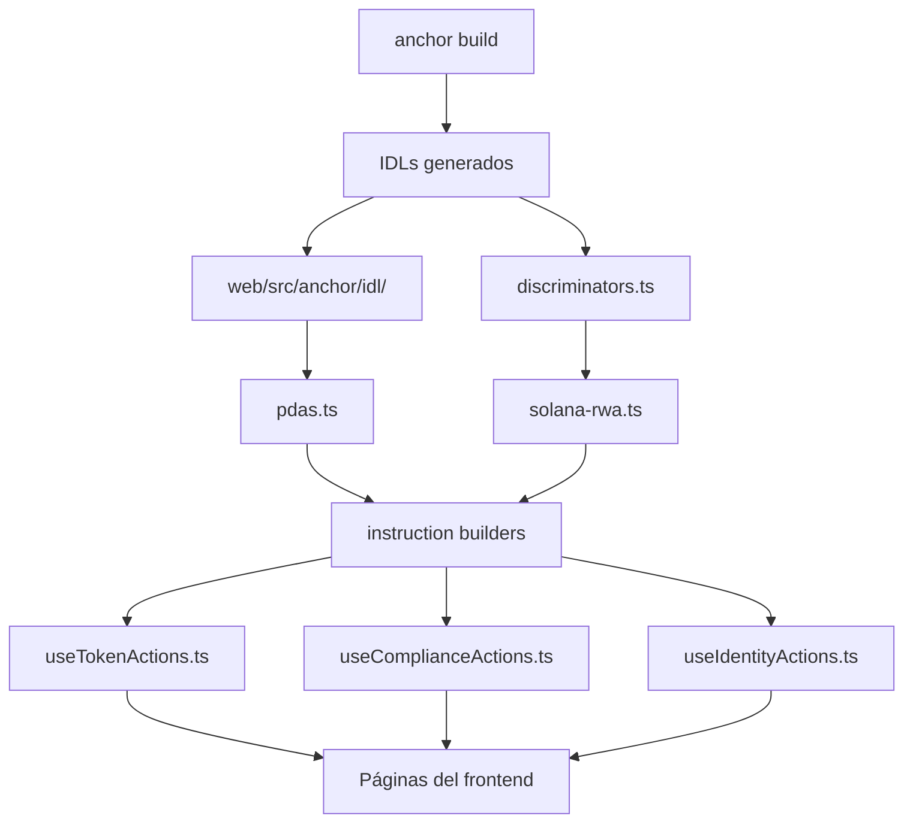

# Verificación Integral: Frontend ↔ Smart Contracts

## Resumen

Análisis de compatibilidad entre los cambios realizados en los smart contracts y el frontend web. Se identificaron **incompatibilidades críticas** que requieren corrección inmediata.

---

## 1. INCOMPATIBILIDAD CRÍTICA: PDA Seeds de TokenState

### Smart Contract (Nuevo)
```rust
// solana-rwa/programs/solana-rwa/src/pdas/mod.rs:22-25
pub fn derive_token_state_pda() -> (Pubkey, u8) {
    let seeds: &[&[u8]] = &[b"token", b"state"];
    Pubkey::find_program_address(seeds, &crate::id())
}
```

### Frontend (Actual - INCOMPATIBLE)
```typescript
// web/src/anchor/pdas.ts:66-75
export function deriveTokenStatePda(
  owner: PublicKey,  // ← Recibe owner como parámetro
  programId: PublicKey
): PublicKey {
  const [pda] = PublicKey.findProgramAddressSync(
    [Buffer.from("token"), owner.toBuffer()],  // ← Usa [b"token", owner]
    programId
  );
  return pda;
}
```

**Problema:** El frontend deriva el TokenState usando `[b"token", owner]` pero el smart contract ahora usa `[b"token", b"state"]`. Esto significa que **el frontend no podrá encontrar el TokenState PDA**.

**Solución:** Actualizar `deriveTokenStatePda` para usar seeds fijas:
```typescript
export function deriveTokenStatePda(
  programId: PublicKey  // Ya no necesita owner
): PublicKey {
  const [pda] = PublicKey.findProgramAddressSync(
    [Buffer.from("token"), Buffer.from("state")],
    programId
  );
  return pda;
}
```

**Archivos afectados:**
- `web/src/anchor/pdas.ts` - Función `deriveTokenStatePda`
- `web/src/hooks/useTokenActions.ts` - Todas las llamadas a `deriveTokenStatePda`
- `web/src/anchor/types.ts` - Documentación de seeds

---

## 2. INCOMPATIBILIDAD: Transfer Instruction - Accounts de Frozen

### Smart Contract (Nuevo)
```rust
// solana-rwa/programs/solana-rwa/src/lib.rs:185-227
pub struct Transfer<'info> {
    pub token: AccountLoader<'info, TokenState>,
    pub from: Signer<'info>,
    pub from_balance: AccountLoader<'info, BalanceAccount>,
    pub receiver: AccountInfo<'info>,
    pub to_balance: AccountLoader<'info, BalanceAccount>,
    pub from_frozen: Option<AccountLoader<'info, FrozenAccount>>,  // ← NUEVO
    pub to_frozen: Option<AccountLoader<'info, FrozenAccount>>,    // ← NUEVO
    pub system_program: Program<'info, System>,
}
```

### Frontend (Actual - INCOMPATIBLE)
```typescript
// web/src/anchor/solana-rwa.ts:175-207
export function buildTransferInstruction(
  tokenState: PublicKey,
  tokenOwner: PublicKey,  // ← YA NO EXISTE en el nuevo Transfer
  from: PublicKey,
  fromBalance: PublicKey,
  receiver: PublicKey,
  toBalance: PublicKey,
  amount: bigint,
  _programId: PublicKey
): InstructionResult {
  return {
    keys: [
      { pubkey: tokenState, isSigner: false, isWritable: false },
      { pubkey: tokenOwner, isSigner: false, isWritable: false },  // ← DEBE REMOVERSE
      { pubkey: from, isSigner: true, isWritable: false },
      { pubkey: fromBalance, isSigner: false, isWritable: true },
      { pubkey: receiver, isSigner: false, isWritable: false },
      { pubkey: toBalance, isSigner: false, isWritable: true },
      { pubkey: SystemProgram.programId, isSigner: false, isWritable: false },
      // ← FALTAN: from_frozen, to_frozen (opcionales)
    ],
    data,
  };
}
```

**Problema:**
1. El frontend pasa `tokenOwner` que ya no existe en la estructura `Transfer`
2. Faltan los accounts opcionales `from_frozen` y `to_frozen`
3. El orden de accounts es diferente

**Solución:**
```typescript
export function buildTransferInstruction(
  tokenState: PublicKey,
  from: PublicKey,
  fromBalance: PublicKey,
  receiver: PublicKey,
  toBalance: PublicKey,
  amount: bigint,
  fromFrozen?: PublicKey,   // ← NUEVO (opcional)
  toFrozen?: PublicKey,     // ← NUEVO (opcional)
  _programId?: PublicKey
): InstructionResult {
  const keys = [
    { pubkey: tokenState, isSigner: false, isWritable: false },
    { pubkey: from, isSigner: true, isWritable: false },
    { pubkey: fromBalance, isSigner: false, isWritable: true },
    { pubkey: receiver, isSigner: false, isWritable: false },
    { pubkey: toBalance, isSigner: false, isWritable: true },
    { pubkey: SystemProgram.programId, isSigner: false, isWritable: false },
  ];
  
  // Agregar frozen accounts si existen
  if (fromFrozen) {
    keys.push({ pubkey: fromFrozen, isSigner: false, isWritable: false });
  }
  if (toFrozen) {
    keys.push({ pubkey: toFrozen, isSigner: false, isWritable: false });
  }

  return { keys, data };
}
```

---

## 3. INCOMPATIBILIDAD: Mint Instruction - Agent Account

### Smart Contract (Nuevo)
```rust
pub struct Mint<'info> {
    pub token: AccountLoader<'info, TokenState>,
    // token_owner YA NO EXISTE
    pub agent: Signer<'info>,
    pub recipient: AccountInfo<'info>,
    pub balance_account: AccountLoader<'info, BalanceAccount>,
    pub agent_account: AccountLoader<'info, AgentAccount>,  // ← NUEVO
    pub system_program: Program<'info, System>,
}
```

### Frontend (Actual - INCOMPATIBLE)
```typescript
// web/src/anchor/solana-rwa.ts:102-132
export function buildMintInstruction(
  tokenState: PublicKey,
  tokenOwner: PublicKey,  // ← YA NO EXISTE
  agent: PublicKey,
  recipient: PublicKey,
  balanceAccount: PublicKey,
  amount: bigint,
  _programId: PublicKey
): InstructionResult {
  return {
    keys: [
      { pubkey: tokenState, isSigner: false, isWritable: true },
      { pubkey: tokenOwner, isSigner: false, isWritable: false },  // ← DEBE REMOVERSE
      { pubkey: agent, isSigner: true, isWritable: false },
      { pubkey: recipient, isSigner: false, isWritable: false },
      { pubkey: balanceAccount, isSigner: false, isWritable: true },
      { pubkey: SystemProgram.programId, isSigner: false, isWritable: false },
      // ← FALTA: agent_account
    ],
    data,
  };
}
```

**Solución:**
```typescript
export function buildMintInstruction(
  tokenState: PublicKey,
  agent: PublicKey,
  recipient: PublicKey,
  balanceAccount: PublicKey,
  agentAccount: PublicKey,  // ← NUEVO
  amount: bigint,
  _programId?: PublicKey
): InstructionResult {
  return {
    keys: [
      { pubkey: tokenState, isSigner: false, isWritable: true },
      { pubkey: agent, isSigner: true, isWritable: false },
      { pubkey: recipient, isSigner: false, isWritable: false },
      { pubkey: balanceAccount, isSigner: false, isWritable: true },
      { pubkey: agentAccount, isSigner: false, isWritable: false },
      { pubkey: SystemProgram.programId, isSigner: false, isWritable: false },
    ],
    data,
  };
}
```

---

## 4. INCOMPATIBILIDAD: Burn Instruction - Agent Account

### Smart Contract (Nuevo)
```rust
pub struct Burn<'info> {
    pub token: AccountLoader<'info, TokenState>,
    // token_owner YA NO EXISTE
    pub agent: Signer<'info>,
    pub sender: Signer<'info>,
    pub balance_account: AccountLoader<'info, BalanceAccount>,
    pub agent_account: AccountLoader<'info, AgentAccount>,  // ← NUEVO
    pub system_program: Program<'info, System>,
}
```

### Frontend (Actual - INCOMPATIBLE)
```typescript
// web/src/anchor/solana-rwa.ts:137-170
export function buildBurnInstruction(
  tokenState: PublicKey,
  tokenOwner: PublicKey,  // ← YA NO EXISTE
  agent: PublicKey,
  sender: PublicKey,
  balanceAccount: PublicKey,
  amount: bigint,
  _programId: PublicKey
): InstructionResult {
  return {
    keys: [
      { pubkey: tokenState, isSigner: false, isWritable: true },
      { pubkey: tokenOwner, isSigner: false, isWritable: false },  // ← DEBE REMOVERSE
      { pubkey: agent, isSigner: true, isWritable: false },
      { pubkey: sender, isSigner: true, isWritable: true },
      { pubkey: balanceAccount, isSigner: false, isWritable: true },
      { pubkey: SystemProgram.programId, isSigner: false, isWritable: false },
      // ← FALTA: agent_account
    ],
    data,
  };
}
```

---

## 5. INCOMPATIBILIDAD: Initialize Instruction - Seeds

### Smart Contract (Nuevo)
```rust
pub struct Initialize<'info> {
    pub payer: Signer<'info>,
    #[account(
        init,
        payer = payer,
        seeds = [b"token", b"state"],  // ← CAMBIADO
        bump,
        space = 8 + std::mem::size_of::<TokenState>()
    )]
    pub token: AccountLoader<'info, TokenState>,
    pub system_program: Program<'info, System>,
}
```

### Frontend (Actual)
El frontend pasa el `tokenState` como parámetro y lo calcula con `deriveTokenStatePda(owner, programId)`. Con el cambio de seeds, esta función debe actualizarse (ver punto 1).

---

## 6. INCOMPATIBILIDAD: IDL Desactualizado

### Ubicación: `web/src/anchor/idl/solana-rwa.json`

**Problema:** El IDL del frontend tiene:
- Seeds `[b"token", owner]` para TokenState
- `token_owner` account en Mint, Burn, Transfer
- Sin `agent_account` en Mint/Burn
- Sin `from_frozen`/`to_frozen` en Transfer
- Program ID: `6XDDBdZm8pqamteHWRHS2A8Ka4Pb6BkN5nCpWxWCzVpe` (diferente al de Anchor.toml)

**Solución:** Regenerar IDL con `anchor idl build` y copiar a `web/src/anchor/idl/`

---

## 7. INCOMPATIBILIDAD: Discriminators

### Ubicación: `web/src/anchor/discriminators.ts`

**Problema:** Los discriminadores se generan del IDL. Cuando cambian las estructuras de accounts o los parámetros de instrucciones, los discriminadores pueden cambiar.

**Solución:** Regenerar discriminadores después de `anchor build`.

---

## 8. INCOMPATIBILIDAD: Compliance Aggregator - RemoveModule

### Smart Contract (Nuevo)
```rust
pub struct RemoveModule<'info> {
    pub aggregator: Account<'info, ComplianceAggregatorState>,
    pub owner: Signer<'info>,
    pub token_compliance: AccountLoader<'info, TokenComplianceAccount>,
    pub token_compliance_token: AccountInfo<'info>,
    pub system_program: Program<'info, System>,  // ← NUEVO
}
```

### Frontend
Verificar que `buildComplianceRemoveModuleInstruction` incluya `system_program`.

---

## MATRIZ DE INCOMPATIBILIDADES

| # | Instrucción | Smart Contract | Frontend | Estado |
|---|-------------|---------------|----------|--------|
| 1 | Initialize | `[b"token", b"state"]` | `[b"token", owner]` | ❌ INCOMPATIBLE |
| 2 | Mint | Sin token_owner, con agent_account | Con token_owner, sin agent_account | ❌ INCOMPATIBLE |
| 3 | Burn | Sin token_owner, con agent_account | Con token_owner, sin agent_account | ❌ INCOMPATIBLE |
| 4 | Transfer | Sin token_owner, con frozen | Con token_owner, sin frozen | ❌ INCOMPATIBLE |
| 5 | Freeze | `[b"token", b"state"]` | `[b"token", owner]` | ❌ INCOMPATIBLE |
| 6 | Unfreeze | `[b"token", b"state"]` | `[b"token", owner]` | ❌ INCOMPATIBLE |
| 7 | AddAgent | `[b"token", b"state"]` | `[b"token", owner]` | ❌ INCOMPATIBLE |
| 8 | RemoveAgent | `[b"token", b"state"]` | `[b"token", owner]` | ❌ INCOMPATIBLE |
| 9 | TransferOwner | `[b"token", b"state"]` | `[b"token", owner]` | ❌ INCOMPATIBLE |
| 10 | RemoveModule | Con system_program | Verificar | ⚠️ PENDIENTE |
| 11 | can_transfer | Con identity accounts | Sin identity accounts | ❌ INCOMPATIBLE |

---

## PLAN DE ACCIÓN

### Fase 1: Regenerar IDL (P0)
1. Ejecutar `anchor build` en `solana-rwa/`
2. Copiar IDLs generados a `web/src/anchor/idl/`
3. Regenerar discriminadores

### Fase 2: Actualizar PDA Derivation (P0)
1. Modificar `deriveTokenStatePda()` en `web/src/anchor/pdas.ts`
2. Actualizar todas las llamadas que usan owner como parámetro

### Fase 3: Actualizar Instruction Builders (P0)
1. `buildMintInstruction` - Remover tokenOwner, agregar agentAccount
2. `buildBurnInstruction` - Remover tokenOwner, agregar agentAccount
3. `buildTransferInstruction` - Remover tokenOwner, agregar frozen accounts
4. `buildFreezeInstruction` - Actualizar seeds de token
5. `buildUnfreezeInstruction` - Actualizar seeds de token
6. `buildAddAgentInstruction` - Actualizar seeds de token
7. `buildRemoveAgentInstruction` - Actualizar seeds de token
8. `buildTransferOwnerInstruction` - Actualizar seeds de token
9. `buildComplianceRemoveModuleInstruction` - Agregar system_program
10. `buildComplianceCanTransferInstruction` - Agregar identity accounts

### Fase 4: Actualizar Hooks (P1)
1. `useTokenActions.ts` - Actualizar llamadas a instruction builders
2. `useComplianceActions.ts` - Actualizar accounts de compliance
3. `useIdentityActions.ts` - Verificar compatibilidad

### Fase 5: Testing (P1)
1. Testing en localnet con `anchor test`
2. Testing de integración frontend-backend
3. Verificación de transacciones end-to-end

---

## DIAGRAMA DE DEPENDENCIAS


