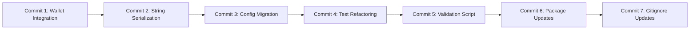

# Plan de Commits Atomicos - Solana RWA Integrity Verification

## Analisis del Workspace

### Verificacion de Codigo Obsoleto

| Verificacion | Resultado |
|--------------|-----------|
| `web/src/types/solana_rwa.ts` eliminado | ✅ Reemplazado por `web/src/anchor/types.ts` |
| Referencias a `/types/solana_rwa` | ✅ No hay referencias pendientes |
| `web/src/anchor/idl/*.json` nuevos | ✅ Correctamente integrados (3 archivos IDL) |
| `WalletDebugPanel.tsx` nuevo | ✅ Importado en `layout.tsx` |
| `useWalletManager.ts` nuevo | ✅ Importado en `WalletConnect.tsx` y exportado en `hooks/index.ts` |
| `.surfpool/` directorios | ⚠️ Deben ser ignorados por `.gitignore` |

### Archivos que DEBEN ser ignorados

Los siguientes directorios ya tienen reglas en `.gitignore` pero aparecen como untracked:

| Directorio | Regla `.gitignore` | Estado |
|------------|-------------------|--------|
| `solana-rwa/.surfpool/logs/` | `.surfpool/logs/` | Debe agregarse al `.gitignore` |
| `solana-rwa/.surfpool/runbook-outputs/` | No existe | Debe agregarse al `.gitignore` |
| `web/.surfpool/` | No existe | Debe agregarse al `.gitignore` |

---

## Plan de Commits Atomicos

### Commit 1: Wallet Integration Fixes (Fase 6.1-6.2)

**Descripcion:** Corregir errores de integracion con wallets Solana, incluyendo el error "Plugin Closed" de Backpack y la actualizacion del panel de debug.

**Archivos:**
- `web/src/hooks/useTokenActions.ts` - Fix error "Plugin Closed" usando `sendRawTransaction()` en lugar de `sendTransaction`
- `web/src/components/WalletDebugPanel.tsx` - Nuevo componente que muestra informacion especifica de Solana (reemplaza EIP-6963)
- `web/src/hooks/useWalletManager.ts` - Nuevo hook para gestion de wallets con Wallet Standard
- `web/src/components/WalletConnect.tsx` - Actualizado para usar `useWalletManager`
- `web/src/providers/SolanaProvider.tsx` - Actualizado para Wallet Standard
- `web/src/hooks/index.ts` - Exportar `useWalletManager`

**Mensaje:**
```
fix(wallet): fix "Plugin Closed" error and update wallet integration

- Use connection.sendRawTransaction() instead of wallet adapter's sendTransaction
  to avoid "Plugin Closed" errors when Backpack wallet closes after signing
- Add WalletDebugPanel component showing Solana-specific debug info
- Migrate to useWalletManager hook with Wallet Standard support
- Update WalletConnect to use new wallet manager
- Update SolanaProvider for Wallet Standard compatibility
- Export useWalletManager from hooks index
```

---

### Commit 2: String Serialization Fix (Fase 6.3)

**Descripcion:** Corregir el error "memory allocation failed, out of memory" en Surfpool causado por formato incorrecto de serializacion de Strings en el cliente TypeScript.

**Archivos:**
- `web/src/anchor/client.ts` - Crear `serializeAnchorString()` con prefijo de 4 bytes (u32 LE) y aplicarlo a `buildInitializeInstruction()` y `buildIdentityRegisterWithDataInstruction()`

**Mensaje:**
```
fix(client): correct String serialization for Anchor compatibility

- Add serializeAnchorString() function using 4-byte u32 LE length prefix
- Update buildInitializeInstruction() to use Anchor String format
- Update buildIdentityRegisterWithDataInstruction() to use Anchor String format
- Fix "memory allocation failed, out of memory" error on Surfpool
- Anchor documentation: String requires 4 bytes for length prefix + UTF-8 bytes
```

---

### Commit 3: Configuration and Types Migration

**Descripcion:** Migrar tipos y configuracion de Solana a estructura centralizada en `web/src/anchor/`.

**Archivos:**
- `web/src/anchor/types.ts` - Nuevos tipos TypeScript (program IDs, discriminators, interfaces de datos)
- `web/src/anchor/idl/compliance-aggregator.json` - Nuevo IDL
- `web/src/anchor/idl/identity-registry.json` - Nuevo IDL
- `web/src/anchor/idl/solana-rwa.json` - Nuevo IDL
- `web/src/config/solana.ts` - Actualizada configuracion de red
- `web/src/app/deploy/page.tsx` - Actualizado para nuevos tipos
- `web/src/app/manage/page.tsx` - Actualizado para nuevos tipos
- `web/src/app/layout.tsx` - Agregar WalletDebugPanel
- `web/src/types/solana_rwa.ts` - ELIMINADO (reemplazado por web/src/anchor/types.ts)

**Mensaje:**
```
chore(config): migrate types and config to centralized anchor structure

- Create web/src/anchor/types.ts with program IDs, discriminators, and data interfaces
- Add IDL JSON files for all three programs (solana-rwa, identity-registry, compliance-aggregator)
- Update solana.ts configuration for network settings
- Update deploy and manage pages to use new type structure
- Add WalletDebugPanel to root layout
- Remove deprecated web/src/types/solana_rwa.ts (migrated to anchor/types.ts)
```

---

### Commit 4: Test Refactoring and Security Tests (Fases 2-3)

**Descripcion:** Refactorizar tests existentes y agregar 17 nuevos tests de seguridad para PDA enforcement.

**Archivos:**
- `solana-rwa/tests/solana-rwa.ts` - Punto de entrada de tests actualizado
- `solana-rwa/tests/token-program.ts` - Tests para transfer_owner, transfer_freeze_authority, get_supply_info
- `solana-rwa/tests/security/pda-enforcement.ts` - 17 nuevos tests (SC-450 a SC-473, CP-050 a CP-052)

**Nuevos Tests:**
| Categoria | Tests |
|-----------|-------|
| PDA Edge Cases | SC-450, SC-451, SC-452, SC-453 |
| Race Conditions | SC-460, SC-461, SC-462 |
| Economic Security | SC-470, SC-471, SC-472, SC-473 |
| Cross-Program Integration | CP-050, CP-051, CP-052 |

**Mensaje:**
```
test(security): add 17 new security tests for PDA enforcement

PDA Edge Cases (SC-450 to SC-453):
- Test PDA collision prevention across different token owners
- Verify PDA derivation is deterministic across runs
- Handle PDA derivation with different wallet pubkeys
- Prevent balance PDA reuse after account close

Race Conditions (SC-460 to SC-462):
- Handle concurrent mint attempts to same wallet
- Handle concurrent agent additions
- Maintain consistency after rapid freeze/unfreeze cycles

Economic Security (SC-470 to SC-473):
- Prevent supply overflow with maximum amount
- Handle decimal precision correctly
- Prevent balance underflow
- Verify rent-exemption for all PDA accounts

Cross-Program Integration (CP-050 to CP-052):
- Verify identity before allowing token operations
- Check compliance before transfer
- Maintain consistent state across all three programs

Also refactor:
- Update solana-rwa.ts as test entry point
- Add transfer_owner, transfer_freeze_authority, get_supply_info tests
```

---

### Commit 5: Validation Script and Documentation (Fases 4-5)

**Descripcion:** Crear script de validacion automatizada y actualizar documentacion de integridad.

**Archivos:**
- `solana-rwa/scripts/validate-integrity.ts` - Nuevo script de validacion (400+ lineas)
- `plans/solana-integrity-verification-plan.md` - Actualizado con resultados de Fases 1-6

**Funcionalidad del Script:**
- Validacion de discriminators SHA256 para instrucciones
- Validacion de orden de accounts entre Rust e IDL
- Validacion de campos de eventos
- Validacion de disponibilidad de instrucciones

**Mensaje:**
```
docs(validation): add integrity validation script and update plan

- Create validate-integrity.ts script (400+ lines) for automated validation
- Validate SHA256 discriminators for all instructions
- Validate account key ordering between Rust source and IDL
- Validate event fields and field names
- Validate instruction availability consistency
- Update integrity verification plan with Fase 4 and 5 results
- Document usage: npx ts-node scripts/validate-integrity.ts
```

---

### Commit 6: Package and Lock File Updates

**Descripcion:** Actualizar dependencias de paquetes del proyecto Solana.

**Archivos:**
- `solana-rwa/package.json`
- `solana-rwa/package-lock.json`
- `solana-rwa/yarn.lock`

**Mensaje:**
```
chore(deps): update Solana project package dependencies
```

---

### Commit 7: Update .gitignore for Surfpool Directories

**Descripcion:** Agregar reglas al `.gitignore` para directorios `.surfpool/` que contienen logs y estado temporal.

**Archivos:**
- `solana-rwa/.gitignore` - Agregar reglas para `.surfpool/logs/`, `.surfpool/runbook-outputs/`
- `web/.gitignore` - Agregar regla para `.surfpool/`

**Mensaje:**
```
chore(gitignore): add Surfpool logs and outputs to ignore rules

- Add .surfpool/logs/ to ignore temporary simulation logs
- Add .surfpool/runbook-outputs/ to ignore runbook execution outputs
- Add web/.surfpool/ to ignore Surfpool state in web directory
- Keep .surfpool/state/*.tx-state.json for deployment tracking (as per existing config)
```

---

## Diagrama de Dependencias entre Commits



**Nota:** Los commits pueden aplicarse en cualquier orden, pero se recomienda el orden mostrado para mantener un historial logico.

---

## Resumen de Cambios

| Categoria | Archivos Modificados | Archivos Nuevos | Archivos Eliminados |
|-----------|---------------------|-----------------|---------------------|
| Wallet Integration | 4 | 2 | 0 |
| String Serialization | 1 | 0 | 0 |
| Config Migration | 4 | 4 | 1 |
| Test Refactoring | 3 | 0 | 0 |
| Validation Script | 1 | 1 | 0 |
| Package Updates | 3 | 0 | 0 |
| Gitignore | 2 | 0 | 0 |
| **TOTAL** | **18** | **7** | **1** |

---

## Comandos Git Ejecutar

```bash
# Commit 1: Wallet Integration Fixes
git add web/src/hooks/useTokenActions.ts web/src/components/WalletDebugPanel.tsx web/src/hooks/useWalletManager.ts web/src/components/WalletConnect.tsx web/src/providers/SolanaProvider.tsx web/src/hooks/index.ts
git commit -m 'fix(wallet): fix "Plugin Closed" error and update wallet integration

- Use connection.sendRawTransaction() instead of wallet adapter sendTransaction
  to avoid "Plugin Closed" errors when Backpack wallet closes after signing
- Add WalletDebugPanel component showing Solana-specific debug info
- Migrate to useWalletManager hook with Wallet Standard support
- Update WalletConnect to use new wallet manager
- Update SolanaProvider for Wallet Standard compatibility
- Export useWalletManager from hooks index'

# Commit 2: String Serialization Fix
git add web/src/anchor/client.ts
git commit -m 'fix(client): correct String serialization for Anchor compatibility

- Add serializeAnchorString function using 4-byte u32 LE length prefix
- Update buildInitializeInstruction to use Anchor String format
- Update buildIdentityRegisterWithDataInstruction to use Anchor String format
- Fix "memory allocation failed, out of memory" error on Surfpool'

# Commit 3: Configuration and Types Migration
git add web/src/anchor/types.ts web/src/anchor/idl/ web/src/config/solana.ts web/src/app/deploy/page.tsx web/src/app/manage/page.tsx web/src/app/layout.tsx web/src/types/solana_rwa.ts
git rm web/src/types/solana_rwa.ts
git commit -m 'chore(config): migrate types and config to centralized anchor structure

- Create web/src/anchor/types.ts with program IDs, discriminators, and data interfaces
- Add IDL JSON files for all three programs
- Update solana.ts configuration for network settings
- Update deploy and manage pages to use new type structure
- Add WalletDebugPanel to root layout
- Remove deprecated web/src/types/solana_rwa.ts'

# Commit 4: Test Refactoring and Security Tests
git add solana-rwa/tests/solana-rwa.ts solana-rwa/tests/token-program.ts solana-rwa/tests/security/pda-enforcement.ts
git commit -m 'test(security): add 17 new security tests for PDA enforcement

PDA Edge Cases (SC-450 to SC-453), Race Conditions (SC-460 to SC-462),
Economic Security (SC-470 to SC-473), Cross-Program Integration (CP-050 to CP-052)'

# Commit 5: Validation Script and Documentation
git add solana-rwa/scripts/validate-integrity.ts plans/solana-integrity-verification-plan.md
git commit -m 'docs(validation): add integrity validation script and update plan

- Create validate-integrity.ts script for automated validation
- Validate SHA256 discriminators, account ordering, event fields
- Update integrity verification plan with Fase 4 and 5 results'

# Commit 6: Package Updates
git add solana-rwa/package.json solana-rwa/package-lock.json solana-rwa/yarn.lock
git commit -m 'chore(deps): update Solana project package dependencies'

# Commit 7: Gitignore Updates
git add solana-rwa/.gitignore web/.gitignore
git commit -m 'chore(gitignore): add Surfpool logs and outputs to ignore rules'
```
