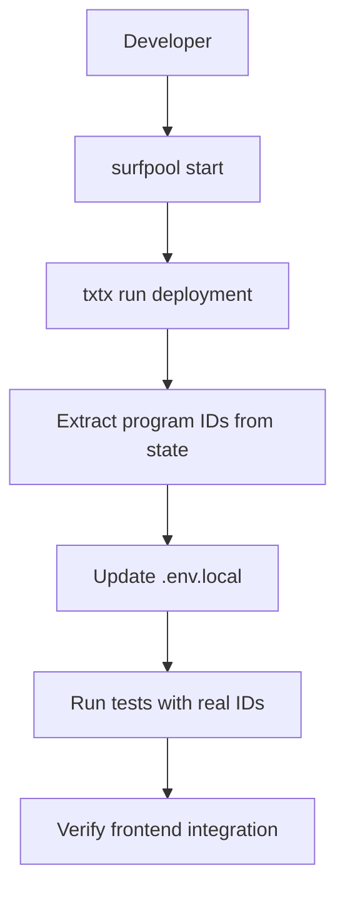
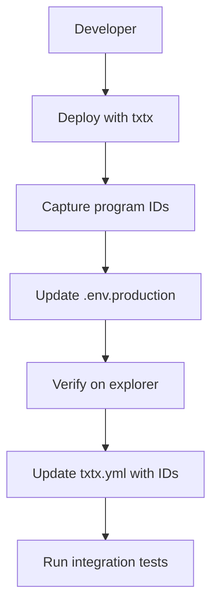

# Solana RWA - Implementation Plan for Inconsistency Fixes

## Executive Summary

This plan addresses the inconsistencies found in the comprehensive analysis of the Solana RWA project. The goal is to fix placeholder values, ensure program ID synchronization across all configuration files, and establish a robust deployment pipeline while maintaining integrity between smart contracts and frontend.

## Current State Analysis

### Issue 1: Placeholder IDs in [`ids.rs`](solana-rwa/programs/solana-rwa/src/ids.rs)

**Status:** CRITICAL - Contains invalid placeholder Base58 strings

```rust
// CURRENT (INVALID PLACEHOLDERS)
pub const IDENTITY_REGISTRY_PROGRAM_ID: &str = "9w8e3r4t5y6u7i8o9p0a1s2d3f4g5h6j7k8l9m0n5";
pub const COMPLIANCE_AGGREGATOR_PROGRAM_ID: &str = "8sJ79x37K7bP9d5t9D9k2b7s4k9r4p6m8r9y8u5i4o7";
```

**Impact Assessment:**
- The `ids.rs` file is currently **NOT USED** anywhere in the codebase
- The search for `get_identity_registry_program_id` and `get_compliance_aggregator_program_id` only found the definitions, not any callers
- The actual cross-program calls in the current implementation use hardcoded program IDs passed from the frontend
- **However**, this file should be fixed as it's intended for future cross-program invocation (CPI) usage

**Correct Values (from [`Anchor.toml`](solana-rwa/Anchor.toml)):**
```toml
[programs.localnet]
identity_registry = "3QreJufDNn5MgdhDtWuYBW2WmQnbDzwf9zLTxXkub8X5"
compliance_aggregator = "EPjdwvyJ8XQfXZvoLufER1trT78Kx7ujYWEKbgvKunzT"
```

### Issue 2: Empty Program IDs in [`txtx.yml`](solana-rwa/txtx.yml)

**Status:** HIGH - Deployment configuration incomplete

```yaml
devnet:
  solana_rwa_program_id: ""
  identity_registry_program_id: ""
  compliance_aggregator_program_id: ""

mainnet:
  solana_rwa_program_id: ""
  identity_registry_program_id: ""
  compliance_aggregator_program_id: ""
```

**Impact:** After deploying to devnet/mainnet, these values must be populated for token operations to work.

### Issue 3: Frontend-Backend Synchronization

**Status:** GOOD - Already properly implemented

- [`web/src/config/solana.ts`](web/src/config/solana.ts) has proper program IDs with environment variable support
- [`web/src/anchor/client.ts`](web/src/anchor/client.ts) has proper instruction builders with discriminators
- [`web/src/hooks/useTokenActions.ts`](web/src/hooks/useTokenActions.ts) has real implementations using the instruction builders

### Issue 4: No Upgradeable Program Pattern

**Status:** MEDIUM - Not implemented

- No upgradeable program pattern is currently in place
- The [`upgrade`](solana-rwa/txtx.yml) runbook exists but needs proper configuration

---

## Implementation Phases

### Phase 1: Fix Placeholder IDs in ids.rs

**Objective:** Replace placeholder IDs with correct values from Anchor.toml

**Changes:**
1. Update `IDENTITY_REGISTRY_PROGRAM_ID` to `"3QreJufDNn5MgdhDtWuYBW2WmQnbDzwf9zLTxXkub8X5"`
2. Update `COMPLIANCE_AGGREGATOR_PROGRAM_ID` to `"EPjdwvyJ8XQfXZvoLufER1trT78Kx7ujYWEKbgvKunzT"`
3. Add network-specific ID support for devnet/mainnet

**Verification:**
- Run `cd solana-rwa && cargo check` to verify compilation
- Run `cd solana-rwa && anchor build` to verify full build

### Phase 2: Configure txtx.yml with Program ID Strategy

**Objective:** Establish a program ID management strategy for txtx deployment

**Changes:**
1. Add placeholder comments for devnet/mainnet program IDs
2. Create a `.env.template` file for environment-specific configuration
3. Add validation rules for program ID format (Base58, 32 characters)

**Strategy Options:**

| Approach | Pros | Cons | Best For |
|----------|------|------|----------|
| **Option A: Environment Variables** | Flexible, no file changes needed after deploy | Requires manual update after each deploy | Development |
| **Option B: State File Extraction** | Automatic from surfpool state | Requires parsing state files | Production |
| **Option C: Hybrid** | Best of both worlds | Slightly more complex | Recommended |

### Phase 3: Implement Program ID Validation Script

**Objective:** Create a verification script to ensure consistency across all configuration files

**Deliverables:**
1. Shell script to validate program IDs match across:
   - `Anchor.toml`
   - `ids.rs`
   - `web/src/config/solana.ts`
   - `txtx.yml` (after deployment)
2. TypeScript validation for frontend program ID format
3. CI/CD integration checklist

### Phase 4: Build and Test Verification

**Objective:** Ensure all changes compile and tests pass

**Verification Steps:**
1. `anchor build` - Compile all programs
2. `anchor test` - Run all Rust/TypeScript tests
3. `cd web && npm run build` - Verify frontend builds
4. Run consistency validation script

### Phase 5: Documentation and Deployment Guide

**Objective:** Document all changes and create deployment checklist

**Deliverables:**
1. Updated deployment guide with program ID management
2. Local development workflow with Surfpool
3. Devnet/mainnet deployment workflow
4. Upgrade procedure documentation

---

## Recommended Implementation Strategy

### Local Development Workflow (Surfpool)



### Devnet/Mainnet Deployment Workflow



---

## File Change Summary

| File | Change Type | Description |
|------|-------------|-------------|
| `solana-rwa/programs/solana-rwa/src/ids.rs` | Modify | Replace placeholder IDs with correct values |
| `solana-rwa/txtx.yml` | Modify | Add program ID validation and comments |
| `web/.env.example` | Create | Template for environment variables |
| `solana-rwa/verify_ids.sh` | Create | Program ID consistency validation script |
| `docs/DEPLOYMENT_WORKFLOW.md` | Create | Deployment workflow documentation |

---

## Risk Assessment

| Risk | Level | Mitigation |
|------|-------|------------|
| Breaking existing deployments | Low | Changes only affect local development; production IDs are environment-specific |
| Build failures | Low | Rust compiler will catch any syntax errors immediately |
| Frontend integration issues | Low | Frontend uses dynamic program IDs from config; no hardcoded values in hooks |
| Test failures | Medium | Some tests may need updated program IDs; will verify after changes |

---

## Implementation Order

1. **ids.rs** - Fix placeholder IDs (5 minutes)
2. **Build verification** - Confirm compilation (2 minutes)
3. **txtx.yml** - Add validation and documentation (10 minutes)
4. **Validation script** - Create consistency checker (15 minutes)
5. **Documentation** - Update deployment guide (20 minutes)
6. **Final verification** - Full build and test suite (5 minutes)

---

## Post-Implementation Checklist

- [ ] `anchor build` succeeds without errors
- [ ] `anchor test` passes all tests
- [ ] `cd web && npm run build` succeeds
- [ ] Program IDs consistent across all files
- [ ] Local deployment with Surfpool works
- [ ] Frontend connects to local program
- [ ] Documentation updated
