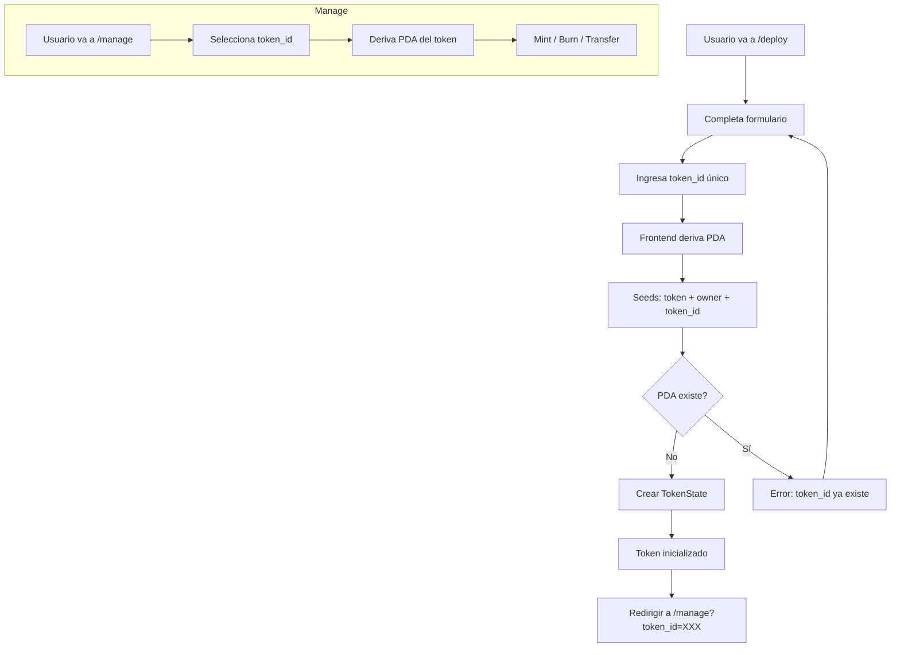

# Multi-Token Implementation Plan

**Date:** 2026-04-29
**Status:** Planning
**Approach:** Opción B — Seeds `[b"token", owner, token_id]`

---

## 1. Resumen del Cambio

### Diseño Actual (Roto para multi-token)
```
TokenState PDA: [b"token", b"state"] → 1 token global por programa
```

### Diseño Propuesto (Multi-token)
```
TokenState PDA: [b"token", owner_bytes, token_id_bytes] → N tokens por wallet
```

### token_id
- **Tipo:** String corto (máx 32 bytes)
- **Ejemplo:** `"rwa-001"`, `"real-estate-a"`, `"token-v2"`
- **Generación:** El usuario lo elige en el formulario de deploy
- **Validación:** Solo caracteres alfanuméricos, guiones y guiones bajos

---

## 2. Impacto en Smart Contract

### 2.1 [`solana-rwa/programs/solana-rwa/src/pdas/mod.rs`](solana-rwa/programs/solana-rwa/src/pdas/mod.rs)

**Actual:**
```rust
pub fn derive_token_state_pda() -> (Pubkey, u8) {
    let seeds: &[&[u8]] = &[b"token", b"state"];
    Pubkey::find_program_address(seeds, &crate::id())
}
```

**Propuesto:**
```rust
pub fn derive_token_state_pda(owner: &Pubkey, token_id: &[u8]) -> (Pubkey, u8) {
    let seeds = &[b"token", owner.as_ref(), token_id];
    Pubkey::find_program_address(seeds, &crate::id())
}
```

### 2.2 [`solana-rwa/programs/solana-rwa/src/lib.rs`](solana-rwa/programs/solana-rwa/src/lib.rs) — Initialize

**Actual:**
```rust
#[derive(Accounts)]
pub struct Initialize<'info> {
    #[account(mut)]
    pub payer: Signer<'info>,
    #[account(
        init,
        payer = payer,
        seeds = [b"token", b"state"],
        bump,
        space = 8 + std::mem::size_of::<TokenState>()
    )]
    pub token: AccountLoader<'info, TokenState>,
    pub system_program: Program<'info, System>,
}
```

**Propuesto:**
```rust
#[derive(Accounts)]
pub struct Initialize<'info> {
    #[account(mut)]
    pub payer: Signer<'info>,
    #[account(
        init,
        payer = payer,
        seeds = [b"token", payer.key().as_ref(), token_id.as_bytes()],
        bump,
        space = 8 + std::mem::size_of::<TokenState>()
    )]
    pub token: AccountLoader<'info, TokenState>,
    pub system_program: Program<'info, System>,
}
```

**Handler:**
```rust
pub fn initialize(
    ctx: Context<Initialize>,
    name: String,
    symbol: String,
    decimals: u8,
    token_id: String,  // NEW PARAMETER
) -> Result<()> {
    // ...
}
```

### 2.3 Todas las instrucciones que usan TokenState

Cada instruction struct que referencia TokenState necesita actualizar las seeds:

| Instruction | Archivo | Línea | Cambio |
|-------------|---------|-------|--------|
| Initialize | lib.rs | ~87 | `[b"token", payer, token_id]` |
| Mint | lib.rs | ~108 | `[b"token", token.owner.as_ref(), token.token_id.as_ref()]` |
| Burn | lib.rs | ~150 | Igual que Mint |
| Transfer | lib.rs | ~190 | Igual que Mint |
| FreezeAccount | lib.rs | ~230 | Igual que Mint |
| UnfreezeAccount | lib.rs | ~260 | Igual que Mint |
| AddAgent | lib.rs | ~290 | Igual que Mint |
| RemoveAgent | lib.rs | ~320 | Igual que Mint |
| TransferOwner | lib.rs | ~350 | Igual que Mint |
| TransferFreezeAuthority | lib.rs | ~380 | Igual que Mint |
| GetSupplyInfo | lib.rs | ~410 | Igual que Mint |

**Problema:** Las instrucciones que leen TokenState necesitan acceder al `token_id` almacenado para verificar las seeds. Esto requiere que TokenState almacene el `token_id`.

### 2.4 [`solana-rwa/programs/solana-rwa/src/states/token_state.rs`](solana-rwa/programs/solana-rwa/src/states/token_state.rs)

**Actual:**
```rust
pub struct TokenState {
    pub owner: Pubkey,
    pub freeze_authority: Pubkey,
    pub total_supply: u64,
    pub name: [u8; 32],
    pub symbol: [u8; 8],
    pub decimals: u8,
    pub bump: u8,
    pub _padding: [u8; 6],
} // 120 bytes
```

**Propuesto:**
```rust
pub struct TokenState {
    pub owner: Pubkey,              // 32
    pub freeze_authority: Pubkey,   // 32
    pub total_supply: u64,          // 8
    pub name: [u8; 32],             // 32
    pub symbol: [u8; 8],            // 8
    pub token_id: [u8; 16],         // 16 NEW
    pub decimals: u8,               // 1
    pub bump: u8,                   // 1
    pub _padding: [u8; 6],          // 6
} // 136 bytes (+16 bytes)
```

### 2.5 Patrón de verificación de seeds en instrucciones

Para las instrucciones que leen TokenState (no Initialize), el patrón es:

```rust
#[derive(Accounts)]
pub struct Mint<'info> {
    /// Token state - seeds verified from stored data
    #[account(
        mut,
        seeds = [b"token", token.load()?.owner.as_ref(), &token.load()?.token_id],
        bump = token.load()?.bump,
    )]
    pub token: AccountLoader<'info, TokenState>,
    // ...
}
```

**Nota:** Esto requiere que `token.load()` sea llamado antes de la verificación de seeds. Anchor soporta esto con `seeds = [b"token", token.load()?.owner.as_ref(), &token.load()?.token_id]`.

---

## 3. Impacto en Frontend

### 3.1 [`web/src/anchor/pdas.ts`](web/src/anchor/pdas.ts)

**Actual:**
```typescript
export function deriveTokenStatePda(programId: PublicKey): PublicKey {
    const [pda] = PublicKey.findProgramAddressSync(
        [Buffer.from("token"), Buffer.from("state")],
        programId
    );
    return pda;
}
```

**Propuesto:**
```typescript
export function deriveTokenStatePda(
    owner: PublicKey,
    tokenId: string,
    programId: PublicKey
): PublicKey {
    const [pda] = PublicKey.findProgramAddressSync(
        [Buffer.from("token"), owner.toBuffer(), Buffer.from(tokenId)],
        programId
    );
    return pda;
}
```

### 3.2 [`web/src/anchor/solana-rwa.ts`](web/src/anchor/solana-rwa.ts) — buildInitializeInstruction

**Actual:**
```typescript
export function buildInitializeInstruction(
    payer: PublicKey,
    tokenState: PublicKey,
    name: string,
    symbol: string,
    decimals: number,
    _programId: PublicKey
): InstructionResult {
    const data = Buffer.alloc(8 + nameBytes + symbolBytes);
    // ...
}
```

**Propuesto:**
```typescript
export function buildInitializeInstruction(
    payer: PublicKey,
    tokenState: PublicKey,
    name: string,
    symbol: string,
    decimals: number,
    tokenId: string,  // NEW
    _programId: PublicKey
): InstructionResult {
    const data = Buffer.alloc(8 + nameBytes + symbolBytes + tokenIdBytes);
    // ...
}
```

### 3.3 [`web/src/app/deploy/page.tsx`](web/src/app/deploy/page.tsx)

**Nuevo campo en formulario:**
```tsx
<input
  type="text"
  placeholder="e.g. rwa-001"
  value={tokenConfig.tokenId}
  onChange={(e) => setTokenConfig(prev => ({ ...prev, tokenId: e.target.value }))}
  maxLength={16}
  pattern="[a-zA-Z0-9_-]+"
/>
```

**PDA derivation:**
```tsx
const tokenStatePda = useMemo(() => {
    if (!publicKey || !tokenConfig.tokenId) return null;
    const programId = new PublicKey(programIdStr);
    return deriveTokenStatePda(publicKey, tokenConfig.tokenId, programId).toString();
}, [publicKey, tokenConfig.tokenId]);
```

### 3.4 [`web/src/hooks/useTokenActions.ts`](web/src/hooks/useTokenActions.ts)

**initializeToken:**
```typescript
const initializeToken = useCallback(async (
    name: string,
    symbol: string,
    decimals: number,
    tokenId: string  // NEW
) => {
    // ...
    const { keys, data } = buildInitializeInstruction(
        currentPublicKey,
        tokenState,
        name, symbol, decimals,
        tokenId,  // NEW
        programId
    );
}, [...]);
```

### 3.5 [`web/src/app/manage/page.tsx`](web/src/app/manage/page.tsx)

**Selector de token:**
```tsx
// Lista de tokens del owner (requiere indexación o input manual)
<select value={selectedTokenId} onChange={...}>
  <option value="rwa-001">RWA Token 001</option>
  <option value="rwa-002">RWA Token 002</option>
</select>
```

**PDA derivation:**
```tsx
const tokenStatePda = useMemo(() => {
    if (!publicKey || !selectedTokenId) return null;
    const programId = new PublicKey(programIdStr);
    return deriveTokenStatePda(publicKey, selectedTokenId, programId).toString();
}, [publicKey, selectedTokenId]);
```

---

## 4. Impacto en Runbooks de Surfpool

### 4.1 [`solana-rwa/runbooks/token-initialization/main.tx`](solana-rwa/runbooks/token-initialization/main.tx)

**Nuevo input:**
```
variable "token_id" {
    value = input.token_id
}
```

**Instruction args:**
```
instruction_args = [variable.token_name, variable.token_symbol, variable.token_decimals, variable.token_id]
```

---

## 5. Diagrama de Flujo



---

## 6. Orden de Implementación

### Fase 1: Smart Contract
1. Actualizar `TokenState` struct (agregar `token_id`)
2. Actualizar `derive_token_state_pda` en `pdas/mod.rs`
3. Actualizar `Initialize` instruction
4. Actualizar todas las instrucciones que usan TokenState
5. `anchor build` + `anchor test`

### Fase 2: Frontend Core
6. Actualizar `deriveTokenStatePda` en `pdas.ts`
7. Actualizar `buildInitializeInstruction` en `solana-rwa.ts`
8. Actualizar `TransactionResult` y `initializeToken` en `useTokenActions.ts`

### Fase 3: Frontend UI
9. Agregar campo `token_id` en `/deploy`
10. Agregar selector de `token_id` en `/manage`
11. Actualizar URL params para `token_id`
12. Actualizar todos los hooks

### Fase 4: Infraestructura
13. Actualizar runbooks de Surfpool
14. Regenerar IDLs
15. Verificación TypeScript completa

---

## 7. Consideraciones

### Migración de datos
- El token global existente (`[b"token", b"state"]`) no es migrable automáticamente
- Opción: Crear instruction `MigrateFromGlobal` que lee el TokenState global y crea uno nuevo con token_id
- Opción: Dejar el token global como está y permitir nuevos tokens con token_id

### Validación de token_id
- Máximo 16 caracteres
- Solo `[a-zA-Z0-9_-]`
- Case-sensitive
- No puede estar vacío

### UX
- Sugerir token_id basado en el nombre del token
- Mostrar lista de tokens existentes del owner en /manage
- URL: `/manage?token_id=rwa-001`
