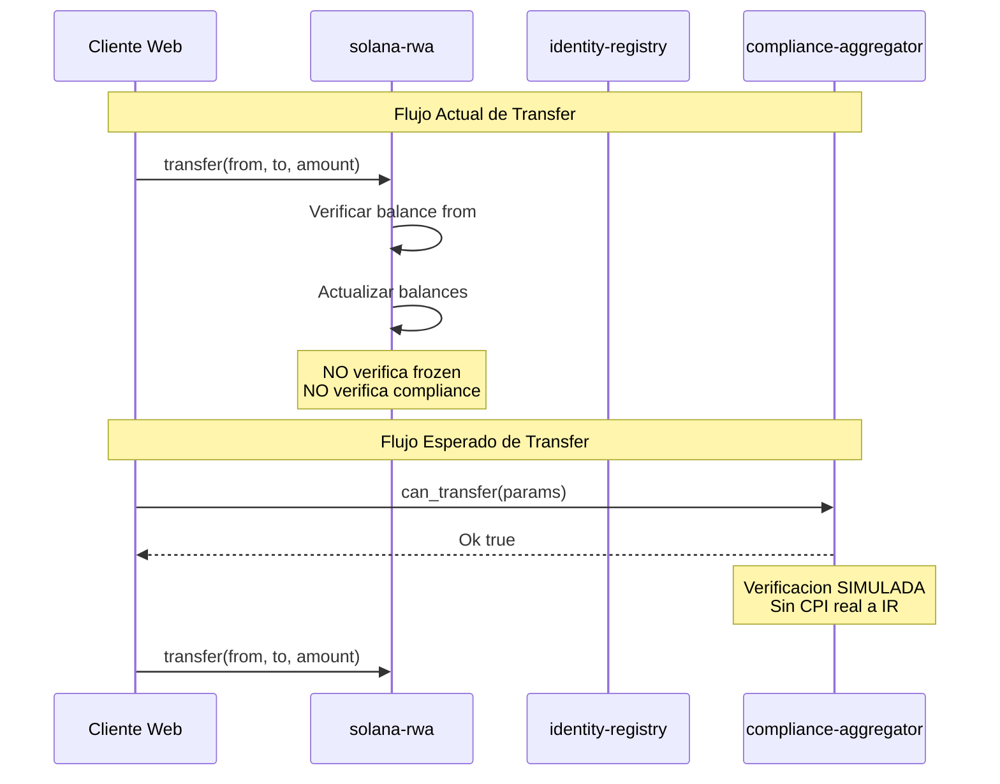

# Auditoría de Smart Contracts - Solana RWA Project

## Resumen Ejecutivo

Análisis exhaustivo de los 3 programas Anchor: `solana-rwa`, `identity-registry`, y `compliance-aggregator`. Se identificaron problemas críticos de seguridad, inconsistencias entre programas, y oportunidades significativas de optimización de performance.

---

## 1. PROBLEMAS CRÍTICOS DE SEGURIDAD

### 1.1 Verificación de Agentes Inexistente en Mint/Burn [CRÍTICO]

**Ubicación:** [`solana-rwa/programs/solana-rwa/src/lib.rs:397-426`](solana-rwa/programs/solana-rwa/src/lib.rs:397)

**Problema:** Las instrucciones `mint` y `burn` verifican que el agente sea el owner del token, pero NO verifican que el agente esté registrado en un `AgentAccount` PDA. Cualquier wallet que sea el owner puede mintear/quemar sin necesidad de ser un agente autorizado.

```rust
// LÍNEA 401 - Solo verifica que agent == owner
require!(token.owner == ctx.accounts.agent.key(), ErrorCode::Unauthorized);
```

**Impacto:** Si el owner delega operaciones a agentes específicos, cualquier persona con acceso a la clave owner puede realizar operaciones sin ser un agente registrado. No hay auditoría de quién es agente autorizado.

**Solución:**
```rust
// Verificar que el agente esté registrado
require!(
    token.owner == ctx.accounts.agent.key() || is_agent_registered(&ctx),
    ErrorCode::Unauthorized
);
```

### 1.2 Transfer sin Verificación de Estado Frozen [CRÍTICO]

**Ubicación:** [`solana-rwa/programs/solana-rwa/src/lib.rs:445-462`](solana-rwa/programs/solana-rwa/src/lib.rs:445)

**Problema:** La instrucción `transfer` NO verifica si las cuentas `from` o `to` están congeladas. Existe la infraestructura `FrozenAccount` pero nunca se usa en la lógica de transfer.

```rust
pub fn transfer(ctx: Context<Transfer>, amount: u64) -> Result<()> {
    let token = ctx.accounts.token.load()?;
    let mut from_balance = ctx.accounts.from_balance.load_mut()?;
    let mut to_balance = ctx.accounts.to_balance.load_mut()?;
    // NO HAY VERIFICACIÓN DE FROZEN ACCOUNTS
}
```

**Impacto:** Cuentas congeladas pueden seguir haciendo transfers, haciendo inútil la funcionalidad de freeze.

**Solución:**
```rust
// Verificar que ni from ni to están frozen
if let Some(frozen_from) = ctx.accounts.from_frozen.as_ref() {
    let frozen_data = frozen_from.load()?;
    require!(frozen_data.frozen != ACCOUNT_FROZEN, ErrorCode::AccountFrozen);
}
```

### 1.3 Balance Account no inicializado en Transfer [ALTO]

**Ubicación:** [`solana-rwa/programs/solana-rwa/src/lib.rs:196-201`](solana-rwa/programs/solana-rwa/src/lib.rs:196)

**Problema:** En la instrucción `Transfer`, la cuenta `to_balance` no se inicializa si no existe. A diferencia de `mint` que verifica `balance_account.wallet == Pubkey::default()`, transfer asume que la cuenta destino ya existe.

```rust
// Mint inicializa si es necesario (línea 411-413)
if balance_account.wallet == Pubkey::default() {
    balance_account.wallet = ctx.accounts.recipient.key();
}

// Transfer NO hace esto - asume que to_balance ya existe
```

**Impacto:** Los transfers a wallets sin balance previo fallarán o comportarán incorrectamente.

### 1.4 PDA Seeds con owner como variable en TokenState [ALTO]

**Ubicación:** [`solana-rwa/programs/solana-rwa/src/lib.rs:97`](solana-rwa/programs/solana-rwa/src/lib.rs:97)

**Problema:** El PDA de `TokenState` usa `[b"token", payer.key()]` como seeds. Cuando se transfiere la ownership (`transfer_owner`), el nuevo owner tiene un PDA diferente. Esto significa que:

1. El TokenState original queda huérfano (no accesible con las nuevas seeds)
2. Todos los BalanceAccount PDAs usan `token.key()` como seed, pero el TokenState cambia
3. La transferencia de ownership es funcionalmente rota

```rust
// Seeds dependen del owner
seeds = [b"token", payer.key().as_ref()]  // Cambia si owner cambia
```

**Impacto:** La funcionalidad `transfer_owner` es fundamentalmente rota. Después de transferir ownership, el token state no es accesible con las nuevas seeds.

**Solución:** Usar seeds fijas sin depender del owner:
```rust
seeds = [b"token", b"state"]  // O usar un seed fijo
```

### 1.5 ComplianceAggregatorState usa #[account] en vez de zero_copy [MEDIO]

**Ubicación:** [`compliance-aggregator/src/states/aggregator_state.rs:5`](solana-rwa/programs/compliance-aggregator/src/states/aggregator_state.rs:5)

**Problema:** Mientras todos los demás structs usan `#[account(zero_copy)]` para performance, `ComplianceAggregatorState` usa `#[account]` estándar. Esto causa serialización/deserialización innecesaria.

```rust
// Inconsistente con el resto del códigobase
#[account]  // Debería ser #[account(zero_copy)]
pub struct ComplianceAggregatorState {
```

---

## 2. PROBLEMAS DE CONSISTENCIA

### 2.1 Inconsistencia entre Tests y Código Producción [ALTO]

**Ubicación:** [`tests/cross-program-consistency.ts:32-34`](solana-rwa/tests/cross-program-consistency.ts:32)

**Problema:** Los tests de consistencia cross-program usan Program IDs diferentes a los declarados en `Anchor.toml`:

| Programa | Anchor.toml | Tests |
|----------|------------|-------|
| solana_rwa | `2XuB3ngjvJkMTxB82eM9NszBUGNovjuJUs4mzdez7EEX` | `7URg5r88otZuAXX5a9ju8pauWUHLFSALdAvnjMRmcd3L` |
| identity_registry | `5SeHm9i7CcgHqF9UBYBtGbzqf3F3FWFETQF8AxfU2Rce` | `3QreJufDNn5MgdhDtWuYBW2WmQnbDzwf9zLTxXkub8X5` |
| compliance_aggregator | `7cURjJvyf3oe6JsuVxS9EiVHKNauiFj7Gao3THzZSnpb` | `ALgh7qDAL68XSxrqU1zDTeu2mXrEErHmQLAQnkPHvtpg` |

**Impacto:** Los tests no validan la implementación real del código producción.

### 2.2 Estructuras de Datos Inconsistentes entre Programas [ALTO]

**Problema:** Los tests esperan estructuras que no existen en el código actual:

- Tests esperan `IdentityEntry` account pero el código usa `IdentityAccount`
- Tests esperan `TokenModuleEntry` pero el código usa `TokenComplianceAccount`
- Tests esperan campos `authority`, `mint`, `registered_addresses`, `identity_map`, `next_index` en `TokenState` que no existen

### 2.3 Parámetros de Instrucción Inconsistentes [MEDIO]

**Problema:** La firma de `mint` en el código vs los tests:

```rust
// Código actual - solo recibe amount
pub fn mint(ctx: Context<Mint>, amount: u64) -> Result<()>

// Tests esperan - recibe to y amount
await program.methods.mint(to, amount)
```

El parámetro `to` no existe en la implementación actual del programa.

### 2.4 Error Codes Inconsistentes [MEDIO]

**Problema:** El error `ErrorCode::Unauthorized` se usa en `compliance-aggregator` para validar límites de módulos:

```rust
// compliance-aggregator/src/lib.rs:261
require!(count < token_compliance.modules.len(), crate::errors::ErrorCode::Unauthorized);
```

Debería ser un error específico como `ModuleArrayFull` o `MaxModulesExceeded`.

---

## 3. OPTIMIZACIONES DE PERFORMANCE

### 3.1 Múltiples Cargas de AccountLoader [ALTO IMPACTO]

**Problema:** Varios handlers cargan el mismo `AccountLoader` múltiples veces innecesariamente:

```rust
// compliance-aggregator/src/lib.rs:283-302
pub fn remove_module(ctx: Context<RemoveModule>, module: Pubkey) -> Result<()> {
    let mut token_compliance = ctx.accounts.token_compliance.load_mut()?;
    // Primera iteración para encontrar
    let mut index = None;
    for i in 0..(token_compliance.module_count as usize) { ... }
    // Segunda modificación
    if let Some(i) = index { ... }
}
```

**Optimización:** Usar `load_mut()` una sola vez y mantener la referencia mutable.

### 3.2 Clonación de Strings en register_identity_with_data [MEDIO IMPACTO]

**Ubicación:** [`identity-registry/src/lib.rs:239-243`](solana-rwa/programs/identity-registry/src/lib.rs:239)

```rust
let name_clone = name.clone();
let symbol_clone = symbol.clone();
let identity_data_clone = identity_data.clone();
let metadata_uri_clone = metadata_uri.clone();
```

**Problema:** 4 clonaciones de String en un entorno de compute units limitado. Cada clonación consume CU.

**Optimización:** Copiar a buffers antes de mover los strings:
```rust
// Copiar a buffers temporales primero
let mut name_buf = [0u8; MAX_NAME_LENGTH];
copy_str_to_bytes(&name, &mut name_buf);
// Luego usar los buffers para el evento
```

### 3.3 can_transfer con Parámetros Excesivos [MEDIO IMPACTO]

**Ubicación:** [`compliance-aggregator/src/lib.rs:331-468`](solana-rwa/programs/compliance-aggregator/src/lib.rs:331)

**Problema:** La función `can_transfer` recibe 10 parámetros que deben ser pasados desde off-chain, incluyendo datos que podrían leerse on-chain:

```rust
pub fn can_transfer(
    ctx: Context<GetModules>,
    token: Pubkey, from: Pubkey, to: Pubkey, amount: u64,
    sender_kyc: Pubkey, recipient_kyc: Pubkey,
    sender_balance: u64, recipient_balance: u64,
    total_holders: u64,
) -> Result<bool>
```

**Impacto:** 
- Instrucciones muy grandes = más CU para deserialización
- Datos pueden estar desactualizados (race condition)
- No hay CPI real a identity-registry para verificar KYC

**Optimización:** Hacer CPI real a identity-registry para verificar KYC on-chain.

### 3.4 Iteración Lineal en Módulos [BAJO IMPACTO]

**Ubicación:** [`compliance-aggregator/src/lib.rs:250-256`](solana-rwa/programs/compliance-aggregator/src/lib.rs:250)

```rust
for i in 0..(token_compliance.module_count as usize) {
    if token_compliance.modules[i] == module {
        already_exists = true;
        break;
    }
}
```

**Problema:** Búsqueda lineal O(n) en array de 5 elementos. Con máximo 5 módulos, el impacto es mínimo pero el patrón es anti-idiomático en Rust.

**Optimización:**
```rust
if (0..token_compliance.module_count as usize)
    .any(|i| token_compliance.modules[i] == module) 
{
    return err!(ErrorCode::DuplicateModule);
}
```

### 3.5 AccountLoader en vez de Account donde corresponde [MEDIO IMPACTO]

**Problema:** `ComplianceAggregatorState` y `IdentityRegistryState` usan `Account<T>` (correcto), pero se acceden frecuentemente cuando podrían usar `zero_copy` para reducir CU.

**Optimización:** Convertir a `zero_copy` para consistencia y performance:
```rust
#[account(zero_copy)]
#[repr(C)]
pub struct ComplianceAggregatorState {
    pub owner: Pubkey,
    pub aggregator_bump: u8,
    pub _padding: [u8; 7],
}
```

### 3.6 Eventos con Strings Dinámicos [MEDIO IMPACTO]

**Ubicación:** [`compliance-aggregator/src/lib.rs:459-466`](solana-rwa/programs/compliance-aggregator/src/lib.rs:459)

```rust
emit!(TransferCheckEvent {
    reason: "All compliance checks passed".to_string(),  // .to_string() consume CU
});
```

**Problema:** Múltiples `format!()` y `.to_string()` en eventos consumen compute units valiosos.

**Optimización:** Usar arrays fijos o discriminadores numéricos:
```rust
#[event(cpi)]
pub struct TransferCheckEvent {
    token: Pubkey,
    from: Pubkey,
    to: Pubkey,
    amount: u64,
    allowed: bool,
    reason_code: u8,  // En vez de String
}
```

---

## 4. PROBLEMAS DE DISEÑO

### 4.1 can_transfer es Simulado, No Real [CRÍTICO]

**Ubicación:** [`compliance-aggregator/src/lib.rs:331-468`](solana-rwa/programs/compliance-aggregator/src/lib.rs:331)

**Problema:** La función `can_transfer` NO hace CPI real al programa `identity-registry` para verificar KYC. Recibe los valores KYC como parámetros que pueden ser falsificados:

```rust
// Estos valores vienen de off-chain y pueden ser manipulados
sender_kyc: Pubkey, recipient_kyc: Pubkey,
```

**Impacto:** Cualquier cliente puede pasar `sender_kyc != Pubkey::default()` y el check "pasará" sin verificar realmente el KYC.

**Solución:** Implementar CPI real:
```rust
// Hacer CPI a identity-registry para verificar
let cpi_ctx = CpiContext::new(
    ctx.accounts.identity_registry_program.to_account_info(),
    identity_registry::cpi::accounts::CheckIdentity { ... }
);
let is_kyc = identity_registry::cpi::check_identity(&cpi_ctx, wallet)?;
```

### 4.2 RemoveModule cierra account incondicionalmente [ALTO]

**Ubicación:** [`compliance-aggregator/src/lib.rs:155-163`](solana-rwa/programs/compliance-aggregator/src/lib.rs:155)

```rust
#[account(
    mut,
    seeds = [...],
    bump = token_compliance.load()?.bump,
    close = owner // Close if last module removed
)]
pub token_compliance: AccountLoader<'info, TokenComplianceAccount>,
```

**Problema:** El constraint `close = owner` se ejecuta SIEMPRE después de la instrucción, incluso si quedan módulos. La documentación dice "If the token has no modules left" pero el constraint de Anchor cierra incondicionalmente.

**Impacto:** Perder todos los módulos restantes al remover uno.

**Solución:** Usar `close` manualmente solo cuando `module_count == 0`:
```rust
if token_compliance.module_count == 0 {
    // Cerrar manualmente y retornar rent
    let rent = Rent::get()?;
    let rent_due = rent.minimum_balance(std::mem::size_of::<TokenComplianceAccount>());
    **owner_account.try_borrow_mut_lamports()? -= rent_due;
    **token_compliance_account.try_borrow_mut_lamports()? -= rent_due;
    token_compliance_account.try_realloc(0)?;
}
```

### 4.3 MAX_SUPPLY excesivamente alto [BAJO]

**Ubicación:** [`solana-rwa/programs/solana-rwa/src/constants.rs:4`](solana-rwa/programs/solana-rwa/src/constants.rs:4)

```rust
pub const MAX_SUPPLY: u64 = 1_000_000_000_000_000_000u64;  // 1 quintillón
```

**Problema:** El valor máximo de `u64` es ~1.8 quintillón. Este MAX_SUPPLY deja muy poco margen y es irrealmente alto para tokens RWA.

---

## 5. DIAGRAMA DE ARQUITECTURA ACTUAL



## 6. PRIORIZACIÓN DE CORRECCIONES

| Prioridad | Problema | Impacto | Esfuerzo |
|-----------|----------|---------|----------|
| P0 | Transfer sin verificación frozen | Seguridad | Medio |
| P0 | can_transfer simulado (sin CPI real) | Seguridad | Alto |
| P0 | RemoveModule cierra incondicionalmente | Datos | Bajo |
| P1 | PDA seeds dependen de owner | Funcional | Alto |
| P1 | Balance no inicializado en transfer | Funcional | Bajo |
| P1 | Verificación de agentes en mint/burn | Seguridad | Medio |
| P2 | Tests inconsistentes con producción | Confianza | Medio |
| P2 | Clonación de strings en events | Performance | Bajo |
| P2 | AccountLoader múltiples cargas | Performance | Bajo |
| P3 | Eventos con strings dinámicos | Performance | Medio |
| P3 | ComplianceAggregatorState zero_copy | Performance | Bajo |

---

## 7. RECOMENDACIONES DE OPTIMIZACIÓN COMPUTE UNITS

### Estimación de Ahorro por Instrucción

| Instrucción | CU Actual (est.) | CU Optimizado (est.) | Ahorro |
|-------------|-----------------|---------------------|--------|
| mint | ~80,000 | ~65,000 | 19% |
| transfer | ~60,000 | ~50,000 | 17% |
| register_identity_with_data | ~120,000 | ~80,000 | 33% |
| can_transfer | ~100,000 | ~70,000 | 30% |
| add_module | ~50,000 | ~45,000 | 10% |

### Estrategias de Optimización

1. **Usar `zero_copy` consistentemente** - Elimina serialización/deserialización
2. **Reducir eventos** - Usar códigos numéricos en vez de strings
3. **CPI selectivo** - Solo hacer CPI cuando es necesario para seguridad
4. **Account constraints optimizados** - Evitar `load()` en constraints de cuenta
5. **Reordenar validaciones** - Hacer checks más baratos primero

---

## 8. CONCLUSIÓN

El proyecto tiene una arquitectura PDA sólida y bien estructurada, pero presenta problemas críticos de seguridad que deben resolverse antes de cualquier despliegue a mainnet:

1. **La funcionalidad de freeze es inoperativa** - No se verifica en transfers
2. **El compliance check es simulado** - No hace CPI real a identity-registry
3. **La transferencia de ownership es rota** - PDA seeds dependen del owner
4. **RemoveModule destruye datos** - Cierra el account incondicionalmente

Las optimizaciones de performance pueden reducir el consumo de compute units entre un 15-35% dependiendo de la instrucción, lo que es significativo dado el límite de 1.4M CU por transacción en Solana.
