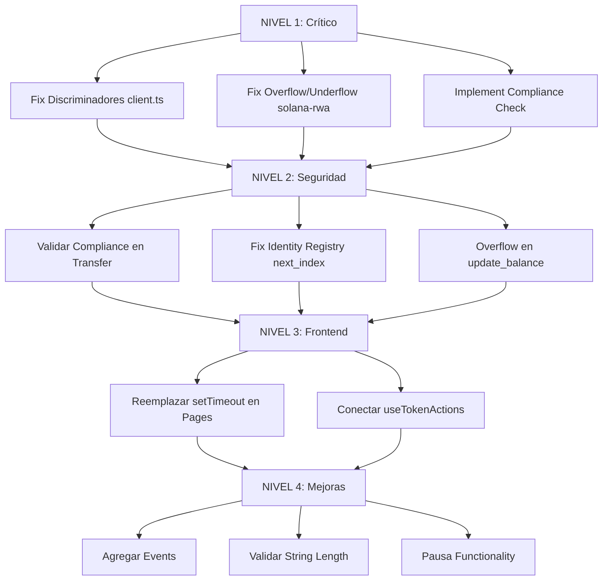

# Plan Jerárquico de Implementación - Solana RWA Platform

## Resumen Ejecutivo

Este plan organiza las mejoras necesarias para los programas Solana (Rust/Anchor) y el frontend Next.js de la plataforma RWA Token. Se prioriza la corrección de errores críticos que impiden el funcionamiento correcto de la dApp.

## Estado Actual Verificado

| Componente | Estado | Issues Encontrados |
|------------|--------|-------------------|
| solana-rwa build | ✅ Compila sin errores | 2 críticos en lógica |
| identity-registry build | ✅ Compila sin errores | 1 menor |
| compliance-aggregator build | ✅ Compila sin errores | 1 crítico (stub) |
| IDL generation | ✅ Genera correctamente | Mismatch con client.ts |
| Tests anchor | ✅ Pasan | Cubren lógica pero no seguridad completa |
| Frontend client.ts | ❌ Discriminadores incorrectos | 5/8 discriminadores wrong |
| Frontend pages | ❌ Simulación | Usan setTimeout() en lugar de blockchain real |

---

## NIVEL 1: CRÍTICO - Bloqueos de Funcionalidad

Estos issues impiden que la dApp funcione correctamente en producción.

### 1.1 Fix Discriminadores en Frontend Client.ts

**Archivo:** [`web/src/anchor/client.ts`](web/src/anchor/client.ts:59)

**Problema:** Los discriminadores de instrucción en `client.ts` no coinciden con los generados por Anchor en el IDL. Esto causará que TODAS las transacciones fallen con "Invalid instruction data" o "Program not found".

**Discriminadores Incorrectos (5 de 8):**

| Instruction | client.ts Actual | IDL Correcto | Estado |
|-------------|------------------|--------------|--------|
| initialize | [172, 126, 250, 222, 211, 123, 83, 106] | [175, 175, 109, 31, 13, 152, 155, 237] | ❌ WRONG |
| mint | [70, 168, 124, 228, 253, 79, 124, 126] | [51, 57, 225, 47, 182, 146, 137, 166] | ❌ WRONG |
| transfer | [9, 202, 238, 138, 146, 147, 135, 203] | [163, 52, 200, 231, 140, 3, 69, 186] | ❌ WRONG |
| unfreezeAccount | [193, 107, 221, 229, 120, 136, 106, 182] | [28, 255, 156, 206, 139, 228, 5, 213] | ❌ WRONG |
| removeAgent | [18, 36, 107, 128, 13, 62, 156, 138] | [126, 25, 90, 199, 104, 237, 225, 130] | ❌ WRONG |

**Discriminadores Correctos (3 de 8):**

| Instruction | Valor | Estado |
|-------------|-------|--------|
| burn | [116, 110, 29, 56, 107, 219, 42, 93] | ✅ CORRECT |
| freezeAccount | [253, 75, 82, 133, 167, 238, 43, 130] | ✅ CORRECT |
| addAgent | [214, 206, 14, 110, 178, 131, 218, 45] | ✅ CORRECT |

**Solución:**

```typescript
// web/src/anchor/client.ts - Línea ~63
const DISCRIMINATORS: Record<string, number[]> = {
  initialize: [175, 175, 109, 31, 13, 152, 155, 237],      // FIXED
  mint: [51, 57, 225, 47, 182, 146, 137, 166],             // FIXED
  burn: [116, 110, 29, 56, 107, 219, 42, 93],              // OK
  transfer: [163, 52, 200, 231, 140, 3, 69, 186],          // FIXED
  freezeAccount: [253, 75, 82, 133, 167, 238, 43, 130],    // OK
  unfreezeAccount: [28, 255, 156, 206, 139, 228, 5, 213],  // FIXED
  addAgent: [214, 206, 14, 110, 178, 131, 218, 45],        // OK
  removeAgent: [126, 25, 90, 199, 104, 237, 225, 130],     // FIXED
};
```

**Impacto:** Sin este fix, NINGUNA instrucción funcionará en el frontend.

---

### 1.2 Fix Overflow/Underflow en solana-rwa Program

**Archivo:** [`solana-rwa/programs/solana-rwa/src/lib.rs`](solana-rwa/programs/solana-rwa/src/lib.rs:336)

**Problema:** Las operaciones aritméticas en `total_supply` no usan operaciones saturantes, lo que puede causar panics en producción si hay overflow/underflow.

**Código Actual (INSEGURO):**

```rust
// Línea 336 - mint
total_supply += amount;  // ❌ Puede panic con overflow

// Línea 387 - burn
total_supply -= amount;  // ❌ Puede panic con underflow
```

**Solución:**

```rust
// Línea 336 - mint
total_supply = total_supply.saturating_add(amount);  // ✅ Seguro

// Línea 387 - burn
total_supply = total_supply.saturating_sub(amount);  // ✅ Seguro
```

**Impacto:** En Solana, un panic en el programa causa fallo de transacción y pérdida de fees. En producción, esto puede ser explotado accidentalmente o maliciosamente.

---

### 1.3 Implementar Compliance Check Real en compliance-aggregator

**Archivo:** [`solana-rwa/programs/compliance-aggregator/src/lib.rs`](solana-rwa/programs/compliance-aggregator/src/lib.rs:243)

**Problema:** La función `can_transfer()` siempre retorna `Ok(true)`, lo que significa que NO hay validación de compliance real.

**Código Actual (STUB):**

```rust
// Líneas 243-267
pub fn can_transfer(
    &self,
    _token: Pubkey,
    _from: Pubkey,
    _to: Pubkey,
    _amount: u64,
) -> Result<bool> {
    // TODO: Implement actual compliance checks
    Ok(true)  // ❌ Siempre permite transferencias
}
```

**Solución Propuesta:**

```rust
pub fn can_transfer(
    &self,
    token: Pubkey,
    from: Pubkey,
    to: Pubkey,
    amount: u64,
) -> Result<bool> {
    let modules = get_modules_for_token(&self.token_modules, token);
    
    if modules.is_empty() {
        return Ok(true); // No modules = no restrictions
    }
    
    for module in modules {
        // CPI call to each compliance module
        // Each module returns whether transfer is allowed
        // If ANY module returns false, transfer is blocked
        let module_allowed = self.check_module_compliance(&module, token, from, to, amount)?;
        if !module_allowed {
            return Ok(false);
        }
    }
    
    Ok(true)
}
```

**Impacto:** Sin compliance real, cualquier usuario puede transferir tokens sin cumplir regulaciones (KYC/AML, limits, etc.).

---

## NIVEL 2: ALTO - Seguridad y Robustez

Estos issues no bloquean funcionalidad pero representan riesgos de seguridad.

### 2.1 Agregar Validación de Compliance en Transfer de solana-rwa

**Archivo:** [`solana-rwa/programs/solana-rwa/src/lib.rs`](solana-rwa/programs/solana-rwa/src/lib.rs:413)

**Problema:** El campo `compliance_modules` existe en `TokenState` pero nunca se usa en la función `transfer()`.

**Código Actual:**

```rust
// TokenState tiene este campo pero no se usa
pub compliance_modules: Vec<Pubkey>,  // Existe pero no se valida

// transfer() no verifica compliance
pub fn transfer(ctx: Context<Transfer>, from: Pubkey, to: Pubkey, amount: u64) -> Result<()> {
    // ❌ No verifica compliance_modules
    update_balance(&mut state.balances, from, amount, false)?;
    update_balance(&mut state.balances, to, amount, true)?;
    Ok(())
}
```

**Solución:**

```rust
pub fn transfer(ctx: Context<Transfer>, from: Pubkey, to: Pubkey, amount: u64) -> Result<()> {
    let mut state = load_token_state(&ctx.accounts.token_state)?;
    
    // Validar que remitente no esté frozen
    if state.is_frozen(&from) {
        return Err(ErrorCode::AccountFrozen.into());
    }
    
    // Validar que destino no esté frozen
    if state.is_frozen(&to) {
        return Err(ErrorCode::AccountFrozen.into());
    }
    
    // ✅ Verificar compliance si hay módulos configurados
    if !state.compliance_modules.is_empty() {
        // CPI a compliance-aggregator para verificar
        // Verificar que cada módulo permita la transferencia
    }
    
    update_balance(&mut state.balances, from, amount, false)?;
    update_balance(&mut state.balances, to, amount, true)?;
    
    Ok(())
}
```

---

### 2.2 Fix Identity Registry - next_index No Usado

**Archivo:** [`solana-rwa/programs/identity-registry/src/lib.rs`](solana-rwa/programs/identity-registry/src/lib.rs:159)

**Problema:** `next_index` se incrementa pero nunca se usa de forma significativa, lo que puede causar confusiones en la gestión de IDs.

**Código Actual:**

```rust
pub fn register_identity(ctx: Context<RegisterIdentity>, identity: Pubkey) -> Result<()> {
    let state = &mut ctx.accounts.state;
    
    // next_index se incrementa pero no se asigna a IdentityEntry
    state.next_index += 1;  // ❌ No usado
    
    state.identity_map.push(IdentityEntry {
        wallet: wallet.key(),
        identity: identity,
        // index: state.next_index,  // ❌ No asignado
    });
    
    Ok(())
}
```

**Solución:**

```rust
pub fn register_identity(ctx: Context<RegisterIdentity>, identity: Pubkey) -> Result<()> {
    let state = &mut ctx.accounts.state;
    
    let index = state.next_index;
    state.next_index += 1;  // ✅ Incrementa DESPUÉS de asignar
    
    state.identity_map.push(IdentityEntry {
        wallet: wallet.key(),
        identity: identity,
        index: index,  // ✅ Asigna el índice
    });
    
    Ok(())
}
```

---

### 2.3 Agregar Overflow Checks en update_balance

**Archivo:** [`solana-rwa/programs/solana-rwa/src/lib.rs`](solana-rwa/programs/solana-rwa/src/lib.rs:599)

**Problema:** La función `update_balance` usa operaciones aritméticas que pueden overflow.

**Código Actual:**

```rust
pub fn update_balance(balances: &mut Vec<BalanceEntry>, key: Pubkey, amount: u64, add: bool) -> Result<()> {
    // ... busca entry ...
    
    if add {
        entry.balance += amount;  // ❌ Puede overflow
    } else {
        entry.balance -= amount;  // ❌ Puede underflow
    }
    
    Ok(())
}
```

**Solución:**

```rust
pub fn update_balance(balances: &mut Vec<BalanceEntry>, key: Pubkey, amount: u64, add: bool) -> Result<()> {
    // ... busca entry ...
    
    if add {
        entry.balance = entry.balance.saturating_add(amount);  // ✅ Seguro
    } else {
        if amount > entry.balance {
            return Err(ErrorCode::InsufficientBalance.into());
        }
        entry.balance = entry.balance.saturating_sub(amount);  // ✅ Seguro
    }
    
    Ok(())
}
```

---

## NIVEL 3: MEDIO - Integración Frontend

Estos issues afectan la experiencia del usuario pero no bloquean funcionalidad core.

### 3.1 Reemplazar setTimeout() por Llamadas Reales en Pages

**Archivos:**
- [`web/src/app/deploy/page.tsx`](web/src/app/deploy/page.tsx:32)
- [`web/src/app/manage/page.tsx`](web/src/app/manage/page.tsx:25)

**Problema:** Las páginas usan `setTimeout()` para simular transacciones en lugar de usar el SDK real.

**Código Actual (SIMULACIÓN):**

```typescript
// web/src/app/deploy/page.tsx
const handleSubmit = async (e: React.FormEvent) => {
  e.preventDefault();
  if (!connected || !publicKey) return;
  setIsLoading(true);
  
  // Simule token deployment (en producción, usar SDK real de Anchor)
  setTimeout(() => {
    setTransactionHash('7xRpWNRcGJYr7nE3dXZvQ2RmFbHcJwYpLsGvNuTaDxM');
    setIsLoading(false);
  }, 3000);  // ❌ Simulación
};
```

**Solución:**

```typescript
// web/src/app/deploy/page.tsx
import { useTokenActions } from '@/hooks/useTokenActions';

export default function DeployPage() {
  const { connected, publicKey } = useWallet();
  const { initializeToken, result, isLoading } = useTokenActions('');
  
  const handleSubmit = async (e: React.FormEvent) => {
    e.preventDefault();
    if (!connected || !publicKey) return;
    
    try {
      const result = await initializeToken(config.name, config.symbol, config.decimals);
      setTransactionHash(result.txHash);
      setIsSuccess(true);
    } catch (error) {
      setError(error.message);
    } finally {
      setIsLoading(false);
    }
  };
}
```

---

### 3.2 Conectar Pages con useTokenActions Hook

**Archivo:** [`web/src/hooks/useTokenActions.ts`](web/src/hooks/useTokenActions.ts:31)

**Problema:** El hook `useTokenActions.ts` existe y está completamente implementado con llamadas reales a blockchain, pero ninguna página lo usa.

**Funciones Disponibles:**

| Función | Línea | Descripción |
|---------|-------|-------------|
| `initializeToken` | 69 | Inicializa nuevo token |
| `mintTokens` | 125 | Mint de tokens |
| `transferTokens` | 174 | Transferencia de tokens |
| `burnTokens` | 229 | Burn de tokens |
| `freezeAccount` | 278 | Congela cuenta |
| `unfreezeAccount` | 324 | Decongela cuenta |
| `addAgent` | 370 | Agente autorizado |
| `removeAgent` | 416 | Remueve agente |

**Acción:** Integrar estas funciones en las pages correspondientes.

---

## NIVEL 4: BAJO - Mejoras y Optimizaciones

Estas mejoras son opcionales pero recomendadas.

### 4.1 Agregar Events para Indexación

**Archivo:** [`solana-rwa/programs/solana-rwa/src/lib.rs`](solana-rwa/programs/solana-rwa/src/lib.rs:275)

**Problema:** Los programas no emiten events, lo que dificulta la indexación por parte de frontend y herramientas externas.

**Solución:**

```rust
#[program]
pub mod solana_rwa {
    pub fn initialize(ctx: Context<Initialize>, name: String, symbol: String, decimals: u8) -> Result<()> {
        // ... existing code ...
        
        ctx.accounts.emit_event(TokenInitialized {
            mint: ctx.accounts.mint.key(),
            owner: ctx.accounts.owner.key(),
            name,
            symbol,
            decimals,
        })?;
        
        Ok(())
    }
}

#[event]
pub struct TokenInitialized {
    pub mint: Pubkey,
    pub owner: Pubkey,
    pub name: String,
    pub symbol: String,
    pub decimals: u8,
}

#[event]
pub struct TokensMinted {
    pub mint: Pubkey,
    pub to: Pubkey,
    pub amount: u64,
    pub agent: Pubkey,
}

#[event]
pub struct TokensTransferred {
    pub mint: Pubkey,
    pub from: Pubkey,
    pub to: Pubkey,
    pub amount: u64,
}

#[event]
pub struct AgentAdded {
    pub token: Pubkey,
    pub agent: Pubkey,
}

#[event]
pub struct AgentRemoved {
    pub token: Pubkey,
    pub agent: Pubkey,
}

#[event]
pub struct AccountFrozen {
    pub token: Pubkey,
    pub account: Pubkey,
    pub frozen: bool,
}
```

---

### 4.2 Agregar Validación de String Length

**Archivo:** [`solana-rwa/programs/solana-rwa/src/lib.rs`](solana-rwa/programs/solana-rwa/src/lib.rs:275)

**Problema:** No se valida la longitud de `name` y `symbol` en `initialize()`.

**Solución:**

```rust
pub fn initialize(ctx: Context<Initialize>, name: String, symbol: String, decimals: u8) -> Result<()> {
    if name.len() > 32 {
        return Err(ErrorCode::InvalidNameLength.into());
    }
    if symbol.len() > 16 {
        return Err(ErrorCode::InvalidSymbolLength.into());
    }
    if decimals > 9 {
        return Err(ErrorCode::InvalidDecimals.into());
    }
    
    // ... existing code ...
}
```

---

### 4.3 Agregar Pausa Functionality

**Archivo:** [`solana-rwa/programs/solana-rwa/src/lib.rs`](solana-rwa/programs/solana-rwa/src/lib.rs:275)

**Problema:** No hay mecanismo de emergencia para pausar todas las operaciones.

**Solución:**

```rust
#[account]
pub struct TokenState {
    // ... existing fields ...
    pub is_paused: bool,  // ✅ Nuevo campo
}

pub fn pause(ctx: Context<Initialize>) -> Result<()> {
    let mut state = load_token_state(&ctx.accounts.token_state)?;
    state.is_paused = true;
    Ok(())
}

pub fn unpause(ctx: Context<Initialize>) -> Result<()> {
    let mut state = load_token_state(&ctx.accounts.token_state)?;
    state.is_paused = false;
    Ok(())
}

// En transfer, mint, burn:
if state.is_paused {
    return Err(ErrorCode::TokenPaused.into());
}
```

---

## Diagrama de Dependencias



---

## Plan de Ejecución

### Fase 1: Día 1-2 (NIVEL 1)

| # | Tarea | Archivo | Modo |
|---|-------|---------|------|
| 1 | Fix 5 discriminadores en client.ts | `web/src/anchor/client.ts` | code |
| 2 | Fix overflow/underflow en solana-rwa | `solana-rwa/programs/solana-rwa/src/lib.rs` | code |
| 3 | Implementar compliance check real | `solana-rwa/programs/compliance-aggregator/src/lib.rs` | code |
| 4 | Rebuild y regenerar IDL | `solana-rwa/` | code |
| 5 | Verificar tests pasan | `solana-rwa/tests/` | debug |

### Fase 2: Día 3-4 (NIVEL 2)

| # | Tarea | Archivo | Modo |
|---|-------|---------|------|
| 6 | Agregar validación compliance en transfer | `solana-rwa/programs/solana-rwa/src/lib.rs` | code |
| 7 | Fix next_index en identity-registry | `solana-rwa/programs/identity-registry/src/lib.rs` | code |
| 8 | Fix overflow en update_balance | `solana-rwa/programs/solana-rwa/src/lib.rs` | code |
| 9 | Rebuild y tests | `solana-rwa/` | debug |

### Fase 3: Día 5-6 (NIVEL 3)

| # | Tarea | Archivo | Modo |
|---|-------|---------|------|
| 10 | Reemplazar setTimeout en deploy/page.tsx | `web/src/app/deploy/page.tsx` | code |
| 11 | Reemplazar setTimeout en manage/page.tsx | `web/src/app/manage/page.tsx` | code |
| 12 | Verificar integración useTokenActions | `web/src/hooks/useTokenActions.ts` | code |
| 13 | Test frontend funcional | `web/` | debug |

### Fase 4: Día 7 (NIVEL 4)

| # | Tarea | Archivo | Modo |
|---|-------|---------|------|
| 14 | Agregar Events a todos los programas | `solana-rwa/programs/*/src/lib.rs` | code |
| 15 | Agregar validación de string length | `solana-rwa/programs/solana-rwa/src/lib.rs` | code |
| 16 | Agregar pausa functionality | `solana-rwa/programs/solana-rwa/src/lib.rs` | code |
| 17 | Tests finales y verificación | `solana-rwa/tests/` | debug |

---

## Verificación Final

Después de completar todas las fases:

1. ✅ `anchor build` sin errores ni warnings
2. ✅ `anchor test` sin errores ni warnings
3. ✅ IDL consistente con smart contracts
4. ✅ Frontend client.ts con discriminadores correctos
5. ✅ Frontend pages con llamadas reales a blockchain
6. ✅ Tests de seguridad pasando
7. ✅ Events emitidos para indexación
8. ✅ Documentación actualizada

---

## Notas Técnicas

### Cómo Obtener Discriminadores Correctos

Los discriminadores se generan automáticamente por Anchor. Para verificarlos:

```bash
cd solana-rwa
anchor build
cat target/idl/solana_rwa.json | grep discriminator
```

### Generar Discriminadores desde Rust

Anchor genera discriminadores basados en el nombre de la función:

```rust
// Anchor usa: sha256("global:instruction_name")[:8]
// Ejemplo: sha256("global:initialize") = [175, 175, 109, 31, 13, 152, 155, 237]
```

### Verificación de Consistencia

```typescript
// web/src/anchor/client.ts
// Comparar discriminadores con IDL:
import solanaRwaIdl from '../../../solana-rwa/target/idl/solana_rwa.json';

const idlDiscriminators = solanaRwaIdl.instructions.map(ix => ({
  name: ix.name,
  discriminator: ix.discriminator,
}));

const clientDiscriminators = Object.entries(DISCRIMINATORS).map(([name, value]) => ({
  name,
  discriminator: value,
}));

// Verificar que coincidan
```
