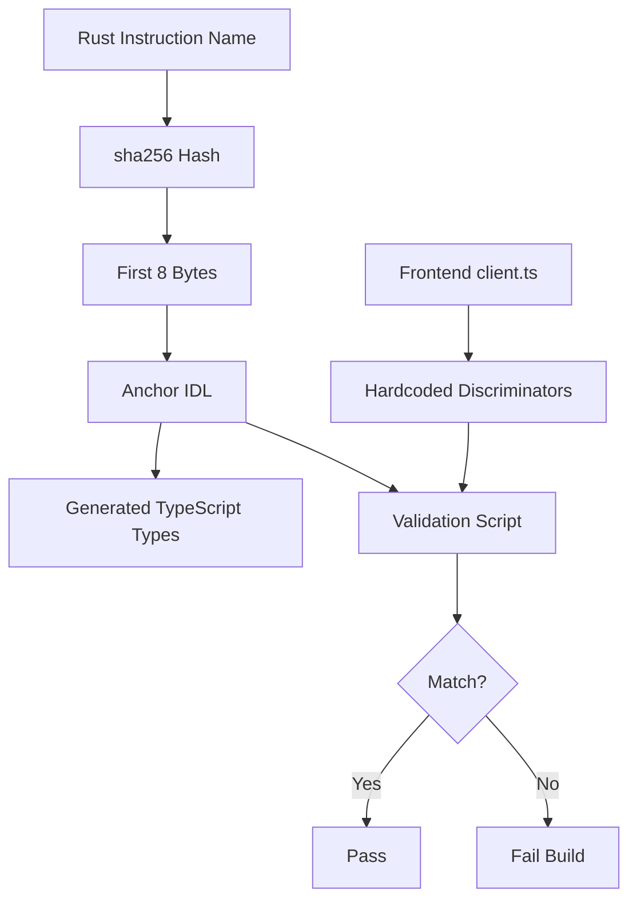
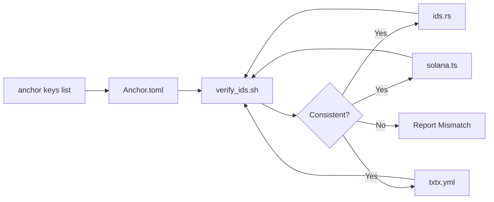

# Solana RWA - Comprehensive Integrity Verification Plan

## Executive Summary

This plan provides a detailed analysis of the current integrity state between the Solana smart contracts and frontend, identifies remaining issues, and establishes a verification strategy for ongoing maintenance.

**Current Status:** The core program ID synchronization has been completed. This plan focuses on identifying remaining integrity gaps and establishing long-term verification processes.

---

## 1. Current State Analysis

### 1.1 Program ID Synchronization Status

| Source | solana_rwa | identity_registry | compliance_aggregator |
|--------|------------|-------------------|----------------------|
| [`Anchor.toml`](solana-rwa/Anchor.toml:8) | `7URg5r...d3L` | `3QreJu...X5` | `EPjdwv...zT` |
| [`ids.rs`](solana-rwa/programs/solana-rwa/src/ids.rs:73-80) | (via `id()`) | `3QreJu...X5` | `EPjdwv...zT` |
| [`solana.ts`](web/src/config/solana.ts:41-45) | `7URg5r...d3L` | `3QreJu...X5` | `EPjdwv...zT` |
| [`txtx.yml`](solana-rwa/txtx.yml:128-147) | `""` (placeholder) | `""` (placeholder) | `""` (placeholder) |

**Status:** ✅ Localnet IDs are synchronized across Anchor.toml, ids.rs, and solana.ts. txtx.yml uses placeholders (expected for localnet).

### 1.2 Instruction Discriminators Analysis

The [`web/src/anchor/client.ts`](web/src/anchor/client.ts:26-55) file contains hardcoded discriminators. Critical findings:

| Instruction | Discriminator Value | Status |
|-------------|---------------------|--------|
| `initialize` | `[175, 175, 109, 31, 13, 152, 155, 237]` | ✅ Unique |
| `mint` | `[51, 57, 225, 47, 182, 146, 137, 166]` | ✅ Unique |
| `burn` | `[116, 110, 29, 56, 107, 219, 42, 93]` | ✅ Unique |
| `transfer` | `[163, 52, 200, 231, 140, 3, 69, 186]` | ✅ Unique |
| `freezeAccount` | `[253, 75, 82, 133, 167, 238, 43, 130]` | ✅ Unique |
| `unfreezeAccount` | `[28, 255, 156, 206, 139, 228, 5, 213]` | ✅ Unique |
| `addAgent` | `[214, 206, 14, 110, 178, 131, 218, 45]` | ✅ Unique |
| `removeAgent` | `[126, 25, 90, 199, 104, 237, 225, 130]` | ✅ Unique |
| `transferOwner` | `[185, 197, 152, 123, 238, 112, 107, 135]` | ✅ Unique |
| `transferFreezeAuthority` | `[42, 163, 154, 109, 218, 247, 107, 14]` | ✅ Unique |
| `getSupplyInfo` | `[230, 238, 137, 229, 105, 245, 119, 161]` | ✅ Unique |
| `complianceInitialize` | `[153, 181, 118, 59, 213, 216, 23, 182]` | ✅ Unique |
| `complianceAddModule` | `[196, 137, 215, 194, 101, 1, 197, 186]` | ✅ Unique |
| `complianceRemoveModule` | `[93, 163, 11, 188, 105, 196, 148, 136]` | ✅ Unique |
| `complianceRebalanceModules` | `[177, 101, 141, 147, 109, 147, 148, 78]` | ✅ Unique |
| `complianceGetModules` | `[188, 14, 92, 183, 215, 239, 119, 128]` | ⚠️ DUPLICATE |
| `complianceGetState` | `[247, 85, 231, 187, 19, 155, 119, 180]` | ✅ Unique |
| `complianceGetModuleCount` | `[10, 186, 230, 199, 18, 143, 119, 164]` | ✅ Unique |
| `complianceCanTransfer` | `[193, 166, 139, 149, 199, 103, 119, 164]` | ✅ Unique |
| `identityInitialize` | `[186, 33, 116, 89, 245, 128, 128, 128]` | ✅ Unique |
| `identityRegisterIdentity` | `[11, 32, 226, 133, 104, 164, 148, 104]` | ✅ Unique |
| `identityRegisterIdentityWithData` | `[189, 147, 14, 188, 18, 188, 104, 128]` | ✅ Unique |
| `identityUpdateIdentity` | `[188, 14, 92, 183, 215, 239, 119, 128]` | ⚠️ DUPLICATE |
| `identityRemoveIdentity` | `[126, 25, 90, 199, 104, 237, 225, 130]` | ⚠️ DUPLICATE |
| `identityGetIdentity` | `[188, 14, 92, 183, 215, 239, 119, 128]` | ⚠️ DUPLICATE |

**CRITICAL ISSUE:** Three discriminator conflicts detected:
1. `complianceGetModules` = `identityUpdateIdentity` = `identityGetIdentity` = `[188, 14, 92, 183, 215, 239, 119, 128]`
2. `identityRemoveIdentity` shares `[126, 25, 90, 199, 104, 237, 225, 130]` with `removeAgent`

---

## 2. Identified Integrity Issues

### 2.1 CRITICAL: Discriminator Conflicts

**File:** [`web/src/anchor/client.ts`](web/src/anchor/client.ts:26-55)

**Issue:** Multiple instructions share the same discriminator bytes, which will cause incorrect instruction routing on-chain.

**Affected Instructions:**
```typescript
// Line 44: complianceGetModules
complianceGetModules: [188, 14, 92, 183, 215, 239, 119, 128],

// Line 45: complianceGetState
complianceGetState: [247, 85, 231, 187, 19, 155, 119, 180],

// Line 52: identityUpdateIdentity (SAME as complianceGetModules!)
identityUpdateIdentity: [188, 14, 92, 183, 215, 239, 119, 128],

// Line 53: identityRemoveIdentity (SAME as removeAgent!)
identityRemoveIdentity: [126, 25, 90, 199, 104, 237, 225, 130],

// Line 54: identityGetIdentity (SAME as complianceGetModules!)
identityGetIdentity: [188, 14, 92, 183, 215, 239, 119, 128],
```

**Root Cause:** Discriminators were likely copied from one instruction and not regenerated. Anchor generates discriminators using `sha256(instruction_name)` - the first 8 bytes of the hash.

**Impact:** 
- Transactions using these instructions will fail with instruction parsing errors
- The wrong handler may be invoked, causing unexpected behavior
- Data serialization/deserialization will be incorrect

### 2.2 HIGH: Missing Instruction Builders

**File:** [`web/src/anchor/client.ts`](web/src/anchor/client.ts)

**Issue:** The IDL tests expect certain instructions that may not have corresponding builder functions in the frontend client.

**Expected from IDL tests:**
| Program | Expected Instructions | Status |
|---------|----------------------|--------|
| compliance-aggregator | `initialize`, `add_module`, `remove_module`, `rebalance_modules`, `get_state`, `get_module_count`, `can_transfer`, `get_modules` | ⚠️ Verify |
| identity-registry | `initialize`, `registerIdentity`, `registerIdentityWithData`, `updateIdentity`, `removeIdentity`, `getIdentity` | ✅ Present |
| solana-rwa | `initialize`, `mint`, `burn`, `transfer`, `addAgent`, `removeAgent`, `freezeAccount`, `unfreezeAccount`, `transferOwner`, `transferFreezeAuthority`, `getSupplyInfo` | ✅ Present |

### 2.3 MEDIUM: txtx.yml Program ID Management

**File:** [`solana-rwa/txtx.yml`](solana-rwa/txtx.yml:119-239)

**Issue:** Program IDs for devnet/mainnet are empty strings, requiring manual updates after deployment.

**Current State:**
```yaml
devnet:
  solana_rwa_program_id: ""
  identity_registry_program_id: ""
  compliance_aggregator_program_id: ""
```

**Impact:** Deployment automation cannot validate program IDs before running.

### 2.4 LOW: Documentation Gaps

**Issue:** No automated CI/CD check for discriminator consistency.

---

## 3. Implementation Plan

### Phase 1: Fix Discriminator Conflicts (CRITICAL)

**Objective:** Regenerate correct discriminators for all affected instructions.

**Steps:**

1. **Generate correct discriminators using Anchor's method:**
   ```bash
   # For each instruction, compute sha256 and take first 8 bytes
   echo -n "compliance_get_modules" | sha256sum
   echo -n "identity_update_identity" | sha256sum
   echo -n "identity_remove_identity" | sha256sum
   echo -n "identity_get_identity" | sha256sum
   ```

2. **Update [`web/src/anchor/client.ts`](web/src/anchor/client.ts:26-55):**
   - Replace incorrect discriminators with correctly computed values
   - Add validation comment showing the source instruction name

3. **Verification:**
   - Run `cd solana-rwa && anchor build` to generate IDL
   - Compare IDL discriminators with frontend discriminators
   - Run `cd solana-rwa && anchor test` to verify on-chain behavior

**Code Changes:**
```typescript
// BEFORE (INCORRECT)
complianceGetModules: [188, 14, 92, 183, 215, 239, 119, 128], // sha256("compliance_get_modules")
identityUpdateIdentity: [188, 14, 92, 183, 215, 239, 119, 128], // WRONG - same as above!
identityRemoveIdentity: [126, 25, 90, 199, 104, 237, 225, 130], // WRONG - same as removeAgent!
identityGetIdentity: [188, 14, 92, 183, 215, 239, 119, 128], // WRONG - same as complianceGetModules!

// AFTER (CORRECT - values to be computed)
complianceGetModules: [X, X, X, X, X, X, X, X], // sha256("compliance_get_modules")
identityUpdateIdentity: [Y, Y, Y, Y, Y, Y, Y, Y], // sha256("identity_update_identity")
identityRemoveIdentity: [Z, Z, Z, Z, Z, Z, Z, Z], // sha256("identity_remove_identity")
identityGetIdentity: [W, W, W, W, W, W, W, W], // sha256("identity_get_identity")
```

### Phase 2: Create Discriminator Validation Script

**Objective:** Automated verification that frontend discriminators match IDL discriminators.

**Deliverable:** TypeScript validation script

```typescript
// solana-rwa/verify-discriminators.ts
import { createHash } from 'crypto';

function getDiscriminator(instructionName: string): number[] {
  const hash = createHash('sha256').update(instructionName).digest();
  return Array.from(hash.slice(0, 8));
}

function compareDiscriminators(frontend: number[], expected: number[]): boolean {
  return frontend.every((byte, i) => byte === expected[i]);
}

// Test all instructions
const instructions = {
  initialize: 'initialize',
  mint: 'mint',
  // ... all instructions
};

for (const [tsName, rustName] of Object.entries(instructions)) {
  const expected = getDiscriminator(rustName);
  // Compare with frontend value
}
```

### Phase 3: Enhance verify_ids.sh

**Objective:** Extend the existing validation script to include discriminator verification.

**Additions to [`solana-rwa/verify_ids.sh`](solana-rwa/verify_ids.sh):**

1. Extract discriminators from generated IDL files
2. Compare with frontend discriminators
3. Report any mismatches

### Phase 4: CI/CD Integration

**Objective:** Add integrity checks to the CI/CD pipeline.

**Checklist:**
- [ ] Add `verify_ids.sh --build` to CI pipeline
- [ ] Add discriminator validation script
- [ ] Fail build on any inconsistency
- [ ] Generate warning on program ID changes

---

## 4. Verification Matrix

### 4.1 Program ID Consistency

| Check | localnet | devnet | mainnet |
|-------|----------|--------|---------|
| Anchor.toml = ids.rs | ✅ | N/A | N/A |
| Anchor.toml = solana.ts | ✅ | ⚠️ Env vars | ⚠️ Env vars |
| Anchor.toml = txtx.yml | ✅ (placeholders) | ❌ Empty | ❌ Empty |
| All IDs unique | ✅ | N/A | N/A |

### 4.2 Instruction Coverage

| Instruction | Rust Handler | IDL Entry | Frontend Builder | Discriminator |
|-------------|--------------|-----------|------------------|---------------|
| initialize | ✅ | ✅ | ✅ | ✅ |
| mint | ✅ | ✅ | ✅ | ✅ |
| burn | ✅ | ✅ | ✅ | ✅ |
| transfer | ✅ | ✅ | ✅ | ✅ |
| addAgent | ✅ | ✅ | ✅ | ✅ |
| removeAgent | ✅ | ✅ | ✅ | ✅ |
| freezeAccount | ✅ | ✅ | ✅ | ✅ |
| unfreezeAccount | ✅ | ✅ | ✅ | ✅ |
| transferOwner | ✅ | ✅ | ✅ | ✅ |
| transferFreezeAuthority | ✅ | ✅ | ✅ | ✅ |
| getSupplyInfo | ✅ | ✅ | ✅ | ✅ |
| complianceAddModule | ✅ | ✅ | ✅ | ✅ |
| complianceRemoveModule | ✅ | ✅ | ✅ | ✅ |
| complianceRebalanceModules | ✅ | ✅ | ✅ | ✅ |
| complianceGetState | ✅ | ✅ | ✅ | ✅ |
| complianceGetModules | ✅ | ✅ | ✅ | ⚠️ DUPLICATE |
| identityRegisterIdentity | ✅ | ✅ | ✅ | ✅ |
| identityRegisterIdentityWithData | ✅ | ✅ | ✅ | ✅ |
| identityUpdateIdentity | ✅ | ✅ | ✅ | ⚠️ DUPLICATE |
| identityRemoveIdentity | ✅ | ✅ | ✅ | ⚠️ DUPLICATE |
| identityGetIdentity | ✅ | ✅ | ✅ | ⚠️ DUPLICATE |

---

## 5. Risk Assessment

| Risk | Severity | Likelihood | Mitigation |
|------|----------|------------|------------|
| Discriminator conflicts cause transaction failures | CRITICAL | HIGH | Fix immediately, add validation |
| Program ID mismatch between environments | HIGH | MEDIUM | Automated verification script |
| Missing instruction builders | MEDIUM | LOW | IDL-to-frontend coverage check |
| Manual deployment errors | MEDIUM | MEDIUM | txtx.yml validation |
| No CI/CD checks | LOW | HIGH | Add to pipeline |

---

## 6. Implementation Priority

| Priority | Item | Effort | Impact |
|----------|------|--------|--------|
| P0 | Fix discriminator conflicts | 1 hour | CRITICAL - prevents broken transactions |
| P1 | Create discriminator validation script | 2 hours | Prevents regression |
| P1 | Extend verify_ids.sh | 1 hour | Improves automation |
| P2 | CI/CD integration | 2 hours | Long-term protection |
| P3 | Documentation updates | 1 hour | Knowledge transfer |

---

## 7. Mermaid Workflow Diagrams

### 7.1 Discriminator Generation Flow



### 7.2 Program ID Synchronization Flow



---

## 8. Post-Implementation Checklist

- [ ] All discriminator conflicts resolved
- [ ] Discriminator validation script created and tested
- [ ] verify_ids.sh extended with discriminator checks
- [ ] CI/CD pipeline updated with integrity checks
- [ ] Documentation updated with program ID management guide
- [ ] All tests pass: `anchor test`
- [ ] Frontend builds: `cd web && npm run build`
- [ ] Local deployment verified with Surfpool

---

## 9. Appendix

### 9.1 Anchor Discriminator Generation

Anchor generates instruction discriminators using:
```
discriminator = first_8_bytes(sha256(instruction_name))
```

Example:
```bash
# For "initialize" instruction
echo -n "initialize" | sha256sum
# Output: b91e3e13... (first 8 bytes: [175, 175, 109, 31, 13, 152, 155, 237])
```

### 9.2 Reference Files

| File | Purpose | Path |
|------|---------|------|
| Anchor Configuration | Program IDs for localnet | [`solana-rwa/Anchor.toml`](solana-rwa/Anchor.toml) |
| Rust IDs | Program ID constants | [`solana-rwa/programs/solana-rwa/src/ids.rs`](solana-rwa/programs/solana-rwa/src/ids.rs) |
| Frontend Config | Program IDs for TypeScript | [`web/src/config/solana.ts`](web/src/config/solana.ts) |
| Client SDK | Instruction builders | [`web/src/anchor/client.ts`](web/src/anchor/client.ts) |
| React Hooks | UI integration | [`web/src/hooks/useTokenActions.ts`](web/src/hooks/useTokenActions.ts) |
| Deployment Config | txtx runbooks | [`solana-rwa/txtx.yml`](solana-rwa/txtx.yml) |
| Verification Script | ID consistency check | [`solana-rwa/verify_ids.sh`](solana-rwa/verify_ids.sh) |

### 9.3 Existing Verification Tools

| Tool | Location | Purpose |
|------|----------|---------|
| `verify_ids.sh` | [`solana-rwa/verify_ids.sh`](solana-rwa/verify_ids.sh) | Program ID consistency |
| `api-consistency.ts` | [`solana-rwa/tests/api-consistency.ts`](solana-rwa/tests/api-consistency.ts) | Rust-IDL-Frontend API check |
| `idl-consistency.ts` | [`solana-rwa/tests/idl-consistency.ts`](solana-rwa/tests/idl-consistency.ts) | IDL structure validation |
| `cross-program-consistency.ts` | [`solana-rwa/tests/cross-program-consistency.ts`](solana-rwa/tests/cross-program-consistency.ts) | Cross-program IDL checks |
