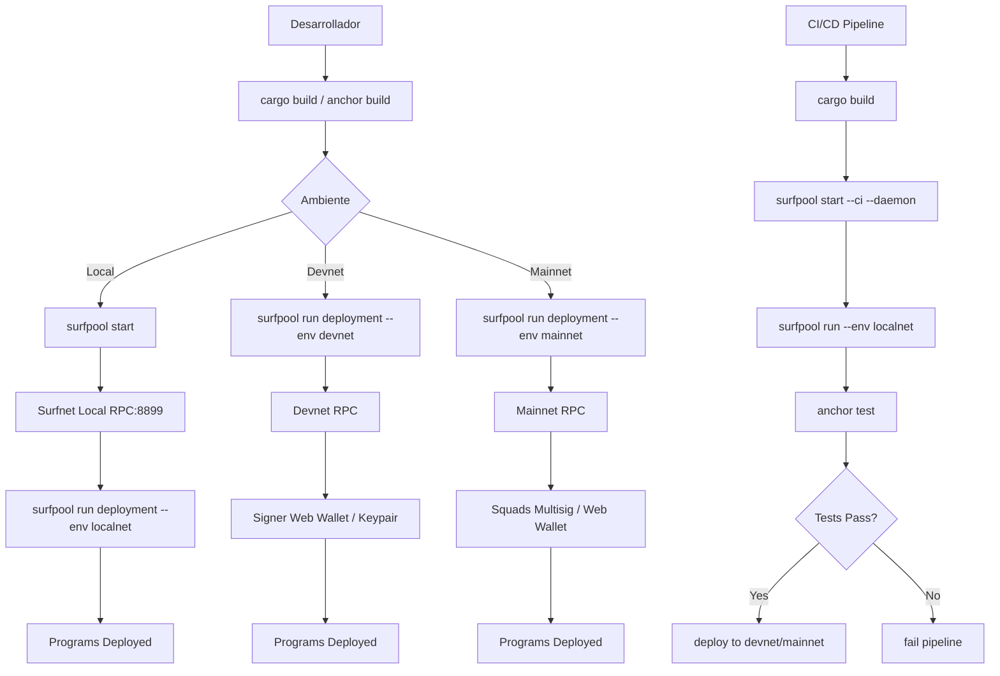

# Plan de Implementación de txtx / Surfpool

## Análisis del Sitio https://docs.surfpool.run/

### ¿Qué es Surfpool?

Surfpool es un **reemplazo drop-in de `solana-test-validator`** construido para desarrolladores de Solana. Sus características principales son:

1. **Simnet (Surfnet)**: Nodo local de Solana que clona cuentas de Mainnet bajo demanda (just-in-time)
2. **txtx DSL**: Lenguaje declarativo para Infrastructure as Code (IaC) de despliegues blockchain
3. **Web3 Runbooks**: Archivos `.tx` que definen cómo desplegar, firmar y ejecutar transacciones
4. **Terminal UI**: Dashboard en tiempo real para monitorear la red local
5. **Studio Web UI**: Interfaz web para ejecutar runbooks de forma supervisada

### ¿Qué es txtx?

txtx es el **Domain Specific Language (DSL)** usado por Surfpool para describir despliegues. Los runbooks txtx permiten:

- Definir **variables** editables y outputs
- Crear **actions** (desplegar programas, encodear instrucciones, firmar transacciones)
- Configurar **signers** (secret key, web wallet, multisig, etc.)
- Usar **addons** (svm para Solana, evm para EVM)
- Gestionar **múltiples ambientes** (localnet, devnet, mainnet)
- Definir **flows** para ejecución batch

---

## Arquitectura Actual del Proyecto

Tu proyecto ya tiene una base txtx configurada:

```
solana-rwa/
├── txtx.yml                          # Manifest principal
├── runbooks/
│   └── deployment/
│       ├── main.tx                   # Actions de deploy (3 programas)
│       ├── signers.localnet.tx       # Signers para localnet
│       ├── signers.devnet.tx         # Signers para devnet
│       └── signers.mainnet.tx        # Signers para mainnet
├── programs/
│   ├── solana-rwa/
│   ├── identity-registry/
│   └── compliance-aggregator/
└── Anchor.toml
```

---

## Plan de Implementación

### Fase 1: Instalación del Toolchain

#### 1.1 Instalar Surfpool CLI

```bash
# Opción A: Script de instalación (recomendado)
curl -sL https://run.surfpool.run/ | bash

# Opción B: Desde source
git clone https://github.com/txtx/surfpool.git
cd surfpool
cargo install --path .
```

#### 1.2 Verificar instalación

```bash
surfpool --version
surfpool --help
```

#### 1.3 (Opcional) Configurar shell completions

```bash
surfpool completions zsh  # o bash, fish
```

---

### Fase 2: Desarrollo Local

#### 2.1 Iniciar Surfnet Local

```bash
cd solana-rwa

# Opción A: Auto-detect (recomendado - detecta Anchor project)
surfpool start

# Opción B: Con opciones explícitas
surfpool start --port 8899 --ws-port 8900 --no-studio

# Opción C: CI mode (sin UI, para pipelines)
surfpool start --ci
```

Al iniciar desde un directorio de programa Anchor, Surfpool:
- Genera automáticamente runbooks para desplegar los programas
- Inicia el dashboard en `http://localhost:18488`
- Configura el RPC en `http://127.0.0.1:8899`

#### 2.2 Ejecutar Runbook de Deploy Local

```bash
# Ejecutar el runbook de deployment en modo no-supervisado
surfpool run deployment --env localnet -u --manifest-file-path ./txtx.yml
```

#### 2.3 Watch Mode (auto-redeploy)

```bash
# Reinicia automáticamente cuando los .so cambian
surfpool start --watch
```

#### 2.4 Configurar Solana CLI para Localnet

```bash
solana config set --url http://127.0.0.1:8899
```

---

### Fase 3: Configuración Multi-Ambiente

#### 3.1 Mejorar `txtx.yml`

El archivo actual necesita mejoras para soportar todos los ambientes:

```yaml
---
name: solana-rwa
id: solana-rwa
runbooks:
  - name: deployment
    description: Deploy all Solana RWA programs
    location: ./runbooks/deployment
    # State management para evitar re-deploy innecesarios
    state:
      location: .surfpool/state
environments:
  localnet:
    network_id: localnet
    rpc_api_url: http://127.0.0.1:8899
    # Para local, podemos usar keypair directamente
    payer_keypair_json: ~/.config/solana/id.json
    authority_keypair_json: ~/.config/solana/id.json
  devnet:
    network_id: devnet
    rpc_api_url: https://api.devnet.solana.com
    payer_keypair_json: ~/.config/solana/id.json
    authority_keypair_json: ~/.config/solana/id.json
  mainnet:
    network_id: mainnet
    rpc_api_url: https://api.mainnet-beta.solana.com
    # Para mainnet, se recomienda usar web_wallet o squads multisig
    # Los signers se definen en signers.mainnet.tx
```

#### 3.2 Signers por Ambiente

**Localnet** (`signers.localnet.tx`):
- Usa `svm::secret_key` con keypair file
- Adecuado para desarrollo donde la seguridad no es crítica

**Devnet** (`signers.devnet.tx`):
- Puede usar `svm::web_wallet` para interacción manual
- O `svm::secret_key` para automatización

**Mainnet** (`signers.mainnet.tx`):
- Se recomienda `svm::squads` para multisig
- O `svm::web_wallet` para firma manual en Studio

#### 3.3 Variables de Ambiente

Las variables definidas en `txtx.yml` under cada environment están disponibles como `input.<nombre>` en los archivos `.tx`:

```tx
// En main.tx, estas variables están disponibles:
addon "svm" {
    rpc_api_url = input.rpc_api_url    // viene de txtx.yml
    network_id = input.network_id      // viene de txtx.yml
}
```

---

### Fase 4: Despliegue en Ambientes

#### 4.1 Deploy a Devnet

```bash
# Ejecutar runbook para devnet
surfpool run deployment --env devnet -u --manifest-file-path ./txtx.yml

# Con interacción web (supervisado)
surfpool run deployment --env devnet --manifest-file-path ./txtx.yml
# Se abre browser en http://127.0.0.1:8488
```

#### 4.2 Deploy a Mainnet

```bash
# Mainnet requiere signers más seguros
surfpool run deployment --env mainnet -u --manifest-file-path ./txtx.yml
```

#### 4.3 Deploy con Airdrop (para testing)

```bash
# Airdrop a wallet específica
surfpool start -a <PUBKEY> --airdrop-amount 10000000000000
```

---

### Fase 5: Integración con CI/CD

#### 5.1 GitHub Actions Example

```yaml
name: Deploy Solana Programs
on:
  push:
    branches: [main]

jobs:
  deploy:
    runs-on: ubuntu-latest
    steps:
      - uses: actions/checkout@v4

      - name: Install Surfpool
        run: curl -sL https://run.surfpool.run/ | bash

      - name: Build Programs
        run: |
          cd solana-rwa
          anchor build

      - name: Deploy to Devnet
        run: |
          cd solana-rwa
          surfpool run deployment --env devnet -u --manifest-file-path ./txtx.yml
        env:
          PAYER_KEYPAIR: ${{ secrets.DEVNET_KEYPAIR }}
```

#### 5.2 Pipeline de Testing Local

```bash
# 1. Start surfnet en background
surfpool start --daemon --ci

# 2. Wait for ready
sleep 5

# 3. Run deployment
surfpool run deployment --env localnet -u

# 4. Run anchor tests
anchor test --provider.url http://127.0.0.1:8899

# 5. Stop surfnet
pkill surfpool
```

---

### Fase 6: Mejoras Adicionales

#### 6.1 State Management

Habilitar state management para evitar re-deploy innecesarios:

```yaml
runbooks:
  - name: deployment
    location: ./runbooks/deployment
    state:
      location: .surfpool/state
```

#### 6.2 Cheatcodes para Desarrollo

Para desarrollo local, se puede usar `instant_surfnet_deployment = true`:

```tx
action "deploy_solana_rwa" "svm::deploy_program" {
    program = svm::get_program_from_anchor_project("solana_rwa")
    authority = signer.authority
    payer = signer.payer
    instant_surfnet_deployment = true  // Deploy instantáneo en surfnet
}
```

> Nota: Esto se comporta diferente al deploy en devnet/mainnet.

#### 6.3 Snapshots para Testing

Pre-cargar cuentas con snapshots de mainnet:

```bash
surfpool start --snapshot mainnet-accounts.json
```

---

## Diagrama de Flujo



---

## Comandos Esenciales Resumen

| Acción | Comando |
|--------|---------|
| Instalar | `curl -sL https://run.surfpool.run/ \| bash` |
| Start local | `surfpool start` |
| Start CI mode | `surfpool start --ci --daemon` |
| Run runbook | `surfpool run deployment --env localnet -u` |
| List runbooks | `surfpool ls` |
| Explain plan | `surfpool run deployment --env localnet --explain` |
| Watch mode | `surfpool start --watch` |
| Dashboard | `http://localhost:18488` |
| Studio UI | `http://localhost:18488` (included in start) |

---

## Archivos a Modificar/Crear

1. **`solana-rwa/txtx.yml`** - Mejorar con todos los ambientes y state management
2. **`solana-rwa/runbooks/deployment/signers.mainnet.tx`** - Configurar para mainnet (squads o web_wallet)
3. **`solana-rwa/.gitignore`** - Agregar `.surfpool/` y archivos de estado
4. **`solana-rwa/README.md`** - Agregar sección de setup con surfpool/txtx
5. **`.github/workflows/solana-deploy.yml`** - Pipeline de CI/CD (nuevo)
6. **`solana-rwa/scripts/dev-setup.sh`** - Script de setup local (nuevo)
