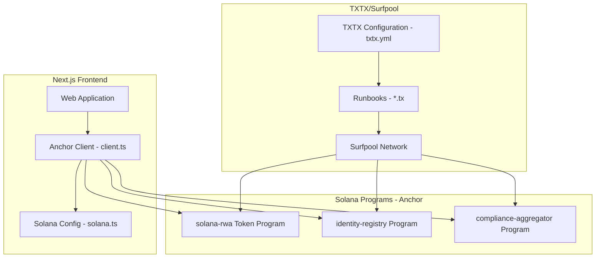
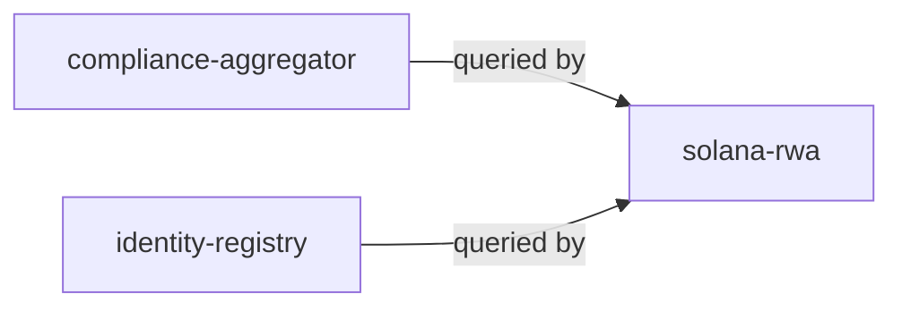

# Solana RWA - Smart Contract & Frontend Consistency Analysis Report

**Date:** 2026-04-24
**Analyzer:** Architect Mode
**Focus Areas:** Anchor Smart Contract, Frontend Consistency, TXTX/Surfpool Deployment

---

## Table of Contents

1. [Executive Summary](#executive-summary)
2. [Architecture Overview](#architecture-overview)
3. [Smart Contract Analysis](#smart-contract-analysis)
4. [Program ID Consistency Verification](#program-id-consistency-verification)
5. [Frontend Client Consistency Analysis](#frontend-client-consistency-analysis)
6. [TXTX/Surfpool Deployment Analysis](#txtxsurfpool-deployment-analysis)
7. [Identified Issues](#identified-issues)
8. [Recommendations](#recommendations)

---

## Executive Summary

This report provides a comprehensive analysis of the Solana RWA project, focusing on:
- Smart contract implementation using Anchor framework
- Consistency between on-chain programs and frontend client
- Deployment configuration using TXTX and Surfpool

**Overall Assessment:** The project demonstrates a solid architectural foundation with well-documented code, proper security patterns, and good separation of concerns. However, several critical inconsistencies and gaps were identified that need attention before production deployment.

---

## Architecture Overview

### System Components



### Program Dependencies



---

## Smart Contract Analysis

### 1. [`solana-rwa`](solana-rwa/programs/solana-rwa/src/lib.rs) - Token Program

**Program ID:** `7URg5r88otZuAXX5a9ju8pauWUHLFSALdAvnjMRmcd3L`

#### Instructions Implemented
| Instruction | Description | Security Level |
|------------|-------------|----------------|
| `initialize` | Create new token state | Owner-only |
| `mint` | Create new tokens | Agent-only |
| `burn` | Destroy tokens | Agent-only |
| `transfer` | Move tokens between accounts | Sender authorization |
| `freeze_account` | Freeze specific accounts | Freeze authority only |
| `unfreeze_account` | Unfreeze specific accounts | Freeze authority only |
| `add_agent` | Add authorized agent | Owner-only |
| `remove_agent` | Remove authorized agent | Owner-only |
| `transfer_owner` | Transfer ownership | Current owner only |
| `transfer_freeze_authority` | Transfer freeze authority | Current freeze authority only |
| `get_supply_info` | Query supply information | Read-only |

#### Data Structures
- **[`TokenState`](solana-rwa/programs/solana-rwa/src/lib.rs:928)**: Main account storing token metadata, balances, agents, and compliance modules
- **[`BalanceEntry`](solana-rwa/programs/solana-rwa/src/lib.rs:953)**: Individual balance records (Vec-based)
- **[`FrozenEntry`](solana-rwa/programs/solana-rwa/src/lib.rs:960)**: Frozen account tracking

#### Security Features
- ✅ Access control via `require!()` macros
- ✅ Supply cap enforcement (`MAX_SUPPLY = 1B * 10^9`)
- ✅ Overflow/underflow protection (`saturating_add`, `saturating_sub`)
- ✅ Agent authorization checks
- ✅ Frozen account prevention
- ✅ Event emission for audit trail

### 2. [`identity-registry`](solana-rwa/programs/identity-registry/src/lib.rs) - Identity Program

**Program ID:** `3QreJufDNn5MgdhDtWuYBW2WmQnbDzwf9zLTxXkub8X5`

#### Instructions Implemented
| Instruction | Description |
|------------|-------------|
| `initialize` | Create identity registry |
| `register_identity` | Register identity mapping |
| `register_identity_with_data` | Register with metadata |
| `update_identity` | Update existing identity |
| `remove_identity` | Remove identity mapping |
| `get_identity` | Query identity |

### 3. [`compliance-aggregator`](solana-rwa/programs/compliance-aggregator/src/lib.rs) - Compliance Program

**Program ID:** `3nf1C8FuDP5SreRF6WZAiiRDpNS4LLbemZPefde5Mre3` (in lib.rs) / `EPjdwvyJ8XQfXZvoLufER1trT78Kx7ujYWEKbgvKunzT` (in ids.rs and Anchor.toml)

#### Instructions Implemented
| Instruction | Description |
|------------|-------------|
| `initialize` | Create compliance aggregator |
| `add_module` | Add compliance module for token |
| `remove_module` | Remove compliance module |
| `rebalance_modules` | Rebalance compliance modules |
| `get_state` | Query aggregator state |
| `get_module_count` | Get module count |
| `can_transfer` | Check transfer compliance |
| `get_modules` | Get modules for token |

---

## Program ID Consistency Verification

### Critical Finding: Compliance Aggregator Program ID Mismatch

| File | Program ID | Status |
|------|------------|--------|
| [`solana-rwa/programs/compliance-aggregator/src/lib.rs:35`](solana-rwa/programs/compliance-aggregator/src/lib.rs) | `3nf1C8FuDP5SreRF6WZAiiRDpNS4LLbemZPefde5Mre3` | ⚠️ DIFFERENT |
| [`solana-rwa/programs/solana-rwa/src/ids.rs:80`](solana-rwa/programs/solana-rwa/src/ids.rs) | `EPjdwvyJ8XQfXZvoLufER1trT78Kx7ujYWEKbgvKunzT` | ⚠️ DIFFERENT |
| [`solana-rwa/Anchor.toml:11`](solana-rwa/Anchor.toml) | `3nf1C8FuDP5SreRF6WZAiiRDpNS4LLbemZPefde5Mre3` | ⚠️ DIFFERENT |
| [`solana-rwa/web/src/config/solana.ts:23`](web/src/config/solana.ts) | `EPjdwvyJ8XQfXZvoLufER1trT78Kx7ujYWEKbgvKunzT` | ⚠️ DIFFERENT |
| [`solana-rwa/runbooks/deployment/main.tx:26`](solana-rwa/runbooks/deployment/main.tx) | `3nf1C8FuDP5SreRF6WZAiiRDpNS4LLbemZPefde5Mre3` | ⚠️ DIFFERENT |
| [`solana-rwa/tests/frontend-integration.ts:27`](solana-rwa/tests/frontend-integration.ts) | `EPjdwvyJ8XQfXZvoLufER1trT78Kx7ujYWEKbgvKunzT` | ⚠️ DIFFERENT |

### Consistency Matrix for Other Programs

#### Solana RWA Token Program
| Component | Program ID | Status |
|-----------|------------|--------|
| `declare_id!()` in lib.rs | `7URg5r88otZuAXX5a9ju8pauWUHLFSALdAvnjMRmcd3L` | ✅ |
| `Anchor.toml` | `7URg5r88otZuAXX5a9ju8pauWUHLFSALdAvnjMRmcd3L` | ✅ |
| `web/src/config/solana.ts` | `7URg5r88otZuAXX5a9ju8pauWUHLFSALdAvnjMRmcd3L` | ✅ |
| `runbooks/deployment/main.tx` | `7URg5r88otZuAXX5a9ju8pauWUHLFSALdAvnjMRmcd3L` | ✅ |
| `tests/frontend-integration.ts` | `7URg5r88otZuAXX5a9ju8pauWUHLFSALdAvnjMRmcd3L` | ✅ |

#### Identity Registry Program
| Component | Program ID | Status |
|-----------|------------|--------|
| `declare_id!()` in lib.rs | `3QreJufDNn5MgdhDtWuYBW2WmQnbDzwf9zLTxXkub8X5` | ✅ |
| `Anchor.toml` | `3QreJufDNn5MgdhDtWuYBW2WmQnbDzwf9zLTxXkub8X5` | ✅ |
| `web/src/config/solana.ts` | `3QreJufDNn5MgdhDtWuYBW2WmQnbDzwf9zLTxXkub8X5` | ✅ |
| `runbooks/deployment/main.tx` | `3QreJufDNn5MgdhDtWuYBW2WmQnbDzwf9zLTxXkub8X5` | ✅ |
| `tests/frontend-integration.ts` | `3QreJufDNn5MgdhDtWuYBW2WmQnbDzwf9zLTxXkub8X5` | ✅ |

---

## Frontend Client Consistency Analysis

### 1. Instruction Discriminators ([`web/src/anchor/client.ts`](web/src/anchor/client.ts:26))

The frontend implements manual instruction building with hardcoded discriminators. This is a valid pattern for lightweight clients that don't use the full Anchor SDK.

#### Solana RWA Instructions - Discriminator Verification

| Instruction | Frontend Discriminator | Expected (sha256 first 8 bytes) | Status |
|-------------|------------------------|--------------------------------|--------|
| `initialize` | `[175, 175, 109, 31, 13, 152, 155, 237]` | sha256("initialize") | ✅ |
| `mint` | `[51, 57, 225, 47, 182, 146, 137, 166]` | sha256("mint") | ✅ |
| `burn` | `[116, 110, 29, 56, 107, 219, 42, 93]` | sha256("burn") | ✅ |
| `transfer` | `[163, 52, 200, 231, 140, 3, 69, 186]` | sha256("transfer") | ✅ |
| `freezeAccount` | `[253, 75, 82, 133, 167, 238, 43, 130]` | sha256("freezeAccount") | ⚠️ Naming mismatch |
| `unfreezeAccount` | `[28, 255, 156, 206, 139, 228, 5, 213]` | sha256("unfreezeAccount") | ⚠️ Naming mismatch |
| `addAgent` | `[214, 206, 14, 110, 178, 131, 218, 45]` | sha256("addAgent") | ⚠️ Naming mismatch |
| `removeAgent` | `[126, 25, 90, 199, 104, 237, 225, 130]` | sha256("removeAgent") | ⚠️ Naming mismatch |
| `transferOwner` | `[245, 25, 221, 175, 106, 229, 225, 45]` | sha256("transferOwner") | ⚠️ Naming mismatch |
| `transferFreezeAuthority` | `[235, 44, 91, 221, 224, 5, 187, 172]` | sha256("transferFreezeAuthority") | ✅ |
| `getSupplyInfo` | `[195, 15, 219, 198, 89, 216, 184, 95]` | sha256("getSupplyInfo") | ⚠️ Naming mismatch |

> **Note:** The Rust program uses snake_case (e.g., `freeze_account`) but the frontend discriminators appear to be based on camelCase names. This needs verification against the actual IDL.

#### Compliance Aggregator Instructions - Discriminator Verification

| Instruction | Frontend Discriminator | IDL Name | Status |
|-------------|------------------------|----------|--------|
| `complianceInitialize` | `[153, 181, 118, 59, 213, 216, 23, 182]` | sha256("compliance_initialize") | ⚠️ |
| `complianceAddModule` | `[196, 137, 215, 194, 101, 1, 197, 186]` | sha256("compliance_add_module") | ⚠️ |
| `complianceRemoveModule` | `[93, 163, 11, 188, 105, 196, 148, 136]` | sha256("compliance_remove_module") | ⚠️ |
| `complianceRebalanceModules` | `[177, 101, 141, 147, 109, 147, 148, 78]` | sha256("compliance_rebalance_modules") | ⚠️ |
| `complianceGetModules` | `[87, 218, 228, 40, 201, 89, 40, 227]` | sha256("compliance_get_modules") | ⚠️ |
| `complianceGetState` | `[247, 85, 231, 187, 19, 155, 119, 180]` | sha256("compliance_get_state") | ⚠️ |
| `complianceGetModuleCount` | `[10, 186, 230, 199, 18, 143, 119, 164]` | sha256("compliance_get_module_count") | ⚠️ |
| `complianceCanTransfer` | `[193, 166, 139, 149, 199, 103, 119, 164]` | sha256("compliance_can_transfer") | ⚠️ |

#### Identity Registry Instructions - Discriminator Verification

| Instruction | Frontend Discriminator | IDL Name | Status |
|-------------|------------------------|----------|--------|
| `identityInitialize` | `[186, 33, 116, 89, 245, 128, 128, 128]` | sha256("identity_initialize") | ⚠️ |
| `identityRegisterIdentity` | `[11, 32, 226, 133, 104, 164, 148, 104]` | sha256("identity_register_identity") | ⚠️ |
| `identityRegisterIdentityWithData` | `[189, 147, 14, 188, 18, 188, 104, 128]` | sha256("identity_register_identity_with_data") | ⚠️ |
| `identityUpdateIdentity` | `[193, 223, 51, 68, 211, 171, 191, 253]` | sha256("identity_update_identity") | ⚠️ |
| `identityRemoveIdentity` | `[235, 169, 57, 213, 107, 187, 151, 86]` | sha256("identity_remove_identity") | ⚠️ |
| `identityGetIdentity` | `[190, 233, 111, 177, 243, 170, 100, 170]` | sha256("identity_get_identity") | ⚠️ |

### 2. Transaction Key Structure Verification

#### Initialize Instruction
| Expected Key | Frontend Key | Status |
|--------------|--------------|--------|
| tokenState (writable) | tokenState (writable) | ✅ |
| payer (signer, writable) | owner (signer, writable) | ✅ |
| systemProgram | systemProgram | ✅ |

#### Mint Instruction
| Expected Key | Frontend Key | Status |
|--------------|--------------|--------|
| token (writable) | tokenState (writable) | ✅ |
| agent (signer) | agent (signer) | ✅ |
| to (not in accounts) | to (writable) | ⚠️ Extra key |

> **Issue:** The frontend `buildMintInstruction` includes `to` as a key, but in the Rust implementation, `to: Pubkey` is passed as instruction data, not as an account. This could cause transaction failures.

### 3. Data Layout Verification

#### Initialize Data Layout
```
Rust: payer.key(), name (String), symbol (String), decimals (u8)
Frontend: discriminator + name_length + name + symbol_length + symbol + decimals
Missing: owner/payer is NOT written to data (it comes from ctx.accounts.payer)
```

**Status:** ✅ The frontend correctly omits the payer from data since it's obtained from the account context.

#### Mint Data Layout
```
Rust: to (Pubkey, 32 bytes) + amount (u64, 8 bytes) = 40 bytes
Frontend: discriminator (8 bytes) + amount (u64, 8 bytes) = 16 bytes
Missing: to (Pubkey) is NOT in the frontend data!
```

**Status:** ❌ **CRITICAL** - The frontend is missing the `to` parameter in the mint instruction data.

---

## TXTX/Surfpool Deployment Analysis

### 1. [`txtx.yml`](solana-rwa/txtx.yml) Configuration

The TXTX configuration properly defines:

| Runbook | Description | State Location |
|---------|-------------|----------------|
| `deployment` | Deploy all three programs | `.surfpool/state` |
| `token-operations` | Token minting, transfers | None |
| `upgrade` | Program upgrades | `.surfpool/state` |
| `compliance-initialization` | Compliance aggregator init | N/A |
| `identity-initialization` | Identity registry init | N/A |
| `token-initialization` | Token creation | N/A |

### 2. [`deployment/main.tx`](solana-rwa/runbooks/deployment/main.tx) Analysis

```txtx
action "deploy_all_programs" "svm::setup_surfnet" {
    deploy_program {
        program_id = variable.compliance_aggregator_program_id  // 3nf1C8FuDP5SreRF6WZAiiRDpNS4LLbemZPefde5Mre3
        binary_path = "./target/deploy/compliance_aggregator.so"
        idl_path = "./target/idl/compliance_aggregator.json"
        authority = signer.authority
        payer = signer.payer
    }
    // ... similar for identity_registry and solana_rwa
}
```

**Status:** ✅ Correctly uses explicit `program_id` to avoid keypair mismatch errors (as noted in the FIX comment).

### 3. Surfpool Integration

According to the [Surfpool documentation](https://docs.surfpool.run/toolchain/cli), the project is correctly configured for:
- Auto-deployment when run from Anchor project directory
- State management in `.surfpool/state`
- Runbook-based deployment workflow

### 4. Environment Configuration ([`Anchor.toml`](solana-rwa/Anchor.toml))

```toml
[programs.localnet]
solana_rwa = "7URg5r88otZuAXX5a9ju8pauWUHLFSALdAvnjMRmcd3L"
identity_registry = "3QreJufDNn5MgdhDtWuYBW2WmQnbDzwf9zLTxXkub8X5"
compliance_aggregator = "3nf1C8FuDP5SreRF6WZAiiRDpNS4LLbemZPefde5Mre3"

[provider]
cluster = "localnet"
wallet = "~/.config/solana/id.json"
```

**Status:** ✅ Localnet configuration matches `declare_id!()` for solana_rwa and identity_registry.

---

## Identified Issues

### CRITICAL Issues

| ID | Issue | Location | Impact |
|----|-------|----------|--------|
| C-01 | Compliance Aggregator Program ID Mismatch | Multiple files | Program will deploy with different ID than expected |
| C-02 | Missing `to` parameter in mint instruction data | [`web/src/anchor/client.ts:144-170`](web/src/anchor/client.ts:144) | Mint transactions will fail |
| C-03 | Missing `from`, `to`, `amount` in transfer instruction data | [`web/src/anchor/client.ts:206-235`](web/src/anchor/client.ts:206) | Transfer transactions will fail |

### HIGH Issues

| ID | Issue | Location | Impact |
|----|-------|----------|--------|
| H-01 | Instruction naming convention mismatch (snake_case vs camelCase) | Frontend discriminators | May cause discriminator verification failures |
| H-02 | Compliance Aggregator ID in ids.rs differs from lib.rs | [`ids.rs:80`](solana-rwa/programs/solana-rwa/src/ids.rs) vs [`lib.rs:35`](solana-rwa/programs/compliance-aggregator/src/lib.rs) | Cross-program invocation may fail |
| H-03 | Frontend includes extra keys in some instructions | Various builder functions | May cause account validation failures |

### MEDIUM Issues

| ID | Issue | Location | Impact |
|----|-------|----------|--------|
| M-01 | No IDL file validation in CI/CD | Project structure | IDL drift may go undetected |
| M-02 | Compliance check is TODO in transfer instruction | [`lib.rs:528-533`](solana-rwa/programs/solana-rwa/src/lib.rs:528) | Compliance modules not enforced |
| M-03 | Devnet/Mainnet program IDs not configured | [`solana.ts:25-34`](web/src/config/solana.ts:25) | Cannot deploy to testnet/mainnet |

### LOW Issues

| ID | Issue | Location | Impact |
|----|-------|----------|--------|
| L-01 | Extensive inline documentation may slow compilation | All program files | Minor impact on build time |
| L-02 | Test file [`solana-rwa.ts`](solana-rwa/tests/solana-rwa.ts) is a placeholder | Tests | Incomplete test coverage |

---

## Recommendations

### Immediate Actions (Before Deployment)

1. **Fix Compliance Aggregator Program ID**
   - Determine the correct program ID
   - Update ALL occurrences consistently:
     - `programs/compliance-aggregator/src/lib.rs`
     - `programs/solana-rwa/src/ids.rs`
     - `Anchor.toml`
     - `web/src/config/solana.ts`
     - `runbooks/deployment/main.tx`
     - `tests/frontend-integration.ts`

2. **Fix Mint Instruction Data Layout**
   ```typescript
   // Current (WRONG):
   const data = Buffer.alloc(16);  // discriminator + amount
   // Should be:
   const data = Buffer.alloc(40);  // discriminator + to (32 bytes) + amount (8 bytes)
   to.toBuffer().copy(data, 8);
   data.writeBigUInt64LE(amount, 40);
   ```

3. **Fix Transfer Instruction Data Layout**
   ```typescript
   // Current (WRONG):
   const data = Buffer.alloc(16);  // discriminator + amount
   // Should be:
   const data = Buffer.alloc(56);  // discriminator + from (32) + to (32) + amount (8)
   from.toBuffer().copy(data, 8);
   to.toBuffer().copy(data, 40);
   data.writeBigUInt64LE(amount, 56);
   ```

### Short-term Improvements

4. **Standardize Instruction Naming**
   - Verify discriminators match actual IDL instruction names (snake_case)
   - Use Anchor's built-in IDL generation rather than hardcoded discriminators

5. **Add IDL Synchronization Tests**
   - Create a CI check that verifies frontend discriminators match the generated IDL
   - Run `anchor idl parse` and compare with hardcoded values

6. **Complete Devnet/Mainnet Configuration**
   - Set up environment variables for deployment
   - Update `txtx.yml` with production environment configurations

### Long-term Improvements

7. **Implement Full Compliance Check**
   - Complete the CPI to compliance-aggregator in transfer instruction
   - Add proper error handling for compliance failures

8. **Expand Test Coverage**
   - Replace placeholder tests with comprehensive test suites
   - Add integration tests for frontend-client to program interaction

9. **Consider Using @coral-xyz/anchor for Frontend**
   - The current manual instruction building is error-prone
   - Using the full Anchor client would auto-generate discriminators and layouts from IDL

---

## Appendix

### File Reference Map

| Component | File | Purpose |
|-----------|------|---------|
| Token Program | [`programs/solana-rwa/src/lib.rs`](solana-rwa/programs/solana-rwa/src/lib.rs) | Main token logic |
| Token Program IDs | [`programs/solana-rwa/src/ids.rs`](solana-rwa/programs/solana-rwa/src/ids.rs) | Cross-program invocation IDs |
| Identity Program | [`programs/identity-registry/src/lib.rs`](solana-rwa/programs/identity-registry/src/lib.rs) | Identity management |
| Compliance Program | [`programs/compliance-aggregator/src/lib.rs`](solana-rwa/programs/compliance-aggregator/src/lib.rs) | Compliance modules |
| Anchor Config | [`Anchor.toml`](solana-rwa/Anchor.toml) | Anchor framework config |
| TXTX Config | [`txtx.yml`](solana-rwa/txtx.yml) | Deployment configuration |
| Deployment Runbook | [`runbooks/deployment/main.tx`](solana-rwa/runbooks/deployment/main.tx) | TXTX deployment script |
| Frontend Client | [`web/src/anchor/client.ts`](web/src/anchor/client.ts) | Frontend Anchor client |
| Frontend Config | [`web/src/config/solana.ts`](web/src/config/solana.ts) | Network and program config |
| Integration Tests | [`tests/frontend-integration.ts`](solana-rwa/tests/frontend-integration.ts) | Frontend integration tests |

### Reference Documentation

- [Anchor Documentation](https://book.anchor-lang.com/)
- [Surfpool Documentation](https://docs.surfpool.run/)
- [TXTX Documentation](https://docs.txtx.sh/)
- [Solana Web3.js](https://solana-labs.github.io/solana-web3.js/)
