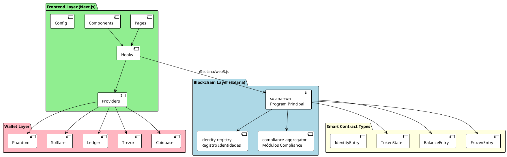
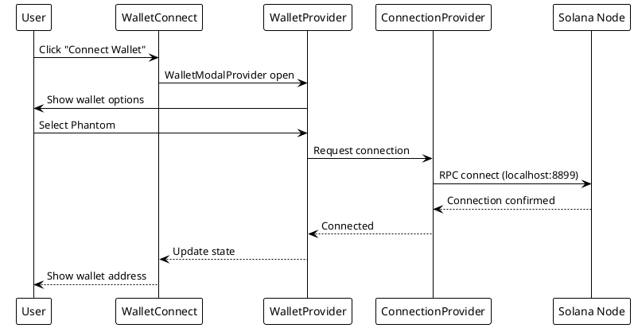
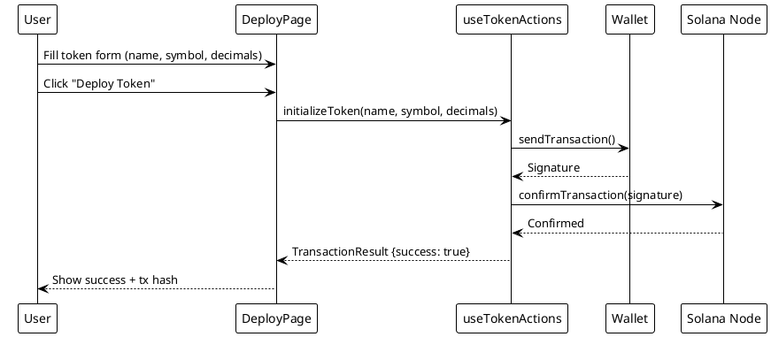
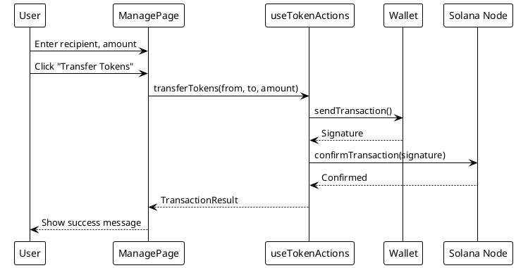
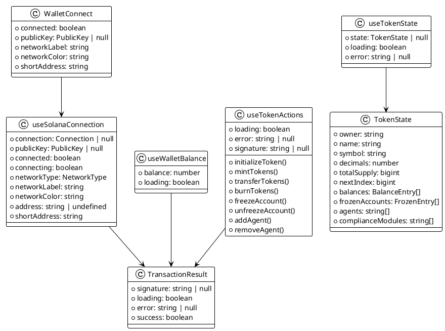
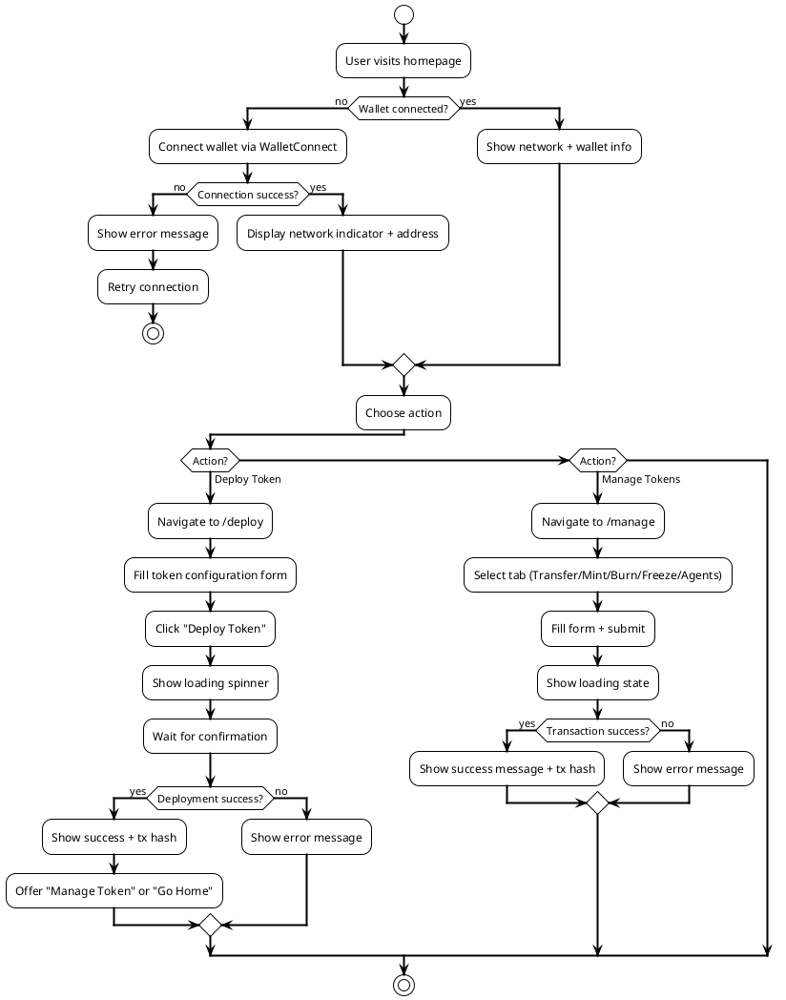

# Solana RWA Token Platform - Documentación Técnica Completa

## Tabla de Contenidos

1. [Resumen del Proyecto](#resumen-del-proyecto)
2. [Tecnologías Implementadas](#tecnologías-implementadas)
3. [Arquitectura del Sistema](#arquitectura-del-sistema)
4. [Definiciones y Conceptos Clave](#definiciones-y-conceptos-clave)
5. [Diagramas UML](#diagramas-uml)
6. [Estructura de Directorios](#estructura-de-directorios)
7. [Defectos y Problemas Encontrados](#defectos-y-problemas-encontrados)
8. [Propuestas de Mejora](#propuestas-de-mejora)
9. [Guía de Despliegue](#guía-de-despliegue)

---

## Resumen del Proyecto

Plataforma de tokenización de Activos del Mundo Real (RWA - Real World Assets) construida sobre **Solana blockchain** con un frontend Next.js. El sistema permite crear y gestionar tokens de seguridad con cumplimiento regulatorio integrado (KYC/AML), control de transferencia y gestión de autoridades.

### Características Principales

- **Tokenización de Activos**: Creación de tokens fungibles con metadata personalizable
- **Control de Acceso**: Sistema de agentes y autoridades para operaciones
- **Cumplimiento Regulatorio**: Módulos de compliance y registro de identidades
- **Gestión de Balances**: Seguimiento on-chain de balances y cuentas congeladas
- **Wallet Agnostic**: Soporte multi-wallet (Phantom, Solflare, Ledger, Trezor, Coinbase)

---

## Tecnologías Implementadas

### Blockchain - Smart Contracts (Rust + Anchor)

| Tecnología | Versión | Propósito |
|------------|---------|-----------|
| **Rust** | Latest | Lenguaje de programación de programas Solana |
| **Anchor Framework** | 0.32.1 | Framework para desarrollo de programas Solana |
| **borsh** | - | Serialización binaria para datos on-chain |
| **solana-program** | - | SDK de programas de Solana |

#### Programas Smart Contract

| Programa | ID | Propósito |
|----------|-----|-----------|
| `solana-rwa` | `7URg5r88otZuAXX5a9ju8pauWUHLFSALdAvnjMRmcd3L` | Programa principal de tokenización RWA |
| `identity-registry` | `3QreJufDNn5MgdhDtWuYBW2WmQnbDzwf9zLTxXkub8X5` | Registro de identidades verificadas |
| `compliance-aggregator` | `EPjdwvyJ8XQfXZvoLufER1trT78Kx7ujYWEKbgvKunzT` | Agregador de módulos de cumplimiento |

### Frontend (Next.js + Solana Web3)

| Tecnología | Versión | Propósito |
|------------|---------|-----------|
| **Next.js** | 15.5.5 | Framework React con App Router |
| **React** | 19.1.0 | Biblioteca UI |
| **TypeScript** | 5.x | Tipado estático |
| **TailwindCSS** | 4.x | Framework CSS utility-first |
| **Turbopack** | - | Bundler de desarrollo/producción |

#### Solana Web3 Stack

| Paquete | Versión | Propósito |
|---------|---------|-----------|
| `@solana/web3.js` | 1.98.4 | SDK oficial para interacción con blockchain |
| `@solana/spl-token` | 0.4.14 | Token program library |
| `@solana/wallet-adapter-react` | 0.15.39 | Hooks React para wallets |
| `@solana/wallet-adapter-react-ui` | 0.9.39 | Componentes UI de wallet |
| `@solana/wallet-adapter-wallets` | 0.19.38 | Adaptadores de wallets |
| `@coral-xyz/anchor` | 0.32.1 | SDK Anchor para frontend |

### Herramientas de Desarrollo

| Herramienta | Propósito |
|-------------|-----------|
| `anchor-cli` | CLI de Anchor para compilación y despliegue |
| `solana-cli` | CLI de Solana para interacción con la red |
| `ts-mocha` | Ejecutor de tests TypeScript |
| `eslint` | Linter para calidad de código |

---

## Arquitectura del Sistema

### Diagrama de Arquitectura (PlantUML)



---

## Definiciones y Conceptos Clave

### Smart Contract

#### TokenState (Cuenta Principal)

Estructura que almacena todo el estado del token en blockchain:

```rust
pub struct TokenState {
    pub owner: Pubkey,              // Dirección del propietario (deployer)
    pub name: String,               // Nombre del token (ej: "RWA Token")
    pub symbol: String,             // Símbolo (ej: "RWA")
    pub decimals: u8,               // Decimales (0-18)
    pub total_supply: u64,          // Suministro total de tokens
    pub next_index: u64,            // Siguiente ID de cuenta
    pub balances: Vec<BalanceEntry>, // Mapa de balances por wallet
    pub frozen_accounts: Vec<FrozenEntry>, // Cuentas congeladas
    pub agents: Vec<Pubkey>,        // Direcciones autorizadas
    pub compliance_modules: Vec<Pubkey>, // Módulos de compliance
}
```

#### BalanceEntry

```rust
pub struct BalanceEntry {
    pub key: Pubkey,    // Dirección de la wallet
    pub value: u64,     // Balance de tokens
}
```

#### FrozenEntry

```rust
pub struct FrozenEntry {
    pub key: Pubkey,    // Dirección de la wallet
    pub frozen: bool,   // Estado de congelación
}
```

### Operaciones del Smart Contract

| Instrucción | Descripción | Requisitos |
|-------------|-------------|------------|
| `initialize` | Crea nuevo estado de token | Payer firma, sistema program |
| `mint` | Crea tokens nuevos | Caller debe ser agent |
| `burn` | Destruye tokens | Caller debe ser agent |
| `transfer` | Transfiere entre cuentas | Sender debe tener balance suficiente |
| `freeze_account` | Congela cuenta | Caller debe ser agent |
| `unfreeze_account` | Desenfría cuenta | Caller debe ser agent |
| `add_agent` | Añade agente autorizado | Caller debe ser owner |
| `remove_agent` | Remueve agente | Caller debe ser owner |

### Código de Errores Personalizado

| Código | Mensaje | Descripción |
|--------|---------|-------------|
| `Unauthorized` | "Unauthorized" | Usuario no autorizado |
| `InsufficientBalance` | "Insufficient balance" | Balance insuficiente |
| `AccountFrozen` | "Account frozen" | Cuenta congelada |

---

## Diagramas UML

### 1. Diagrama de Componentes

```plantuml
@startuml Components
!theme plain
skinparam backgroundColor #FFFFFF
skinparam componentStyle rectangle

package "web/src" {
  
  [app/\nNext.js Pages] as app
  
  package "components" {
    [WalletConnect] as wc
  }
  
  package "providers" {
    [SolanaProvider] as sp
  }
  
  package "hooks" {
    [useSolanaConnection] as usc
    [useWalletBalance] as ub
    [useTokenState] as uts
    [useTokenActions] as uta
  }
  
  package "config" {
    [solana.ts] as sc
  }
  
  package "types" {
    [solana_rwa.ts\n(IDL Types)] as types
  }
  
}

app --> wc
app --> sp
wc --> usc
usc --> sp
ub --> sp
uts --> sc
uts --> types
uta --> sc
uta --> types

sp ..> usc : uses
sp ..> ub : uses
sp ..> uts : uses
sp ..> uta : uses

@enduml
```

### 2. Diagrama de Secuencia - Conexión de Wallet



### 3. Diagrama de Secuencia - Deploy Token



### 4. Diagrama de Secuencia - Transfer Tokens



### 5. Diagrama de Clases



### 6. Diagrama de Flujo de Usabilidad



---

## Estructura de Directorios

```
web/
├── package.json                          # Dependencias y scripts
├── tsconfig.json                         # Configuración TypeScript (ES2020 target)
├── next.config.ts                        # Configuración Next.js
├── postcss.config.mjs                    # PostCSS + TailwindCSS
├── README.md                             # Documentación del proyecto
│
├── public/                               # Assets estáticos
│   ├── file.svg
│   ├── globe.svg
│   ├── next.svg
│   ├── vercel.svg
│   └── window.svg
│
└── src/
    ├── app/                              # Next.js App Router
    │   ├── layout.tsx                    # Layout raíz + SolanaProvider
    │   ├── page.tsx                      # Homepage
    │   ├── globals.css                   # Estilos globales
    │   │
    │   ├── deploy/
    │   │   └── page.tsx                  # Página de deploy de tokens
    │   │
    │   └── manage/
    │       └── page.tsx                  # Página de gestión de tokens
    │
    ├── components/
    │   └── WalletConnect.tsx             # Componente de conexión wallet
    │
    ├── config/
    │   └── solana.ts                     # Configuración Solana (redes, program IDs)
    │
    ├── hooks/
    │   ├── index.ts                      # Barrel exports
    │   ├── useSolanaConnection.ts        # Hook de conexión y red
    │   ├── useWalletBalance.ts           # Hook de balance SOL
    │   ├── useTokenState.ts              # Hook de estado del token
    │   └── useTokenActions.ts            # Hook de acciones (mint, transfer, burn...)
    │
    ├── providers/
    │   └── SolanaProvider.tsx            # Provider de Solana + Wallet Adapter
    │
    └── types/
        └── solana_rwa.ts                 # Tipos IDL generados por Anchor
```

---

## Defectos y Problemas Encontrados

### 1. Token Actions sin Implementación Real ⚠️

**Archivo**: [`web/src/hooks/useTokenActions.ts`](web/src/hooks/useTokenActions.ts)

**Problema**: Las funciones de token actions (`initializeToken`, `mintTokens`, `transferTokens`, etc.) crean transacciones vacías sin construir correctamente los instructions del programa Anchor.

```typescript
// Código actual - Transacción vacía
const transaction = new Transaction();
// Nota: En producción, usar Anchor SDK
const signature = await sendTransaction(transaction, connection);
```

**Impacto**: Las transacciones enviadas no ejecutarán ninguna operación real en el smart contract.

### 2. Deserialización Borsh Simplificada ⚠️

**Archivo**: [`web/src/hooks/useTokenState.ts`](web/src/hooks/useTokenState.ts:116)

**Problema**: El deserializador `deserializeTokenState` es una implementación simplificada que no usa `@coral-xyz/borsh` correctamente.

```typescript
// Nota: Esta es una deserialización simplificada. Para producción, usar @coral-xyz/borsh
function deserializeTokenState(data: Buffer): TokenState {
  // Implementación manual sin validación de discriminator
  // Sin manejo de Vec con length prefix correcto
}
```

**Impacto**: Los datos del TokenState podrían deserializarse incorrectamente, especialmente para Vecs y Strings.

### 3. Program ID Hardcoded 🔴

**Archivo**: [`web/src/config/solana.ts`](web/src/config/solana.ts:11-27)

**Problema**: Los Program IDs son idénticos para todas las redes (devnet, mainnet, localnet), lo cual es incorrecto.

```typescript
export const PROGRAM_IDS = {
  devnet: {
    solanaRwa: '7URg5r88otZuAXX5a9ju8pauWUHLFSALdAvnjMRmcd3L',
  },
  mainnet: {
    solanaRwa: '7URg5r88otZuAXX5a9ju8pauWUHLFSALdAvnjMRmcd3L', // ¡Mismo ID!
  },
  localnet: {
    solanaRwa: '7URg5r88otZuAXX5a9ju8pauWUHLFSALdAvnjMRmcd3L', // ¡Mismo ID!
  },
};
```

**Impacto**: En producción, las direcciones de programa serán incorrectas.

### 4. Sin Manejo de Errores de Wallet 🔴

**Archivo**: [`web/src/providers/SolanaProvider.tsx`](web/src/providers/SolanaProvider.tsx)

**Problema**: No hay manejo de errores para fallos de conexión, wallet disconnect, o transacciones rechazadas.

**Impacto**: La UI puede quedar en estado inconsistente si la wallet se desconecta o hay errores de red.

### 5. Sin Validación de Formulario Completa 🟡

**Archivos**: [`web/src/app/deploy/page.tsx`](web/src/app/deploy/page.tsx), [`web/src/app/manage/page.tsx`](web/src/app/manage/page.tsx)

**Problema**: No se validan los formatos de direcciones Solana ni los rangos de valores.

**Impacto**: El usuario puede ingresar direcciones inválidas o valores negativos.

### 6. Dependencias React 19 vs Wallet Adapter 🟡

**Archivo**: [`web/package.json`](web/package.json:24)

**Problema**: React 19.1.0 no es completamente compatible con algunas versiones de wallet-adapter que esperan React 18.

```
npm warn peer react@"^16.x || ^17.x || ^18.x" from @solana/wallet-adapter-base@0.9.27
```

**Impacto**: Posibles warnings de compatibilidad y comportamientos inesperados.

### 7. Sin React Query Provider 🟡

**Archivo**: [`web/src/app/layout.tsx`](web/src/app/layout.tsx)

**Problema**: `@tanstack/react-query` está instalado pero no se configura como provider.

**Impacto**: Las consultas on-chain no se cachean ni se reintentan automáticamente.

### 8. Web3Provider Obsoleto 🟡

**Archivo**: `web/src/providers/Web3Provider.tsx` (referenciado en environment details)

**Problema**: Existen archivos de provider antiguos (Wagmi/Web3) que podrían causar confusión.

**Impacto**: Posible mezcla de stacks Ethereum y Solana en el mismo proyecto.

---

## Propuestas de Mejora

### Mejoras Críticas (P0)

#### 1. Integración Real con Anchor SDK

```typescript
// Mejora propuesta
import { Program, AnchorProvider } from '@coral-xyz/anchor';
import type { SolanaRwa } from '@/types/solana_rwa';

export function useTokenActions(tokenAccountPubkey: string | null) {
  const { connection } = useConnection();
  const { publicKey, sendTransaction } = useWallet();
  
  const getProvider = (): AnchorProvider => {
    return new AnchorProvider(connection, {
      publicKey: publicKey!,
      sendTransaction,
    }, { preflightCommitment: 'confirmed' });
  };
  
  const program = useMemo(() => {
    return new Program(idl as Idl, getProvider()) as Program<SolanaRwa>;
  }, [connection, publicKey]);
  
  const mintTokens = useCallback(async (recipient: string, amount: bigint) => {
    const sig = await program.methods
      .mint(new PublicKey(recipient), amount)
      .accounts({
        token: new PublicKey(tokenAccountPubkey!),
        agent: publicKey!,
      })
      .rpc();
    return { signature: sig, loading: false, error: null, success: true };
  }, [program, publicKey, tokenAccountPubkey]);
}
```

#### 2. Usar @coral-xyz/borsh para Deserialización

```typescript
import { BorshAccountsCodec } from '@coral-xyz/borsh';
import { TOKEN_STATE_LAYOUT } from '@/types/solana_rwa';

function deserializeTokenState(data: Buffer): TokenState {
  const codec = new BorshAccountsCodec(TOKEN_STATE_LAYOUT);
  return codec.decode(data) as TokenState;
}
```

#### 3. Configurar React Query Provider

```typescript
// web/src/app/layout.tsx
import { QueryClient, QueryClientProvider } from '@tanstack/react-query';

const queryClient = new QueryClient({
  defaultOptions: {
    queries: {
      refetchOnWindowFocus: false,
      retry: 2,
      staleTime: 5000,
    },
  },
});

export default function RootLayout({ children }) {
  return (
    <html lang="en">
      <body>
        <QueryClientProvider client={queryClient}>
          <SolanaProvider network="localnet">
            {children}
          </SolanaProvider>
        </QueryClientProvider>
      </body>
    </html>
  );
}
```

### Mejoras Importantes (P1)

#### 4. Validación de Direcciones Solana

```typescript
import { PublicKey } from '@solana/web3.js';

export function isValidSolanaAddress(address: string): boolean {
  try {
    new PublicKey(address);
    return true;
  } catch {
    return false;
  }
}

// En los formularios:
if (!isValidSolanaAddress(recipient)) {
  setError('Invalid Solana address');
  return;
}
```

#### 5. Actualización Dinámica de Program IDs

```typescript
// web/src/config/solana.ts
import { clusterApiUrl } from '@solana/web3.js';

export const PROGRAM_IDS: Record<NetworkType, ProgramIds> = {
  localnet: {
    solanaRwa: process.env.NEXT_PUBLIC_SOLANA_RWA_LOCALNET || '7URg5r...',
    identityRegistry: process.env.NEXT_PUBLIC_IDENTITY_REGISTRY_LOCALNET || '3QreJu...',
    complianceAggregator: process.env.NEXT_PUBLIC_COMPLIANCE_AGGREGATOR_LOCALNET || 'EPjdwv...',
  },
  devnet: {
    solanaRwa: process.env.NEXT_PUBLIC_SOLANA_RWA_DEVNET || '',
    // ...
  },
  mainnet: {
    solanaRwa: process.env.NEXT_PUBLIC_SOLANA_RWA_MAINNET || '',
    // ...
  },
};
```

#### 6. Manejo de Errores de Wallet

```typescript
// web/src/providers/SolanaProvider.tsx
import { useConnection, useWallet } from '@solana/wallet-adapter-react';
import { NotificationContext } from '@/contexts/NotificationContext';

// En componente:
const { showNotification } = useNotification();

useEffect(() => {
  if (!connected) {
    showNotification('Wallet disconnected', 'error');
  }
}, [connected]);
```

### Mejoras de UX (P2)

#### 7. Indicador de Estado de Red

```typescript
// web/src/components/NetworkStatus.tsx
export function NetworkStatus() {
  const { connection } = useConnection();
  const [slot, setSlot] = useState(0);
  
  useEffect(() => {
    const sub = connection.onSlotChange((s) => setSlot(s), 'confirmed');
    return () => connection.removeSlotChangeListener(sub);
  }, [connection]);
  
  return (
    <div className="flex items-center gap-2">
      <span className={`w-2 h-2 rounded-full ${slot > 0 ? 'bg-green-500' : 'bg-red-500'}`} />
      <span>Slot: {slot.toLocaleString()}</span>
    </div>
  );
}
```

#### 8. Historial de Transacciones

```typescript
// web/src/components/TransactionHistory.tsx
export function TransactionHistory({ address }: { address: string }) {
  const { data, isLoading } = useQuery({
    queryKey: ['transactions', address],
    queryFn: async () => {
      const connection = getConnection('localnet');
      return connection.getSignaturesForAddress(new PublicKey(address), { limit: 10 });
    },
  });
  
  // Render transaction list
}
```

#### 9. Soporte para Multisig

```typescript
// web/src/hooks/useMultisig.ts
import { PublicKey, Transaction } from '@solana/web3.js';
import { MultisigInstruction } from '@solana/spl-governance';

export function useMultisig(multisigAddress: string, signers: PublicKey[]) {
  // Implementar construcción de transacciones multisig
}
```

---

## Guía de Despliegue

### Requisitos Previos

```bash
# Solana CLI
solana --version  # >= 1.18

# Anchor CLI
anchor --version  # >= 0.30

# Node.js
node --version    # >= 20
```

### Despliegue del Smart Contract

```bash
cd solana-rwa

# Compilar programas
anchor build

# Verificar IDLs
anchor idl parse --file target/idl/solana_rwa.json

# Desplegar a devnet
anchor deploy --provider.cluster devnet

# Ejecutar tests
anchor test
```

### Despliegue del Frontend

```bash
cd web

# Instalar dependencias
npm install

# Configurar variables de entorno
echo 'NEXT_PUBLIC_SOLANA_NETWORK=devnet' >> .env.local
echo 'NEXT_PUBLIC_SOLANA_RWA_PROGRAM_ID=7URg5r...' >> .env.local

# Build de producción
npm run build

# Iniciar servidor
npm start
```

### Variables de Entorno Recomendadas

```bash
# .env.local
NEXT_PUBLIC_SOLANA_NETWORK=localnet
NEXT_PUBLIC_SOLANA_RWA_PROGRAM_ID=7URg5r88otZuAXX5a9ju8pauWUHLFSALdAvnjMRmcd3L
NEXT_PUBLIC_IDENTITY_REGISTRY_PROGRAM_ID=3QreJufDNn5MgdhDtWuYBW2WmQnbDzwf9zLTxXkub8X5
NEXT_PUBLIC_COMPLIANCE_AGGREGATOR_PROGRAM_ID=EPjdwvyJ8XQfXZvoLufER1trT78Kx7ujYWEKbgvKunzT
```

---

## Resumen de Estado

| Componente | Estado | Notas |
|------------|--------|-------|
| Smart Contracts | ✅ Completo | 3 programas compilados y desplegados |
| Tests | ✅ 12/12 Passing | Suite completa de tests |
| Wallet Connection | ✅ Funcional | 5 wallets soportadas |
| Frontend Pages | ✅ Funcional | Home, Deploy, Manage |
| Token Actions | ⚠️ Placeholder | Necesita integración Anchor SDK |
| Borsh Deserialization | ⚠️ Simplificado | Necesita @coral-xyz/borsh |
| Program IDs | 🔴 Hardcoded | Necesita configuración por red |
| Error Handling | 🟡 Parcial | Necesita mejoras |
| Form Validation | 🟡 Parcial | Necesita validación de direcciones |

---

*Documento generado: 2026-04-20*
*Versión: 1.0*
